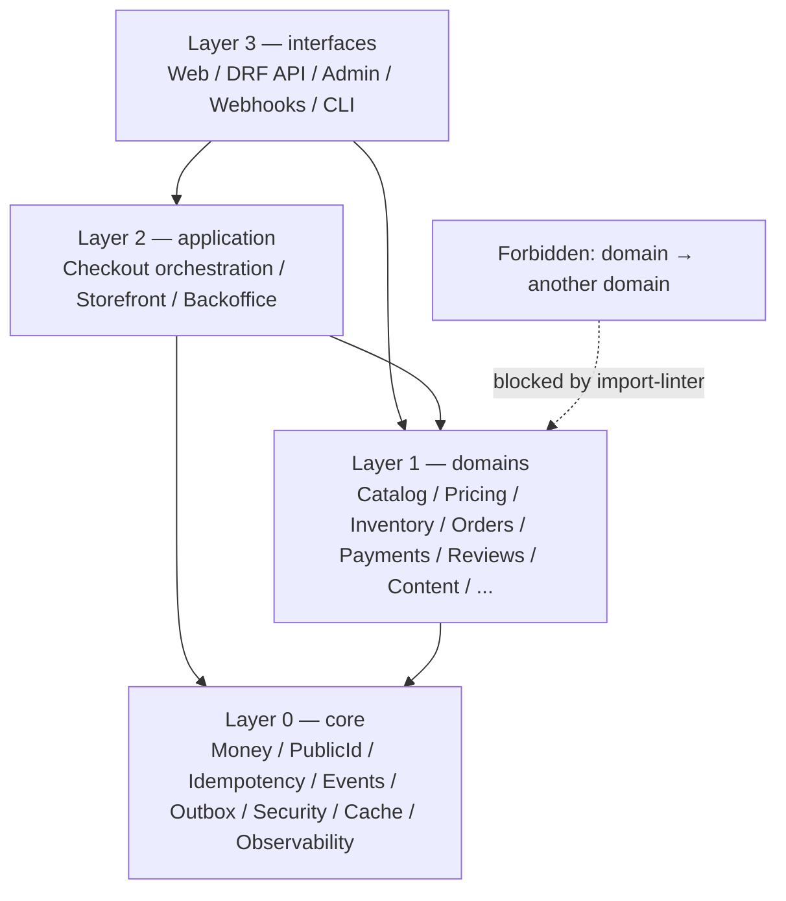
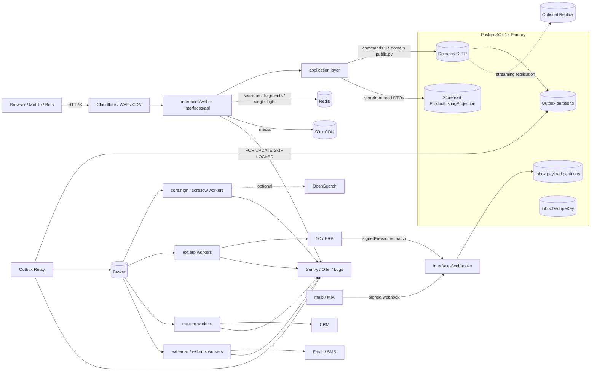

# E-commerce Platform 2026
## Архитектура, техническое решение и Roadmap разработки

> **Версия документа:** 1.3 — Security, Performance & Modular Architecture Hardened  
> **Дата архитектурной фиксации:** 03.09.2026  
> **Security review:** интегрированы H-1…H-7, M-1…M-10 и L-1…L-4  
> **Performance review:** интегрированы B-1…B-12, query-budget и projection/cache/DB optimizations
> **Architecture review:** интегрированы A-1…A-12 и R-1…R-10: module boundaries, application orchestration, DTO-first read path, failure-domain isolation и operability  
> **Целевой рынок:** Молдова  
> **Языки:** RO / RU  
> **Тип проекта:** полноценный интернет-магазин с физическими и цифровыми товарами, оплатой, доставкой, самовывозом, ERP/1С-интеграцией, CMS и маркетинговыми модулями.

---

## Содержание

1. [Цели и принципы архитектуры](#1-цели-и-принципы-архитектуры)
2. [Итоговый технологический стек](#2-итоговый-технологический-стек)
3. [Архитектура верхнего уровня](#3-архитектура-верхнего-уровня)
4. [Структура проекта и машинно-проверяемые границы](#4-структура-проекта-и-машинно-проверяемые-границы)
5. [Доменная модель](#5-доменная-модель)
6. [Каталог, категории и мультиязычность](#6-каталог-категории-и-мультиязычность)
7. [Товары, SKU и характеристики](#7-товары-sku-и-характеристики)
8. [Цены, скидки и промо](#8-цены-скидки-и-промо)
9. [Остатки, резервирование и ERP/1С](#9-остатки-резервирование-и-erp1с)
10. [Поиск, фильтрация и сортировка](#10-поиск-фильтрация-и-сортировка)
11. [Корзина и Checkout](#11-корзина-и-checkout)
12. [Платежи: maib, MIA и другие методы](#12-платежи-maib-mia-и-другие-методы)
13. [Личный кабинет, избранное и сравнение](#13-личный-кабинет-избранное-и-сравнение)
14. [Отзывы и рейтинг](#14-отзывы-и-рейтинг)
15. [Доставка, магазины и карты](#15-доставка-магазины-и-карты)
16. [Цифровые товары](#16-цифровые-товары)
17. [CMS, статьи, акции, видео и мероприятия](#17-cms-статьи-акции-видео-и-мероприятия)
18. [Trade-In и eUpgrade](#18-trade-in-и-eupgrade)
19. [Глобальные элементы сайта](#19-глобальные-элементы-сайта)
20. [Фоновые задачи и интеграции](#20-фоновые-задачи-и-интеграции)
21. [Безопасность, privacy и cookie consent](#21-безопасность-privacy-и-cookie-consent)
22. [Производительность и SQL bottleneck-и](#22-производительность-и-sql-bottleneck-и)
23. [Observability, backups и эксплуатация](#23-observability-backups-и-эксплуатация)
24. [Тестирование](#24-тестирование)
25. [Roadmap](#25-roadmap)
26. [Критерии готовности к production](#26-критерии-готовности-к-production)

---

# 1. Цели и принципы архитектуры

Главная задача — построить магазин, который хорошо работает как при небольшом каталоге, так и после роста до крупного retail-проекта, не заставляя команду переписывать ключевые сущности через год. После security review безопасность считается частью доменной архитектуры, а не финальным «hardening»-этапом.

### Базовые правила

1. **PostgreSQL — источник истины.**  
   Заказы, оплаты, остатки, резервы, цены заказа, идемпотентность, согласия и юридически значимые данные нельзя хранить только в Redis.

2. **Redis — ускоритель, а не база.**  
   Он используется для кэша, сессий, rate-limit и брокера задач. Потеря Redis не должна приводить к потере заказов, денег, резервов или защиты от повторной операции.

3. **Product и SKU — разные сущности.**  
   Карточка товара и конкретная продаваемая вариация не должны смешиваться.

4. **Checkout и Order — разные сущности.**  
   Незавершённый checkout не должен превращаться в «грязный» заказ.

5. **Остаток нельзя просто читать — его нужно резервировать.**  
   Все переходы резерва являются атомарными state transitions, а инварианты дополнительно защищаются `CHECK`/`UNIQUE`-constraint-ами PostgreSQL.

6. **Критичные операции выполняются транзакционно.**  
   Checkout, резерв, создание заказа, фиксация цены, coupon/trade-in redemption, подтверждение оплаты и refund строятся вокруг `transaction.atomic()`.

7. **Object-level authorization обязательна по умолчанию.**  
   Ни одна View/API-функция не получает `Order`, `CheckoutSession`, `PaymentAttempt`, `TradeInQuote`, `Review`, `FavoriteItem` и другие пользовательские объекты через прямой `.get(pk=...)`. Чтение выполняется через `selectors/policies`, принимающие `actor` и возвращающие уже scoped QuerySet.

8. **Внутренний PK и публичный идентификатор разделяются.**  
   Внутри PostgreSQL разрешён быстрый `bigint` PK. Всё, что появляется в URL, письмах, webhook payload, QR, Track & Trace или интеграциях, использует отдельный непредсказуемый `public_id` (UUIDv7) либо подписанный одноразовый токен. Последовательные PK наружу не выводятся.

9. **Idempotency — доменная сущность PostgreSQL.**  
   Повтор webhook, двойной клик «Оформить заказ», HTTP retry или повтор Celery-задачи не должны создавать вторую коммерческую операцию. Redis может быть только L1-фильтром; окончательное решение принимает `IdempotencyKey`/`InboxEvent` в PostgreSQL.

10. **Деньги хранятся в minor units.**  
    На всём критическом пути цена/скидка/доставка/платёж/Trade-In фиксируются целыми минимальными единицами валюты (`*_minor`, для MDL — баны). `Decimal` используется только на границе отображения и для коэффициентов/курсов, а правило округления централизовано.

11. **Денежные значения заказа фиксируются snapshot-ом.**  
    Старый заказ никогда не должен меняться после изменения актуальной цены товара.

12. **Async используется там, где он действительно нужен.**  
    Внешние HTTP-вызовы, фоновые интеграции и I/O можно выполнять асинхронно. Денежную и складскую бизнес-логику не нужно превращать в async ради моды.

13. **Внешний сервис не должен ломать основной request.**  
    OpenSearch, CRM, email, ERP и аналитика подключаются через **Transactional Outbox** и workers. Платёжная инициализация выполняется повторяемо и после фиксации локального состояния.

14. **Webhook — ускоритель, reconciliation — путь к истине.**  
    Входящий webhook синхронно только аутентифицируется и надёжно фиксируется как событие. Изменение финансового состояния выполняет worker под блокировкой строк и state machine. Периодическая сверка с провайдером гарантирует сходимость даже при потере webhook.

15. **Guest checkout не означает доверие к email/телефону.**  
    Гостевой заказ не привязывается к существующему аккаунту только по совпадению email или телефона. Привязка возможна лишь после подтверждения владения каналом связи.

16. **Безопасность фильтров — whitelist, а не динамический ORM.**  
    GET-параметры фильтрации и сортировки проходят декларативный реестр разрешённых полей и парсеров. Динамический `.filter(**request.GET.dict())`, `.order_by(request.GET['sort'])` и интерполяция пользовательских строк в SQL запрещены.

17. **Персональные данные минимизируются и имеют lifecycle.**  
    Согласия гостей фиксируются сервером под псевдонимным идентификатором; удаление аккаунта проектируется как контролируемая анонимизация PII с сохранением тех фискальных данных, которые обязаны храниться.

18. **Архитектура строится от данных и инвариантов, а не от скриншотов UI.**


19. **Горячие read-path-и обслуживаются projection-моделями.**  
    Каталог не собирает плитку товара через цепочку JOIN-ов по Product/Variant/Price/Inventory/Rating/Image/Promotion. Для storefront существует плоская `ProductListingProjection`, которую можно полностью пересчитать из OLTP-источников.

20. **EAV — источник истины, но не горячий фильтрационный индекс.**  
    `ProductAttributeValue` используется для админки, сравнения, экспорта и валидации. Storefront-фасеты читают `facet_choice_ids`/promoted typed columns из listing projection.

21. **Query budget — часть CI.**  
    Ключевые страницы имеют фиксированный бюджет SQL-запросов и тесты против N+1. Регрессия с 6 до 60 запросов считается падением сборки, а не задачей для будущего code review.

22. **Кэш обязан переживать cold start.**  
    Redis не считается вечным хранилищем даже для навигации. При miss разрешён controlled single-flight rebuild с stale fallback и периодическим re-warm; cache miss не должен превращаться ни в stampede, ни в исчезновение меню.

23. **Read replica — explicit opt-in, а не глобальный ORM-router.**  
    По умолчанию request читает из primary. Реплика подключается только измеренно для безопасных stale-tolerant read-path-ов; после записи действует sticky-primary/read-your-own-writes policy.

24. **Crawler/query-space ограничивается инженерно.**  
    Канонические URL недостаточны: мультифасетные комбинации, глубокая пагинация и сортировки получают crawl/noindex/rate-limit/query-cost policy, чтобы боты не стали основной нагрузкой БД.

25. **Batch changes коалесцируются.**  
    ERP-import, массовая переоценка и индексация не создают событие/задачу на каждую строку. Изменения обновляются set-based SQL и публикуются батчами с дедупликацией ID.

26. **Тяжёлые поля исключаются из list-query.**  
    JSONB/long text/raw payload/response snapshots не выбираются через `SELECT *` там, где они не нужны. Для read-моделей используются `.only()`/`.defer()`/специализированные managers.

---

27. **Домены не импортируют друг друга напрямую.**  
    Каждый домен слоя `domains/` знает только себя и `core`. Междоменные сценарии живут в `application/`, а внешний контракт домена публикуется через `public.py`. Прямые cross-domain imports моделей/services запрещены машинно через `import-linter`/CI.

28. **Cross-domain use case имеет одного владельца в application layer.**  
    `place_order`, применение Trade-In, checkout orchestration и другие сценарии, затрагивающие несколько доменов, не принадлежат ни `orders`, ни `checkout` как домену. Они живут в `application/<bounded-context>/use_cases/`.

29. **`public.py` — единственная разрешённая точка входа в домен.**  
    Наружу домен отдаёт функции/команды и immutable DTO, но не ORM-модели. Это одновременно защита модульного монолита от деградации и будущий seam для возможного выделения сервиса.

30. **Storefront — отдельный application/read слой, а не часть `catalog`.**  
    `ProductListingProjection`, фасеты, listing cache, FilterSpec и `ProductCard` DTO принадлежат `application/storefront`. `catalog` остаётся OLTP-доменом товаров/вариантов/характеристик и не импортирует pricing/inventory/reviews/promotions.

31. **Read path DTO-first.**  
    Проекция не рендерится сразу в HTML. Селектор storefront возвращает стабильные DTO (`ProductCard`, `FacetCount`, `Badge`), а Web/DRF являются terminal adapters: DTO → HTML или DTO → JSON. Web и Mobile API используют один и тот же оптимизированный read-path.

32. **Очереди изолируются по failure domain, а не только по приоритету.**  
    ERP, CRM, email, SMS и core-jobs имеют отдельные queues/worker pools. Падение 1С не должно блокировать подтверждение заказа по email. Для каждого внешнего вендора обязательны explicit timeout, circuit breaker, bounded retry и DLQ/replay procedure.

33. **События имеют типизированный и версионированный контракт.**  
    Каждое Outbox/Inbox event имеет `event_name` + `event_version` и валидируется DTO/schema из `core/events`. Consumer обязан явно поддерживать версии; неизвестная версия уходит в DLQ и поднимает alert.

34. **Trace context переживает async-границы.**  
    `OutboxEvent`/Inbox payload metadata хранят `trace_id`, `span_id`, `request_id`; relay передаёт их в headers, worker восстанавливает OTel context. Цепочка «checkout → payment → ERP → notification» должна собираться в один trace.

35. **Инварианты выражаются типами, не только соглашениями.**  
    `Money` — value object с `minor: int` и `currency`; `PublicId` — отдельный тип/UUIDv7. Нельзя создать деньги из `Decimal` без явной фабрики и `RoundingPolicy`, а внутренний bigint PK не должен случайно попасть в URL-резолвер.

36. **Projection updates монотонны.**  
    `ProductListingProjection.source_version` участвует в guarded upsert: более старое событие не может перезаписать более новое состояние. Полный rebuild остаётся reconciliation-механизмом, а не основной защитой от race.

37. **Analytics имеет владельца и consent contract.**  
    Если `domains/analytics` не реализован в MVP, `popularity_score` считается только из доступных first-party сигналов без view tracking (например, продажи + избранное). Нельзя зависеть от несуществующего «event pipeline».

38. **Архитектурные решения и эксплуатация документируются как исполняемые артефакты.**  
    Критические решения фиксируются в `docs/adr/`; каждый production alert содержит ссылку на runbook; для сложных инцидентов существует процедура санированного production snapshot-а без PII/secret data.

39. **MVP режет фичи, но не инварианты.**  
    `public_id`, Money, IdempotencyKey, actor policies, DB constraints, module boundaries, event versioning, listing projection и query budgets входят в фундамент. Trade-In/eUpgrade/Chatwoot/OpenSearch/replica и другие функции могут быть отложены без изменения ядра.

---

# 2. Итоговый технологический стек

| Слой | Рекомендуемое решение |
|---|---|
| Python | **Python 3.14.7** |
| Backend | **Django 6.1.1** → плановый переход на **Django 6.2 LTS** после релиза |
| API | **Django REST Framework 3.18** |
| Frontend | **Django Templates + HTMX + Alpine.js** |
| SPA | Не требуется на первом этапе |
| Mobile API | DRF |
| Database | **PostgreSQL 18.6 Primary** |
| Read Replica | **Не обязательна на старте; explicit opt-in после измерений / для HA** |
| Catalog read model | **ProductListingProjection** в PostgreSQL |
| Cache / Sessions | **Redis** |
| Queue / Workers | **Celery 5.6** |
| Outbox Relay | **Celery Beat / dedicated lightweight relay**; Debezium не нужен на целевом масштабе |
| Async integrations | **Transactional Outbox / Inbox** |
| Search — старт | **ProductListingProjection + PostgreSQL FTS + `pg_trgm` + GIN** |
| Facets — старт | `int[]`/GIN + promoted typed columns в listing projection |
| Search — рост | OpenSearch **только по метрикам** |
| DB connections | psycopg3 connection pool; PgBouncer — только при подтверждённой необходимости |
| Media | S3-compatible object storage + CDN |
| Payments | maib + MIA + дополнительные provider adapters |
| Maps | Leaflet + production tile provider |
| Monitoring | Sentry + structured logging + OpenTelemetry |
| PostgreSQL performance | `pg_stat_statements` + slow query logging + query budgets CI |
| Reverse proxy / CDN | Cloudflare + Nginx/аналог |
| Sitemaps | статические артефакты в S3/CDN, генерируемые background-job |
| Deployment | Docker |
| Backups | PostgreSQL backups + PITR |
| CI/CD | GitHub Actions / аналог |

> **Зафиксировано на 03.09.2026:** для нового проекта базовой комбинацией в этом документе считаются Python 3.14.7, Django 6.1.1 и PostgreSQL 18.6. Django 6.1 не является LTS, поэтому обновление на ветку 6.2 LTS следует включить в план сопровождения после её выпуска.

> **Важно про async:** Django поддерживает async views и многие async ORM-операции, но критические транзакционные сценарии магазина не проектируются как «полностью async ORM». Checkout, резервирование, заказ и денежные переходы выполняются в обычных транзакциях PostgreSQL.

> **Важно про масштаб:** целевой baseline — десятки тысяч товаров/SKU и порядка десятков тысяч пользовательских сессий в сутки. Для такого масштаба сначала оптимизируется PostgreSQL/read-model/cache architecture; OpenSearch, read replica, Debezium и PgBouncer не добавляются «на всякий случай».

### Почему DRF, а не Django Ninja как основной API

Django Ninja можно применять точечно, но основной публичный API магазина разумнее строить на DRF: зрелая экосистема, permissions, serializers, throttling, pagination, browsable API и большое количество production-паттернов.

### Почему без Next.js на первом этапе

Django Templates + HTMX позволяют получить:

- SSR и хорошее SEO;
- меньше инфраструктуры;
- единый backend;
- простую авторизацию и CSRF;
- быстрые частичные обновления интерфейса;
- более дешёвую поддержку.

Next.js имеет смысл подключать позже, если появится отдельная frontend-команда, сложный SPA или независимые web/mobile clients.

# 3. Архитектура верхнего уровня

Платформа реализуется как **структурированный модульный монолит**. Модули разделены не «папками ради порядка», а четырьмя слоями с односторонними зависимостями. Это сохраняет ACID-транзакции checkout-а внутри одной PostgreSQL и одновременно не даёт проекту выродиться в distributed monolith.



### Правило зависимостей

```text
interfaces
    ↓
application
    ↓
domains
    ↓
core
```

- `core` не знает ни одного домена;
- `domains/*` не импортируют друг друга;
- `application/*` оркестрирует несколько доменов через их `public.py`;
- `interfaces/*` занимается I/O и переводом DTO в HTML/JSON/HTTP;
- `integrations/*` — чистый Python anti-corruption layer внешних API;
- Celery task — тонкая transport-обёртка, а не место бизнес-логики.

### Runtime / data flow



### Горячий read-path storefront: DTO-first

Каталог не строится из OLTP JOIN-ов и не заканчивается непосредственно Django template-ом:

```text
canonical filters
      ↓
application/storefront FilterSpec + query-cost guard
      ↓
ProductListingProjection
      ↓
list[ProductCard] / FacetResult DTO
      ├── interfaces/web    → HTML partial → anonymous fragment cache
      └── interfaces/api    → JSON
```

Таким образом, мобильный API и HTMX не создают два независимых query-path-а. HTML fragment cache остаётся web-оптимизацией, но сам selector/DTO/index strategy общий.

### Cross-domain write-path: application orchestration

`place_order` затрагивает checkout, pricing, promotions, trade-in, inventory, orders, payments, idempotency и outbox. Его владелец:

```text
application/checkout/use_cases/place_order.py
```

Application service вызывает только публичные доменные интерфейсы. Пока все критичные домены находятся в одной PostgreSQL, сценарий выполняется одной локальной `transaction.atomic()` и **не является распределённой сагой**. Распределённая saga/compensation понадобится только при реальном выносе одного из ACID-доменов в отдельный сервис.

### Синхронная зона

Внутри HTTP-request и критичной транзакции остаются только локальные операции:

- actor/policy validation;
- Cart/Checkout validation;
- Pricing preparation до взятия горячих row-lock-ов;
- короткие conditional updates inventory/coupon/redemption;
- Order/PaymentAttempt/IdempotencyKey/Outbox insert;
- durable Inbox ingest для webhook.

Внешний HTTP к банку/ERP/CRM/notifications выполняется после локального commit или worker-ом. Для всех outbound integrations действуют timeout + circuit breaker + bounded retry.

### Реплика — explicit opt-in

Глобальный router «все SELECT на replica» запрещён. Реплика используется только в stale-tolerant сценариях и только по измеренной необходимости. После пользовательской записи действует sticky-primary/read-your-own-writes policy.

# 4. Структура проекта и машинно-проверяемые границы

Целевая структура фиксирует четыре архитектурных слоя. Django-приложения остаются внутри монолита и одной БД, но их зависимости проверяются CI.

```text
project/
├── config/
│   ├── settings/{base,local,staging,production}.py
│   ├── celery.py                       # routing по failure domain
│   ├── urls.py
│   └── database.py                     # replica only explicit opt-in
│
├── core/                               # Layer 0: не знает доменов
│   ├── money.py                        # Money value object + RoundingPolicy
│   ├── public_id.py                    # UUIDv7/PublicId type
│   ├── dto.py
│   ├── idempotency/
│   ├── outbox/                         # partitions + relay + trace metadata
│   ├── inbox/
│   ├── events/                         # versioned typed event registry
│   │   ├── registry.py
│   │   ├── catalog.py
│   │   ├── payments.py
│   │   └── reviews.py
│   ├── cache/
│   │   ├── single_flight.py
│   │   └── versioning.py
│   ├── security/
│   │   ├── signing.py
│   │   ├── trusted_ip.py
│   │   └── actor.py
│   └── observability/
│       ├── logging.py
│       ├── tracing.py
│       └── metrics.py
│
├── domains/                            # Layer 1: домены НЕ импортируют друг друга
│   ├── catalog/
│   │   ├── public.py                   # единственная внешняя точка входа
│   │   ├── models/
│   │   ├── services/
│   │   ├── selectors/
│   │   ├── dto.py
│   │   ├── policies.py
│   │   └── admin.py
│   ├── pricing/
│   │   ├── public.py
│   │   └── pipeline/
│   ├── inventory/
│   │   ├── public.py                   # reserve/commit/release/availability
│   │   ├── models/
│   │   └── state_machine.py
│   ├── orders/
│   ├── payments/
│   │   ├── public.py
│   │   ├── state_machine.py
│   │   ├── providers/
│   │   └── reconciliation.py
│   ├── reviews/
│   ├── delivery/
│   ├── stores/
│   ├── content/
│   ├── tradein/
│   ├── promotions/
│   ├── accounts/
│   ├── notifications/
│   └── analytics/                      # optional in MVP, consent-gated
│
├── application/                        # Layer 2: cross-domain orchestration/read apps
│   ├── checkout/
│   │   ├── models.py                   # CheckoutSession
│   │   ├── use_cases/
│   │   │   ├── place_order.py
│   │   │   ├── apply_coupon.py
│   │   │   └── apply_tradein_quote.py
│   │   └── steps/
│   ├── storefront/
│   │   ├── models.py                   # ProductListingProjection
│   │   ├── projections/
│   │   │   ├── builder.py
│   │   │   ├── rebuild.py
│   │   │   └── batch_consumer.py
│   │   ├── selectors.py                # -> list[ProductCard]
│   │   ├── dto.py                      # ProductCard/FacetCount/Badge
│   │   ├── filters.py
│   │   ├── facets.py
│   │   └── cache.py
│   └── backoffice/
│
├── interfaces/                         # Layer 3: I/O adapters
│   ├── web/
│   │   ├── views/
│   │   ├── renderers/
│   │   ├── templates/
│   │   └── seo/
│   ├── api/v1/
│   ├── webhooks/
│   │   ├── maib.py
│   │   ├── mia.py
│   │   └── erp.py
│   └── admin/
│
├── integrations/                       # чистый Python, без Django models
│   ├── base/
│   │   ├── client.py                   # mandatory timeouts
│   │   ├── circuit_breaker.py
│   │   └── retry.py
│   ├── erp/{client.py,dto.py}
│   ├── maib/{client.py,signature.py,dto.py}
│   ├── mia/
│   ├── crm/
│   └── chatwoot/
│
├── tasks/                              # thin Celery wrappers
│   ├── projections.py
│   ├── payments.py
│   ├── erp.py
│   ├── notifications.py
│   └── maintenance.py
│
├── docs/
│   ├── adr/
│   ├── runbooks/
│   └── architecture.md
│
└── tests/
    ├── unit/
    ├── integration/
    ├── concurrency/
    ├── security/
    ├── performance/
    └── contracts/
```

## 4.1. `public.py` — публичный контракт домена

Из другого домена/application-кода разрешено импортировать только `<domain>.public` и DTO/types, объявленные контрактом.

```python
# domains/inventory/public.py
from .services.reservation import reserve, commit, release
from .selectors.availability import get_availability
from .dto import AvailabilitySnapshot, ReservationResult

__all__ = [
    "reserve", "commit", "release",
    "get_availability",
    "AvailabilitySnapshot", "ReservationResult",
]
```

**ORM-модели в `__all__` не экспортируются.** Публичный контракт принимает/возвращает value objects и DTO, а не живые QuerySet/model instance соседнего домена.

## 4.2. CI enforcement границ

`import-linter`/AST contract запрещает cross-domain import внутренних модулей:

```ini
[importlinter:contract:domain-boundaries]
name = Domains communicate through public contracts
type = forbidden
source_modules =
    domains.orders
    domains.inventory
    domains.pricing
    domains.catalog
forbidden_modules =
    domains.orders.models
    domains.inventory.models
    domains.pricing.models
    domains.catalog.models
```

Реальный CI-конфиг строится по allowlist: `application/*` может импортировать `domains.*.public`, а `domains/*` — только `core` и собственные модули.

## 4.3. Application layer — дом для cross-domain use cases

Если операция требует два и более домена, она не добавляется в «самый удобный» `services.py`. Она получает владельца в `application/`.

Примеры:

- `application/checkout/use_cases/place_order.py`;
- `application/checkout/use_cases/apply_tradein_quote.py`;
- `application/storefront/projections/builder.py`;
- `application/backoffice/...` для административных сценариев, пересекающих домены.

Это предотвращает god-module `checkout`/`catalog` и делает зависимости видимыми.

## 4.4. DTO-first boundary

Domain/application public API не должен заставлять интерфейс знать ORM:

```python
@dataclass(frozen=True, slots=True)
class ProductCard:
    public_id: PublicId
    name: str
    slug: str
    image_path: str
    price: Money
    regular_price: Money | None
    in_stock: bool
    rating_avg_x10: int
    rating_count: int
    badges: tuple["Badge", ...]
```

Один selector используется обеими границами:

```text
application.storefront.selectors.list_products(...)
       ↓ list[ProductCard]
       ├─ interfaces/web  → HTML
       └─ interfaces/api  → JSON
```

## 4.5. Что допускается выносить в сервисы

На целевом масштабе модульный монолит — **целевое состояние**, а не временный компромисс.

Хорошие кандидаты на будущий независимый deployment:

- CMS/content;
- notifications;
- analytics;
- image processing;
- dedicated search.

`catalog + pricing + inventory + orders + payments + checkout` остаются вместе, пока их связывает одна ACID-транзакция. Вынос любого из них требует распределённой saga/compensation и должен оправдываться реальной организационной/нагрузочной причиной.

# 5. Доменная модель

```text
CATEGORY
  └── PRODUCT
        └── PRODUCT_VARIANT / SKU
              ├── PRODUCT_ATTRIBUTE_VALUE
              ├── PRICE_PROJECTION
              ├── INVENTORY_BALANCE
              └── PRODUCT_IMAGE

APPLICATION/STOREFRONT
└── PRODUCT_LISTING_PROJECTION   # product × language, disposable hot read-model

ATTRIBUTE_GROUP
ATTRIBUTE_DEFINITION
ATTRIBUTE_CHOICE

PRICE_LIST
PRICE
PROMOTION
PROMOTION_RULE
COUPON
PROMOTION_REDEMPTION
PRICE_PROJECTION

STORE
INVENTORY_BALANCE
INVENTORY_RESERVATION
INVENTORY_EVENT

ANALYTICS_EVENT / AGGREGATE     # optional MVP domain, consent-gated

USER
PROFILE
CUSTOMER_ADDRESS
CONSENT

CART
CART_ITEM
       ↓
CHECKOUT_SESSION
       ↓
ORDER
ORDER_ITEM
       ↓
PAYMENT_ATTEMPT
PAYMENT_EVENT
REFUND
FULFILLMENT / SHIPMENT

TRADE_IN_QUOTE
QUOTE_REDEMPTION

IDEMPOTENCY_KEY
OUTBOX_EVENT                 # time-partitioned payload/history
INBOX_EVENT                  # time-partitioned payload/history
INBOX_DEDUPE_KEY             # compact global dedupe/tombstone registry
```

## 5.1. Внутренние PK и публичные идентификаторы

Для крупных таблиц используется быстрый внутренний `BigAutoField`/`bigint` PK. Он никогда не считается секретом, но **не публикуется** в URL/API/письмах.

Каждая внешне адресуемая сущность получает отдельный `public_id`:

```text
Order
- id              bigint, internal PK
- public_id       UUIDv7, unique, immutable

CheckoutSession
- id              bigint, internal PK
- public_id       UUIDv7, unique

PaymentAttempt / TradeInQuote / Shipment / Return
- id              bigint или UUID internal
- public_id       UUIDv7, unique
```

Публичные ссылки строятся только по `public_id`. Для гостевого доступа к чувствительным объектам одного `public_id` недостаточно: требуется **подписанный ограниченный по времени access token** с nonce/purpose и `max_age`; одноразовые токены после использования помечаются consumed/rotated.

**Performance rule:** `public_id` не используется как внутренний tiebreaker keyset-пагинации. Для стабильного порядка запрос сортируется по `(sort_field, id)` с компактным `bigint`; наружу курсор отдаётся как подписанный непрозрачный token. UUIDv7 остаётся внешним locator-ом, но не раздувает горячие composite indexes.

## 5.2. IdempotencyKey — единый механизм защиты повторных команд

```text
IdempotencyKey
- id                 bigint
- scope              String          # checkout.place_order / refund / digital_fulfillment ...
- key                UUID/String
- actor_fingerprint  nullable
- request_hash       SHA-256
- state              processing / completed / failed
- resource_type
- resource_public_id nullable
- response_status    nullable
- response_body_json nullable
- created_at
- expires_at         # минимум 24 часа для HTTP-команд; больше для финансовых операций
```

На `(scope, key)` действует `UniqueConstraint`. Claim ключа выполняется в PostgreSQL в той же транзакции, где создаётся доменная сущность. Повтор с тем же ключом и тем же `request_hash` возвращает сохранённый результат/ссылку на уже созданный ресурс; тот же ключ с другим payload отклоняется `409 Conflict`.

Redis разрешён только как необязательный L1-антишторм, но не как источник истины идемпотентности.

## 5.3. Деньги — тип `Money`, а не соглашение

В PostgreSQL критические суммы физически хранятся целыми minor units (`bigint`/`integer` по диапазону), но application/domain код работает не с голыми `int`, а с immutable value object:

```python
@dataclass(frozen=True, slots=True, order=True)
class Money:
    minor: int
    currency: str

    def __post_init__(self) -> None:
        if type(self.minor) is not int:
            raise TypeError("Money.minor must be int minor units")

    def __add__(self, other: "Money") -> "Money":
        if self.currency != other.currency:
            raise ValueError("Currency mismatch")
        return Money(self.minor + other.minor, self.currency)
```

Неявного конструктора из `float`/`Decimal` нет. Граница ввода использует явную фабрику с `RoundingPolicy`.

```text
price_minor
regular_price_minor
discount_minor
delivery_minor
total_minor
payment_amount_minor
tradein_value_minor
refund_minor
```

Для MDL: `100.00 MDL == 10000` банов. `Decimal` допустим для курса/коэффициента и представления, но конверсия в Money происходит в одном месте и покрыта unit/property tests.

Аналогично `PublicId` оформляется отдельным типом/newtype, чтобы internal `bigint id` и внешний UUIDv7 нельзя было случайно перепутать в сигнатуре функции или URL builder.

## 5.4. DB-инварианты как последний рубеж

Критические правила дублируются на уровне PostgreSQL:

- `UNIQUE (variant_id, store_id)` для `InventoryBalance`;
- `CHECK (reserved >= 0)`;
- `CHECK (on_hand >= 0)`;
- `CHECK (on_hand >= reserved)`;
- `CHECK (safety_stock >= 0)`;
- `CHECK (rating BETWEEN 1 AND 5)`;
- `UNIQUE (provider, external_event_id)` для Inbox;
- `UNIQUE (scope, key)` для IdempotencyKey;
- `UNIQUE (assigned_order_item_id)` для DigitalCode, когда значение не `NULL`;
- уникальные ограничения redemption-таблиц согласно типу промо/котировки.
- `UNIQUE (product_id, language)` для `ProductListingProjection`;
- partial unique primary-image constraints: одна primary-картинка продукта и одна variant-primary на SKU;
- `UNIQUE (variant_id, price_list_id) WHERE is_current` для активной `PriceProjection`.

Баг сервисного слоя должен приводить к rollback транзакции, а не к отрицательному остатку или двойному списанию.

## Главное изменение по сравнению с первоначальной схемой

`Product` больше не является одновременно товаром, SKU, ценой, остатком и набором характеристик. Дополнительно security boundary теперь является частью модели данных: публичные IDs, object-scoped access, идемпотентность и DB-инварианты проектируются до первых production-миграций.

---

# 6. Каталог, категории и мультиязычность

## 6.1. Категории

Стартовый вариант — **Adjacency List**:

```text
Category
- id
- parent_id
- name
- slug
- sort_order
- is_active
```

Для редких административных перестроений дерева используются Recursive CTE. Storefront не должен выполнять рекурсивный CTE на каждом request: готовое дерево хранится как versioned Redis value.

### Кэширование дерева: event-driven + single-flight fallback

Нельзя выбирать между двумя плохими крайностями — «каждый miss строит дерево» и «miss никогда не восстанавливается». Целевой протокол:

```text
CMS/ERP меняет Category
        ↓ transaction.on_commit
background rebuild
        ↓
SET catalog:category_tree:<lang>:<version>
SET catalog:category_tree:<lang>:stale   # last-known-good
```

При cache miss:

1. request пытается взять короткий single-flight lock через атомарный `cache.add(lock_key, 1, timeout=30)`;
2. победитель строит дерево и атомарно публикует новый key;
3. остальные requests отдают `stale`-версию либо кратко ждут bounded interval;
4. при ошибке rebuild старая валидная версия сохраняется;
5. Celery Beat периодически re-warm-ит ключи как страховка от Redis restart/LRU eviction/упавшего event-worker-а.

```text
Redis miss
   ├─ lock acquired  → rebuild once → publish
   └─ lock busy      → serve stale / bounded wait
```

**Strict:** timeout/cache eviction не должен убирать навигацию со всего сайта; stale лучше, чем DB stampede или пустое меню.

При росте до действительно огромного/глубокого дерева допускается `ltree`/materialized path, но для retail-каталога текущего масштаба `Adjacency List + cached projection + single-flight recovery` достаточно.

## 6.2. Интернационализация (RO / RU) и SEO-требования

Для обеспечения максимальной видимости в поисковых системах Google на рынке Молдовы, индексируемые версии страниц обязаны иметь изолированные физические URL для каждой языковой локали:

```text
/ro/catalog/telefoane/
/ru/catalog/telefony/
```

Локализация URL реализуется строго через стандартный механизм Django `i18n_patterns`. Использование cookies или сессий для переключения языков допустимо исключительно для сохранения пользовательских предпочтений, но **категорически запрещено** для подмены контента по одному и тому же URL (один URL = один язык контента).

Для двух фиксированных языковых версий (`ro` / `ru`) в качестве движка перевода базы данных утверждается пакет `django-modeltranslation`. Он расширяет существующие таблицы каталога явными колонками, обеспечивая скорость чтения O(1) без использования ресурсоемких SQL `JOIN`:

```text
Category / Product / ProductVariant:
- name_ro, name_ru
- slug_ro, slug_ru (обязательные B-Tree индексы)
- meta_title_ro, meta_title_ru
- meta_description_ro, meta_description_ru
```

### Комплексные SEO-требования (Обязательно к реализации)

1. **Теги `hreflang`:** Каждая страница каталога и карточки товара должна выводить в `<head>` перекрестные ссылки на свои языковые версии для робота Google:
   ```html
   <link rel="alternate" hreflang="ro-md" href="https://site.md" />
   <link rel="alternate" hreflang="ru-md" href="https://site.md" />
   <link rel="alternate" hreflang="x-default" href="https://site.md" />
   ```
2. **Канонические ссылки (`rel="canonical"`):** Защита от дублей страниц при использовании GET-параметров фильтрации и пагинации. Ссылка должна вести на чистый URL без мусорных параметров сортировки.
3. **Локализованные слоги (`slug`):** URL-адреса должны генерироваться на основе названия сущности на конкретном языке (`/ro/sfaturi/` и `/ru/sovety/`). При необходимости стабильного суффикса используется внешний `public_id`/короткий derived public token, **не внутренний bigint PK** (`/catalog/product-slug-<public>/`).
4. **Статический XML Sitemap:** Celery-задача периодически генерирует sitemap index и разбитые по лимитам файлы `ro`/`ru`, кладёт их в S3/CDN. Web request не проходит по всему каталогу. При существенном catalog-version change допускается внеочередная regeneration job. Файлы включают `xhtml:link` для языковых альтернатив.
5. **Система 301 редиректов при смене Slug:** При изменении слага категории или товара контент-менеджером, старый слаг автоматически записывается в таблицу `SlugHistory`. При запросе старого URL система обязана выполнить `HttpResponsePermanentRedirect` (301) на новый актуальный URL, предотвращая появление 404 ошибок для поисковых роботов.
6. **Социальная разметка OpenGraph:** Для всех страниц каталога и товаров обязателен вывод тегов `og:title`, `og:description`, `og:image` (ссылка на основное изображение товара из S3) и локализованных тегов `og:locale` (`ro_MD` и `ru_RU`).
7. **Микроразметка Schema.org (JSON-LD):** На страницах товара используется текущая серверная цена/наличие; для листинга статус и цена читаются из `ProductListingProjection`, а checkout никогда не доверяет проекции как источнику истины.
8. **Crawl budget / faceted navigation:** индексируемой комбинацией считается чистая категория и ограниченный набор SEO-разрешённых фасетов. Multi-facet combinations, `sort`, глубокая пагинация и технические параметры получают `noindex`/`nofollow`/robots policy согласно SEO-матрице. Canonical не считается защитой БД от crawler load.
9. **Bot/query guard:** Cloudflare/Nginx применяет отдельный rate limit к query-heavy catalog URLs, а приложение ограничивает число фасетов и глубину страницы до выполнения SQL.


### Осознанный lock-in `django-modeltranslation`

`django-modeltranslation` допускается как практичный выбор для двух фиксированных языков **только в OLTP/admin контуре**. Storefront не зависит от его patched QuerySet-ов: `ProductListingProjection` хранит отдельную строку на язык и возвращает уже локализованные DTO.

Если появляется третий/четвёртый язык либо каталог выносится отдельно, это считается trigger-ом пересмотра translation storage. До этого момента миграционная стоимость принята осознанно и локализована вне hot read-path.

---

# 7. Товары, SKU и характеристики

## 7.1. Product vs ProductVariant

Пример:

```text
iPhone 17 Pro
├── 256 GB / Black
├── 256 GB / Silver
├── 512 GB / Black
└── 1 TB / Black
```

`Product` хранит маркетинговую сущность:

- название;
- бренд;
- категория;
- описание;
- SEO;
- общую галерею;
- related products.

`ProductVariant` / SKU хранит продаваемую единицу:

- SKU;
- EAN/GTIN;
- variant options;
- цену;
- статус продажи;
- вес/габариты;
- max credit months;
- остаток через inventory;
- variant-specific image.

Все `CartItem`, `OrderItem`, `InventoryBalance` и `Price` должны ссылаться именно на SKU.

## 7.2. Характеристики — OLTP EAV + storefront facet projection

Нормализованная typed-модель остаётся источником истины:

```text
AttributeDefinition
- code
- group
- data_type: integer / decimal / bool / text / choice
- unit
- filterable
- comparable
- sortable

ProductAttributeValue
- product/variant
- attribute
- value_integer
- value_decimal
- value_boolean
- value_text
- choice
```

Она нужна для админки, валидации, сравнения, импорта/экспорта и построения projections. Но каталог **не выполняет self-join/EXISTS по EAV на каждый выбранный facet**.

### Discrete facets

В `ProductListingProjection` хранится компактный массив IDs разрешённых дискретных значений:

```text
facet_choice_ids = [brand/apple, ram/256, color/black, ...]
```

SQL:

```sql
WHERE facet_choice_ids @> ARRAY[:choice_ids]
```

Массив покрывается GIN-индексом. Число выбранных дискретных фасетов больше не увеличивает число JOIN-ов.

### Range facets

5–10 реально востребованных диапазонных атрибутов категории продвигаются в отдельные typed columns listing-проекции, например:

```text
attr_ram_gb
attr_screen_inch_x10
attr_storage_gb
attr_width_mm
```

На них создаются category-specific/general btree indexes только после измерения реального usage. Редко используемые диапазонные свойства остаются display/comparison-only и не обязаны быть storefront-фильтрами.

### Facet counts

Счётчики строятся по уже отфильтрованной listing-проекции через `unnest(facet_choice_ids)` и кэшируются 60–120 секунд по хэшу канонического filter-set. Если candidate set превышает установленный threshold, UI показывает фасеты без live-count либо ограниченный набор — нельзя запускать неограниченный aggregate по миллионам элементов ради косметического числа.

`Product.specifications_projection JSONB` можно оставить как display/read projection для карточки товара; это не источник истины и не основной filter index.

## 7.3. Изображения

```text
ProductImage
- product
- variant nullable
- image
- alt_ro
- alt_ru
- sort_order
- is_primary
```

DB-инварианты гарантируют одну primary-картинку на соответствующем уровне:

```sql
CREATE UNIQUE INDEX product_one_primary
ON product_image(product_id)
WHERE is_primary AND variant_id IS NULL;

CREATE UNIQUE INDEX variant_one_primary
ON product_image(variant_id)
WHERE is_primary AND variant_id IS NOT NULL;
```

Storefront listing не грузит галерею. `primary_image_path` денормализуется в `ProductListingProjection`; карточка товара получает галерею отдельным bounded query.

Frontend:

- PhotoSwipe — fullscreen gallery;
- Swiper — thumbnails / horizontal carousel;
- responsive `srcset`;
- AVIF/WebP;
- lazy loading вне LCP-изображения;
- immutable CDN URLs/versioning.

## 7.4. Похожие товары

Похожие товары не нужно ранжировать тяжёлым ORM-запросом при каждом открытии карточки. Базовый алгоритм может учитывать:

- подкатегорию / compare group;
- бренд;
- ценовой диапазон;
- наличие;
- popularity;
- совместимость характеристик.

Результат лучше кэшировать или заранее хранить список IDs в projection. Блок можно лениво подгружать HTMX, когда пользователь приближается к нижней части страницы.

## 7.5. Недавно просмотренные

Для простого UX достаточно `localStorage` с ограниченным списком SKU/Product IDs. Это не нагружает PostgreSQL и работает для гостей.

Если позже нужны cross-device history, email/push сценарии или аналитика просмотренных товаров, события просмотра можно дополнительно отправлять асинхронно в event/analytics pipeline. Не следует синхронно писать каждое открытие карточки в основную OLTP-таблицу.


## 7.6. ProductListingProjection — read-model `application/storefront`

`ProductListingProjection` **не принадлежит домену `catalog`**. Это disposable application/read model витрины, собираемая из публичных контрактов catalog/pricing/inventory/reviews/promotions.

Одна строка соответствует **Product × Language** и содержит всё, что требуется grid/API без JOIN-ов:

```text
ProductListingProjection
- id                       bigint
- product_id               bigint
- product_public_id        uuidv7
- language                 char(2)
- category_id              bigint
- category_path_ids        bigint[]
- brand_id                 bigint
- name                     text
- slug                     text
- primary_image_path       text
- min_price_minor          bigint
- max_price_minor          bigint
- min_regular_price_minor  bigint
- discount_percent_bps     integer
- in_stock                 boolean
- in_stock_store_ids       bigint[]
- rating_avg_x10           smallint
- rating_count             integer
- popularity_score         integer
- badge_codes              text[]        # структурные codes, не локализованный текст
- facet_choice_ids         bigint[]
- promoted range columns   typed nullable columns
- created_sort_key         bigint/timestamptz sortable representation
- is_active                boolean
- updated_at               timestamptz
- source_version           bigint

UNIQUE(product_id, language)
```

`badge_codes` рендерятся/локализуются на границе Web/API, а не хранят human-readable UI-текст.

### Builder dependencies

Builder находится в:

```text
application/storefront/projections/builder.py
```

и читает данные только через:

```text
domains.catalog.public
domains.pricing.public
domains.inventory.public
domains.reviews.public
domains.promotions.public
```

Прямые импорты чужих ORM-моделей запрещены.

### DTO-first selector

```text
ProductListingProjection
      ↓
application/storefront/selectors.py
      ↓
list[ProductCard]
      ├─ Web renderer → HTML
      └─ DRF serializer → JSON
```

Таким образом, добавление мобильного клиента не создаёт второй неоптимизированный catalog query-path.

### Индексы baseline

```sql
CREATE INDEX listing_cat_price
ON product_listing_projection(language, category_id, min_price_minor, id)
WHERE is_active;

CREATE INDEX listing_cat_popular
ON product_listing_projection(language, category_id, popularity_score DESC, id)
WHERE is_active;

CREATE INDEX listing_cat_new
ON product_listing_projection(language, category_id, created_sort_key DESC, id)
WHERE is_active;

CREATE INDEX listing_category_path_gin
ON product_listing_projection USING GIN(category_path_ids);

CREATE INDEX listing_facets_gin
ON product_listing_projection USING GIN(facet_choice_ids);
```

### Monotonic batch upsert — защита от race

Цена и остаток могут измениться одновременно и прийти разными batch events. Более старый worker не имеет права перезаписать более свежую projection:

```sql
INSERT INTO product_listing_projection (...)
VALUES (...)
ON CONFLICT (product_id, language)
DO UPDATE SET
    ...,
    source_version = EXCLUDED.source_version,
    updated_at = NOW()
WHERE EXCLUDED.source_version > product_listing_projection.source_version;
```

`source_version` строится из монотонного revision/event sequence, определённого projection contract-ом. События одного product можно обрабатывать out-of-order без витринного rollback.

### Rebuild / reconciliation

Event-driven consumer выполняет batched/coalesced point rebuild. Периодическая full rebuild/reconciliation сравнивает counts/checksums и способна полностью восстановить таблицу из OLTP. Projection не содержит уникальной коммерческой истины.

# 8. Цены, скидки и промо

Система отказывается от архитектурного антипаттерна, где итоговая скидочная цена (`discount_price`) хранится как единственная статичная истина в таблице товаров. Ценообразование разделяется на нормализованный OLTP-источник, быструю read-модель и immutable snapshot заказа. Все денежные суммы критического пути хранятся в minor units.

## 8.1. Контур 1: Источник истины (OLTP)

- `PriceList` — справочник прайс-листов.
- `Price` — базовая цена SKU (`amount_minor`, `currency`).
- `Promotion` / `PromotionRule` — условия маркетинговых активностей.
- `Coupon` — промокоды: одноразовые, многоразовые, персональные.
- `LoyaltyRule` — начисление/списание бонусов.
- `PromotionRedemption` — факт атомарного использования скидочного права.

### Coupon/Promotion Redemption — защита от double spend

Персональные и ограниченные промо никогда не считаются «использованными» только флагом на клиенте. Применение происходит внутри транзакции создания заказа.

```text
PromotionRedemption
- id
- promotion_rule_id / coupon_id
- order_id
- user_id nullable
- checkout_id
- amount_minor
- created_at
```

Там, где промо одноразовое для пользователя, действует `UniqueConstraint(rule, user)`. Там, где один и тот же rule не должен дважды примениться к заказу — `UniqueConstraint(rule, order)`.

Для глобального счётчика использований применяется условный SQL update:

```sql
UPDATE coupon
SET used_count = used_count + 1
WHERE id = :coupon_id
  AND is_active = TRUE
  AND used_count < max_uses;
```

`rowcount = 0` означает отказ применения. Операция выполняется в той же `transaction.atomic()`, что и создание Order, поэтому rollback заказа откатывает redemption.

## 8.2. Контур 2: Быстрая read-модель (PriceProjection)

В `PriceProjection` предрассчитываются только публичные безусловные скидки витрины. Персональные купоны, loyalty и basket bundles считаются внутри Pricing Pipeline.

```text
PriceProjection
- variant_id
- price_list_id
- regular_price_minor
- effective_price_minor
- discount_minor
- discount_percent_bps
- promotion_id
- is_current             boolean
- source_valid_from      audit/reference
- source_valid_until     audit/reference
- version
- updated_at
```

Горячий запрос не проверяет `valid_from <= NOW() <= valid_until` по двум range-колонкам. В OLTP Promotion/Price сохраняются исходные интервалы, а projection worker/Beat атомарно переключает `is_current`.

```sql
CREATE UNIQUE INDEX price_projection_current
ON price_projection(variant_id, price_list_id)
WHERE is_current;
```

При смене акции worker одновременно обновляет `PriceProjection` и помечает соответствующий `ProductListingProjection` на rebuild. Projection не является источником истины checkout-а.

## 8.3. Контур 3: Snapshot в заказе (OrderItem)

`OrderItem` фиксирует неизменяемый коммерческий снимок:

- `sku`, `product_name`, `variant_name`, `image_path`;
- `regular_unit_price_minor`;
- `selling_unit_price_minor`;
- `discount_minor`;
- `applied_discounts_json`;
- `vat_rate_bps` или юридически утверждённое представление ставки;
- `currency`;
- `currency_exchange_rate` — коэффициент, если требуется фискальным контуром;
- `quantity`.

Изменение товара/акции/прайса после заказа не меняет snapshot.

## 8.4. Маркетинговые сценарии и Pricing Pipeline

Pipeline поддерживает public discounts, coupons, loyalty tiers, bundles, cashback, Trade-In и credit offers.

**Strict:** `PriceProjection` используется для витрины. При переходе в checkout и перед созданием Order корзина заново рассчитывается по OLTP-источникам.

Pipeline возвращает структурированный результат в minor units и список применённых правил. Клиент никогда не присылает «итоговую цену», которой доверяет сервер.

---

# 9. Остатки, резервирование и ERP/1С

Управление складом строится на атомарных переходах состояний, DB-инвариантах и строгом разделении физического остатка ERP от локального транзакционного резерва сайта.

## 9.1. InventoryBalance

```text
InventoryBalance
- id
- variant_id
- store_id
- on_hand        Integer >= 0
- reserved       Integer >= 0
- safety_stock   Integer >= 0
- updated_at

UNIQUE (variant_id, store_id)
CHECK (reserved >= 0)
CHECK (on_hand >= 0)
CHECK (on_hand >= reserved)
CHECK (safety_stock >= 0)
```

Доступность:

```text
available = max(on_hand - reserved - safety_stock, 0)
```

`available` является read-метрикой и не используется как самостоятельный источник истины для записи.

### Physical table tuning

`InventoryBalance` — write-hot таблица. На `on_hand`, `reserved` и арифметическое выражение availability **не создаются лишние индексы**, чтобы сохранять HOT-update при ERP sync/reservation churn. Baseline:

```sql
ALTER TABLE inventory_balance SET (fillfactor = 85);
ALTER TABLE inventory_balance SET (
  autovacuum_vacuum_scale_factor = 0.02,
  autovacuum_analyze_scale_factor = 0.01
);
```

`in_stock`/`in_stock_store_ids` для каталога вычисляются в `ProductListingProjection`, а не агрегируются по всем Store в каждом HTTP-запросе.

## 9.2. InventoryReservation

```text
InventoryReservation
- id                bigint/internal
- public_id         UUID, unique
- checkout_id       ForeignKey -> CheckoutSession   # не произвольная String
- order_id          nullable FK -> Order
- variant_id
- store_id
- quantity
- status            pending / committed / expired / released
- expires_at
- created_at
- updated_at
```

### Атомарное создание резерва

```sql
UPDATE inventory_balance
SET reserved = reserved + :qty
WHERE variant_id = :variant
  AND store_id = :store
  AND (on_hand - reserved - safety_stock) >= :qty;
```

Если `rowcount = 1`, в той же транзакции создаётся `InventoryReservation(status='pending')`. Если `0` — controlled business error.

### Безопасное освобождение протухшего резерва

Нельзя сначала безусловно уменьшать `InventoryBalance.reserved`: worker может гоняться с подтверждением оплаты/коммитом заказа. Освобождение начинается с conditional state transition самой брони.

```sql
UPDATE inventory_reservation
SET status = 'expired', updated_at = NOW()
WHERE id = :reservation_id
  AND status = 'pending'
  AND expires_at < NOW()
RETURNING variant_id, store_id, quantity;
```

Только если `RETURNING` вернул строку, в той же транзакции выполняется:

```sql
UPDATE inventory_balance
SET reserved = reserved - :qty
WHERE variant_id = :variant
  AND store_id = :store
  AND reserved >= :qty;
```

`rowcount` второго UPDATE обязан быть `1`; иначе транзакция откатывается и создаётся critical alert. Аналогично `commit/release` выполняются только из разрешённого предыдущего статуса (`pending`) и ровно один раз.

### Reservation State Machine

```text
pending ──payment/order accepted──> committed
   ├────timeout───────────────────> expired
   └────user/business cancel──────> released
```

Переход из terminal state повторно является no-op/idempotent result, а не повторным изменением `reserved`.

## 9.3. Протокол интеграции с ERP / 1С

Входящие данные имеют version/event_id, SKU/store, occurred_at и криптографическую аутентификацию. Граничные security rules из v1.1 сохраняются: диапазоны, unknown master-data quarantine, timestamp/version ordering, mTLS/signature и bounded payload.

### Batch import — set based, без no-op UPDATE

Пакет из ERP сначала валидируется и переводится в internal IDs. Вместо 20 000 ORM `.save()` выполняется set-based SQL/temporary staging table или bounded batches:

```sql
UPDATE inventory_balance AS b
SET on_hand = v.on_hand,
    updated_at = NOW()
FROM (VALUES
    (:variant1, :store1, :qty1),
    (:variant2, :store2, :qty2)
) AS v(variant_id, store_id, on_hand)
WHERE b.variant_id = v.variant_id
  AND b.store_id = v.store_id
  AND b.on_hand IS DISTINCT FROM v.on_hand;
```

`IS DISTINCT FROM` исключает бессмысленные UPDATE, dead tuples, WAL и downstream invalidations.

### Inbox и идемпотентность

Batch/event metadata регистрируются в `InboxDedupeKey`; raw payload — в time-partitioned Inbox storage. Текущий `reserved` сайта никогда не переписывается ERP-значением.

### Коалесцирование catalog events

Import не создаёт 20 000 Celery-задач. После транзакции формируются bounded events:

```text
catalog.project.batch { product_ids: [...] }
search.index.batch    { product_ids: [...] }   # только если OpenSearch включён
```

Worker дедуплицирует IDs и обновляет `ProductListingProjection`/search пакетами, например по 500–1000 товаров. Для unchanged rows событие не создаётся.

### Reconciliation

Периодическая сверка ERP ↔ local balance остаётся обязательной. Дополнительно измеряются import rows/sec, WAL volume, replica lag (если replica включена), projection lag и autovacuum health.

## 9.4. Самовывоз

Pick-up резерв всегда привязан к конкретному `Store`. Если требуется межскладское перемещение, оно оформляется отдельной логистической сущностью/резервом, а не искусственным изменением `on_hand` магазина назначения.

---

# 10. Поиск, фильтрация и сортировка

Storefront search architecture разделяет **list/filter read-model** и **text relevance**. Главная задача — не допустить, чтобы листинг снова начал строиться JOIN-ами по OLTP/EAV.

## 10.1. Этап 1 — PostgreSQL без OpenSearch

До измеренной необходимости используются:

- `ProductListingProjection` — категории, цены, наличие, rating, popularity, badges и facets;
- PostgreSQL FTS — полнотекстовый поиск по отдельной search vector/read projection;
- `pg_trgm` — typo-tolerant autocomplete/short queries;
- GIN — text vector, `facet_choice_ids`, `category_path_ids`;
- btree/partial indexes — price/popularity/new/promoted range fields.

Autocomplete имеет debounce ~150–250 ms, minimum query length и per-client rate limit; слово из 8 букв не должно обязательно генерировать 8 запросов к БД.

## 10.2. FilterSpec → ProductListingProjection

Пользовательские GET-параметры проходят whitelist и компилируются **только в разрешённые локальные колонки/array operators listing-проекции**.

```python
SORTS = {
    "price_asc": ("min_price_minor", "id"),
    "price_desc": ("-min_price_minor", "id"),
    "new": ("-created_sort_key", "id"),
    "popular": ("-popularity_score", "id"),
}
```

Discrete facet:

```sql
facet_choice_ids @> ARRAY[:choice_ids]
```

Range facet:

```sql
attr_screen_inch_x10 BETWEEN :lo AND :hi
```

`EAV` не участвует в hot list request.

### Strict query rules

- неизвестные filter/sort params отклоняются/нормализуются до canonical set;
- max facet count и max values/facet ограничены;
- `q` bounded по длине и rate-limit;
- FTS использует `websearch`/plain syntax, не raw tsquery;
- RawSQL только с bind parameters;
- query-cost guard срабатывает **до SQL**;
- `.filter(**request.GET.dict())` и dynamic `.order_by(user_input)` запрещены.

## 10.3. Pagination — compact keyset

Неглубокие SEO-страницы могут использовать bounded page-number pagination. Глубокий `OFFSET` запрещён.

Keyset использует `(sort_field, internal_bigint_id)` для компактного composite index. Наружу эти значения сериализуются в подписанный opaque cursor; внутренний `id` не становится публичным object locator.

## 10.4. Facet counts

Для candidate set ниже `FACET_COUNT_MAX_CANDIDATES` счётчики считаются одним aggregate по listing projection:

```sql
SELECT choice_id, COUNT(*)
FROM product_listing_projection p,
LATERAL unnest(p.facet_choice_ids) AS choice_id
WHERE p.language = :lang
  AND p.is_active
  AND p.category_path_ids @> ARRAY[:category_id]
  AND p.facet_choice_ids @> ARRAY[:active_filters]
GROUP BY choice_id;
```

Результат кэшируется в Redis 60–120 секунд по hash канонического filter-set. Для огромного candidate set count может быть omitted/approximate по UX-policy.

## 10.5. Storefront cache: shared DTO path + Web fragment cache

Первичный контракт storefront — selector/DTO. HTML cache является terminal optimization только для Web и **не является единственным быстрым путём**.

```text
FilterSpec
   ↓
ProductListingProjection
   ↓
ProductCard DTOs
   ├─ Web renderer → HTML fragment cache
   └─ API serializer → JSON
```

Для anonymous/bot Web traffic:

```text
grid:<lang>:<category>:<filters_hash>:<sort>:<page_or_cursor>:v<catalog_version>
```

TTL 60–300 секунд + catalog versioning. Кэшируется готовый HTML partial, что экономит SQL и Django rendering.

Для API тот же selector и те же indexes используются без повторных OLTP join-ов. При необходимости можно добавить отдельный short-lived serialized DTO/cache, но это должно быть measurement-driven.

Персонализированные цены/состояния никогда не попадают в общий anonymous cache без явного `vary`/partition policy.

## 10.6. Crawl budget / faceted navigation

Чтобы crawler не генерировал бесконечное query-space:

- clean category + SEO-approved single facet могут быть crawlable/indexable;
- multi-facet combinations получают `noindex, follow`; ссылки на неценные комбинации — `nofollow` согласно SEO policy;
- `sort`, технические filters, глубокая пагинация исключаются robots/edge rules;
- Cloudflare rate limits query-heavy catalog paths отдельно от обычного browsing;
- query-cost guard ограничивает число фасетов/диапазонов ещё до БД.

Canonical нужен для индекса, но **не считается performance-control**.

## 10.7. Popularity — явный источник, не «магический analytics pipeline»

`popularity_score` хранится в `ProductListingProjection`, но его source contract определяется заранее.

### MVP

Если consent-gated `domains/analytics` ещё не реализован, score считается только из доступных first-party событий, которые уже существуют для основной бизнес-логики:

- оплаченные/доставленные продажи за окно;
- добавления в избранное;
- rating/review signal;
- optional manual merchandising boost.

Page-view tracking не считается обязательным источником и не блокирует запуск.

### После появления analytics domain

`domains/analytics` владеет:

- схемой события;
- consent gate;
- ingestion/transport;
- retention/aggregation;
- правилами анонимизации;
- delivery агрегатов в storefront projection.

Сырые metrics никогда не join-ятся в request path. Aggregator обновляет только `popularity_score` изменившихся products батчами.

## 10.8. Этап 2 — OpenSearch только при подтверждённой необходимости

OpenSearch добавляется, если PostgreSQL+listing projection не удовлетворяет измеренным требованиям по morphology/synonyms/relevance/facet scale. Миграционный контракт уже есть: те же projection events индексируют внешний search document.

Критерий — реальные p95/p99 и feature gap, а не число «50k» само по себе.

## 10.9. Web/API parity contract

`interfaces/web` и `interfaces/api/v1` обязаны обращаться к одному application selector. Запрещено создавать отдельный DRF queryset, который повторно собирает карточку через Product/Variant/Price/Inventory.

Contract tests проверяют:

- одинаковый product order для одинакового filter/cursor;
- одинаковые public IDs, price/in-stock/rating/badge semantics;
- одинаковые query budgets на selector-level;
- локализация выполняется в DTO/render boundary, а не через новый OLTP path.

---

# 11. Корзина и сессии оформления (Checkout)

Транзакционная воронка разделяет `Cart`, `CheckoutSession` и `Order`, а guest flow не ослабляет object-level authorization.

## 11.1. Cart

Для авторизованных корзина связана с `User`, для гостей — с непредсказуемым backend-generated `session_key`. Redis может кэшировать UI-состояние, но перед checkout корзина материализуется/валидируется в PostgreSQL.

Слияние guest cart после login выполняется сервером с валидацией существования активных SKU и ограничением размера входного массива.

## 11.2. CheckoutSession

```text
CheckoutSession
- id                bigint/internal
- public_id         UUID, unique
- user_id           nullable
- guest_session_id  nullable
- contacts snapshot
- delivery state
- payment selection
- pricing_snapshot
- expires_at
- status
```

`InventoryReservation` ссылается на `CheckoutSession` FK, а не на предсказуемую строку.

Доступ к checkout выполняется через actor-scoped selector. `public_id` не заменяет авторизацию: для гостя дополнительно проверяется текущая guest session или подписанный purpose-bound token.

## 11.3. Guest Checkout и контактные данные

Guest checkout поддерживается без регистрации, однако:

- совпадение email/телефона с существующим User **никогда автоматически не связывает** CheckoutSession/Order с аккаунтом;
- UI/API не сообщает, существует ли аккаунт с указанным email/телефоном;
- после оформления гостю отправляется подтверждение владения каналом связи;
- «Добавить этот заказ в мой аккаунт» выполняется только после клика по подписанной ссылке/OTP и повторной server-side проверки;
- Track & Trace для гостя открывается по `Order.public_id` + ограниченному по времени подписанному access token, а не по последовательному ID.

## 11.4. Шаги Checkout и server-side validation

> **Владелец cross-domain flow:** все шаги, которые при финальном размещении заказа затрагивают pricing/inventory/orders/payments/promotions/trade-in, оркестрируются `application/checkout/use_cases/place_order.py`. Application layer вызывает только `domains.*.public`; ни `orders`, ни `inventory`, ни `checkout` как домен не импортируют модели соседей.


### Шаг 1 — Контакты

Имя, телефон MD, email. Email нормализуется согласно правилам accounts, но existence-check не раскрывается клиенту.

### Шаг 2 — Доставка

Courier / pickup / digital. Тариф рассчитывается серверным `Delivery Pipeline`; pickup создаёт резерв на конкретном Store.

### Шаг 3 — Оплата

Online card / MIA / credit / IBAN / cash / POS on delivery. Клиент присылает только выбранный method/provider, но не сумму.

### Шаг 4 — Размещение заказа

#### 1. Повторный Pricing Pipeline

Кэшированный snapshot не считается доверенным. Цена заново вычисляется из OLTP, coupon/trade-in права валидируются и атомарно redeem-ятся.

#### 2. PostgreSQL IdempotencyKey вместо Redis TTL

Клиент передаёт `X-Idempotency-Key` (UUID/строго ограниченная строка) либо получает key, заранее привязанный к CheckoutSession. На `(scope='checkout.place_order', key)` действует UniqueConstraint, TTL хранения результата — **не менее 24 часов**.

`Pricing Pipeline` и прочие read-heavy вычисления выполняются **до взятия hot row-lock-ов**, на согласованном snapshot/с обязательной финальной version validation. Внутри короткой write-транзакции остаётся только то, что действительно требует сериализации:

```text
PREPARE (без hot locks)
  normalize request / request_hash
  read CheckoutSession
  run Pricing Pipeline
  build immutable OrderItem payloads
  validate non-locking business rules

BEGIN SHORT TX
  claim IdempotencyKey
  SELECT ... FOR UPDATE CheckoutSession
  revalidate checkout/pricing source versions
  conditional reserve/commit inventory   # hot rows — максимально поздно
  conditional coupon / TradeIn redemption
  create Order + OrderItems
  attach reservations
  create PaymentAttempt(status=created)
  write one/coalesced Outbox event
COMMIT
```

Если version/revalidation не проходит, транзакция откатывается и preparation повторяется. Цель — удерживать популярный `InventoryBalance`/Coupon row lock десятки миллисекунд, а не всё время Pricing Pipeline.

Повтор того же запроса возвращает существующий Order/PaymentAttempt. Повтор с тем же key, но другим payload получает `409`.

Redis может дополнительно гасить burst, но его очистка не меняет результат операции.

#### 3. Инициализация внешнего платежа после локального commit

Сетевой вызов банка не держит длинную транзакцию PostgreSQL. После commit приложение инициирует оплату используя **тот же стабильный provider idempotency key / PaymentAttempt.public_id**.

Если банк timeout-ится, retry продолжает существующий PaymentAttempt, а не создаёт новый Order или резерв. Provider response записывается в PaymentAttempt и IdempotencyKey result.

#### 4. Cash/IBAN

Для post-pay методов Order переводится в разрешённое state machine состояние; резерв коммитится ровно один раз отдельным атомарным переходом.

## 11.5. HTMX и CSRF

HTMX отвечает только за UX. Бизнес-валидация всегда на сервере.

CSRF-токен **не читается JavaScript-ом из HttpOnly-cookie**. Если в production включён `CSRF_COOKIE_HTTPONLY=True`, токен рендерится сервером в DOM (``/meta) и HTMX берёт его из DOM для `X-CSRFToken`. Альтернатива — оставить стандартный CSRF cookie доступным JS, но это должно быть единым осознанным решением настроек; смешивать оба паттерна нельзя.

---

# 12. Платежный контур: maib, MIA Instant Payments и альтернативные методы

Финансовый контур разделяет: локальную попытку оплаты, транспортное событие webhook и подтверждённое состояние провайдера. Webhook ускоряет обновление, но периодический reconciliation является механизмом сходимости к источнику истины.

## 12.1. PaymentAttempt

```text
PaymentAttempt
- id                     bigint/internal
- public_id              UUID, unique
- order_id
- provider
- provider_payment_id    nullable, unique в scope provider
- idempotency_key
- amount_minor           PositiveBigInteger
- currency               ISO-4217
- status                 created / pending / succeeded / failed / refunded...
- created_at / updated_at
```

Сумма хранится только в minor units и сравнивается с `Order.total_minor` точным целочисленным сравнением.

## 12.2. Webhook Protocol — единая архитектура

Весь бизнес-код **удалён из HTTP webhook handler**. Контроллер выполняет только криптографическую проверку и durable ingest события.

### Синхронный HTTP handler

1. Считать `raw_body = request.body` **до JSON parsing**.
2. Получить provider timestamp/event ID/signature из документированного протокола.
3. Проверить допустимое временное окно (`MAX_WEBHOOK_SKEW`) и формат timestamp.
4. Рассчитать HMAC/RSA именно над raw bytes/каноническим provider payload согласно спецификации.
5. Для секретов/HMAC использовать `hmac.compare_digest`, не обычный `==`.
6. Проверить provider allowlist/network controls как дополнительный сигнал, но не вместо подписи.
7. В `transaction.atomic()` выполнить `INSERT InboxEvent(provider, external_event_id, payload_hash, raw_payload_encrypted_or_redacted, provider_timestamp, received_at)` под UniqueConstraint.
8. Новый event → создать Outbox/queue marker `payment.webhook.received`.
9. Точный дубликат → вернуть idempotent `2xx` без повторной бизнес-операции.
10. Вернуть провайдеру `2xx` после durable commit.

Handler **не** меняет `Order.status` и не вызывает внешние сервисы.

### Асинхронный payment worker

Worker загружает InboxEvent и выполняет:

```text
transaction.atomic()
  SELECT PaymentAttempt ... FOR UPDATE
  SELECT Order ... FOR UPDATE
  validate provider_payment_id
  validate amount_minor == order.total_minor
  validate currency
  validate state transition
  update PaymentAttempt
  update Order when business transition allows it
  commit/release inventory exactly once
  write OutboxEvent(s)
  mark InboxEvent.processed_at
COMMIT
```

Два разных provider events (`succeeded`, `refunded`, chargeback и т.п.) сериализуются row lock-ом и проходят state machine в однозначном порядке.

### Replay protection и retention InboxEvent

Дедупликация не должна исчезать сразу после housekeeping. Минимальная мета-запись `(provider, external_event_id, payload_hash, provider_timestamp)` хранится/архивируется не меньше утверждённого финансового retention-периода. Старое событие за пределами timestamp-window не принимается даже если operational payload был архивирован.

## 12.3. Payment State Machine

Переходы статусов объявлены явной матрицей и применяются только в сервисе под `select_for_update()`. Повтор уже применённого события возвращает idempotent success.

```text
created -> pending -> succeeded -> partially_refunded -> refunded
             \-> failed
```

Точная карта зависит от provider capabilities, но запрещённые переходы не «чинятся» ручным присваиванием поля status.

## 12.4. PaymentProvider adapters

`MaibProvider`, `MiaProvider`, `CashProvider`, `IbanProvider`, `CreditProvider` реализуют единый интерфейс. Комиссии не хардкодятся.

### MIA UX

- Mobile: provider deep link/app-to-app.
- Desktop: QR/Request-to-Pay.

## 12.5. Credit

Credit eligibility рассчитывается сервером по SKU и provider rules. Клиентский monthly payment является display-значением; финальные суммы/комиссии берутся из provider response и проходят проверку.

## 12.6. Return URL, SameSite и состояние браузера

Платёжный `return_url` — **не подтверждение оплаты** и не должен зависеть от наличия session cookie.

- По возможности с провайдером согласуется top-level `GET` return.
- В URL передаётся короткий подписанный `state` (`django.core.signing`) с `payment_attempt.public_id`, nonce и expiry.
- Если провайдер возвращает пользователя POST-ом, endpoint всё равно восстанавливает контекст по signed state, а не по cookie.
- Глобальный `SESSION_COOKIE_SAMESITE` не переключается на `None` только ради одного провайдера.
- Return page показывает «проверяем оплату» и читает server-side статус PaymentAttempt; она не может перевести Order в Paid.

## 12.7. Reconciliation — обязательный источник сходимости

Периодическая задача запрашивает у банка состояние всех зависших/сомнительных `PaymentAttempt` и сверяет сумму, валюту и provider status. Расхождение проходит тот же state-machine service под row lock.

Это означает: потерянный, задублированный или задержанный webhook влияет только на скорость отображения статуса, но не оставляет финансовое состояние навсегда неверным.

---

# 13. Личный кабинет, пользовательские списки и сессионная безопасность

## 13.1. User / Profile

Custom User Model создаётся до первых migrations.

### Email identity

Email используется как `USERNAME_FIELD`, но уникальность обязана быть **case-insensitive**:

- входное значение trim + Unicode-safe normalization по принятой политике;
- доменная и локальная часть для идентичности хранятся в нормализованном lowercase виде согласно продуктовой политике;
- `UserManager`, registration, login, password reset и import используют один normalizer;
- в PostgreSQL ставится `UniqueConstraint(Lower('email'))` либо эквивалентное решение (`citext`) — не только `unique=True` у обычного `EmailField`.

Телефон хранится в canonical E.164 (`+373...`) и также нормализуется до проверки уникальности.

## 13.2. Favorites

Для User действует `UNIQUE(user, variant)`. Гость хранит ограниченный список public variant IDs в localStorage.

### Безопасное merge после login

API принимает максимум установленного количества ID (например, 200), валидирует формат каждого элемента, затем получает существующие активные SKU одним запросом:

```python
valid_ids = set(
    ProductVariant.objects.filter(
        public_id__in=guest_ids,
        is_active=True,
    ).values_list("id", flat=True)
)

FavoriteItem.objects.bulk_create(
    [FavoriteItem(user=request.user, variant_id=v) for v in valid_ids],
    ignore_conflicts=True,
)
```

`user` никогда не принимается из payload. Несуществующие/неактивные ID игнорируются/возвращаются как validation errors; одна неверная FK не должна ронять всю пачку 500-ошибкой.

## 13.3. Compare

Сравнение разрешается только внутри `CompareGroup`, а характеристики берутся только из `AttributeDefinition.comparable=True`. Входные ID проходят те же ограничения размера и active/public-id validation, что Favorites.

## 13.4. Logout и HTMX CSRF

Logout — только POST + CSRF.

Рекомендуемый единый production-паттерн:

- `SESSION_COOKIE_HTTPONLY=True`, `Secure=True`, `SameSite=Lax`;
- CSRF token рендерится в DOM сервером;
- HTMX добавляет `X-CSRFToken` из DOM/meta/hidden input;
- код не пытается читать HttpOnly cookie через JavaScript;
- `Origin`/`Host`/trusted origins настроены явно.

## 13.5. Доступ к заказам и Track & Trace

Авторизованный пользователь видит только `Order.objects.for_actor(user)`.

Гостевой Track & Trace требует подписанный access token и `Order.public_id`; endpoint возвращает минимально необходимый статус и не раскрывает PII сверх контекста ссылки. Последовательные внутренние `Order.id` нигде не принимаются как public locator.

---

# 14. Социальный контур (Отзывы) и Модуль клиентской поддержки

Архитектура социального и коммуникационного контура направлена на обеспечение достоверности пользовательского контента, защиту от спам-атак и интеграцию внешних омниканальных платформ поддержки без усложнения бэкенд-инфраструктуры сайта.

## 14.1. Модуль отзывов и оценок (Reviews)

Система реализует прозрачную модель оценки товаров с защитой от коммерческих накруток и денормализованным хранением агрегированных данных.

**Состав полей модели `Review`:**
* `user` (`ForeignKey` к `User`): связь с аккаунтом используется для ownership/verified-purchase, но list-view не обязан join-ить Profile.
* `author_display_name` (String snapshot): публичная подпись фиксируется при публикации/модерации и может быть обезличена независимо от User/Profile.
* `product` (`ForeignKey` к `Product`): Маркетинговая сущность товара, к которой привязывается отзыв.
* `order_item` (`ForeignKey` к `OrderItem`, `null=True`, `blank=True`): Ссылка на конкретную историческую строку выкупленного товара [8.3].
* `rating` (PositiveSmallInteger): Оценка от 1 до 5. На уровне базы данных накладывается констреинт `CheckConstraint(by_range 1..5)`.
* Текстовые блоки: `pros` (Достоинства), `cons` (Недостатки), `comment` (Основной текст отзыва).
* `is_verified_purchase` (Boolean): Бейдж доверия «Проверенная покупка». Выставляется сервером автоматически, если у пользователя есть связанный заказ на этот товар в статусе `Delivered` [11.3].
* `moderation_status` (Enum: pending / approved / rejected): Статус премодерации.
* `created_at` (DateTimeField). Отдельный single-column index не обязателен: approved-list path покрывается составным partial index `(product_id, created_at DESC) WHERE moderation_status='approved'` из §22.3.

### Системные и антиспам правила:
1. **Ограничение дублирования:** На уровне СУБД накладывается уникальный индекс, запрещающий одному пользователю оставлять более одного отзыва на один и тот же `ProductID`. Повторная отправка формы блокируется.
2. **Антиспам и Rate Limit:** Эндпоинт отправки отзывов защищается лимитами на уровне API (Rate Limiting) — не более 1 отправки формы в 60 секунд с одного IP/аккаунта, а также интеграцией капчи (например, Cloudflare Turnstile).

### Высокопроизводительная read-модель рейтинга
Для исключения выполнения ресурсоемких математических агрегаций (`AVG`, `COUNT`) при каждом открытии карточки товара пользователем, контур отзывов оперирует изолированной read-таблицей `ProductRatingProjection`.

```text
ProductRatingProjection
- product_id (Strict Unique)
- rating_avg_x10     (Средний балл ×10, smallint; например 47 = 4.7)
- rating_count       (Общее количество одобренных отзывов)
- rating_1_count ... rating_5_count (Гистограмма распределения оценок)
```

**Регламент обновления:** При переводе отзыва модератором в статус `approved`, система через паттерн **Transactional Outbox** генерирует асинхронное событие `review.approved`. Фоновый воркер `Celery` пересчитывает агрегаты для конкретного `ProductID`, атомарно обновляет строку в `ProductRatingProjection`, помечает соответствующий `ProductListingProjection` dirty для batch rebuild и инициирует точечную инвалидацию кэша карточки товара.


**Performance/privacy snapshot:** `Review.author_display_name` используется в list-view без join к User/Profile и при account anonymization заменяется согласно privacy policy.

**Единое правило rating representation:** storefront projection и rating projection хранят `rating_avg_x10`. Decimal/строковое `4.7` формируется только presentation-layer-ом.

## 14.2. Инфраструктура клиентской поддержки и чата (Support)

В качестве операторской платформы допускается Chatwoot/self-hosted аналог, но интеграция считается внешней системой обработки персональных данных и работает по принципу data minimization.

### Identity Validation

- На стороне Chatwoot обязательно включается `identity_validation`/эквивалент.
- HMAC вычисляется сервером над **точным стабильным внешним идентификатором пользователя**, который затем передаётся в widget; клиент не может подменить `user_id` отдельно от подписи.
- Секрет никогда не попадает в browser bundle.
- Для гостя используется псевдонимный conversation identity, не Order ID.

### Минимизация данных

По умолчанию оператор получает только необходимые для поддержки поля. Полный состав корзины, телефон, адрес и история заказов не отправляются «на всякий случай». Расширенный контекст запрашивается backend-ом по permissioned operator action и аудитируется.

Если используется SaaS за пределами инфраструктуры компании, в privacy/data-processing документации фиксируются цели, состав, retention и трансграничная передача; договор/DPA и регион хранения выбираются юридически осознанно.

Signed webhooks Chatwoot проходят Inbox/replay controls аналогично другим интеграциям.

### Собственный WebSocket-чат — только при необходимости

Если позже внедряется Django Channels: authenticated rooms, object-scoped permissions, private S3 attachments, antivirus/image validation, presigned URLs, reconnect protocol и rate limits обязательны с первого релиза модуля.

---

# 15. Гео-инфраструктура: Доставка, магазины и карты

## 15.1. Store

`Store.code` — strict unique и согласован с ERP. Координаты могут храниться Decimal до появления реальной потребности в PostGIS. Pickup/Delivery capabilities являются явными флагами.

## 15.2. Карты и токены

Leaflet остаётся frontend abstraction. Публичные OSM tiles не используются как production CDN.

Если провайдер (например, Mapbox) требует клиентский access token, этот токен считается **публичным по определению**:

- используется только public-scoped token без management/write permissions;
- token ограничен allowed origins/referrers (`https://site.md/*`, staging отдельно);
- задаётся отдельная квота/budget alert;
- production/staging имеют разные токены;
- предусмотрена ротация;
- secret-scoped API keys никогда не сериализуются во frontend config.

При высоком риске злоупотребления тайлы/стили проксируются через собственный CDN/backend edge, который скрывает vendor credential и применяет rate limits/cache.

## 15.3. DeliveryTariff и единый money format

```text
DeliveryTariff
- id
- public_id
- zone_id
- method
- price_minor       BigInteger >= 0
- free_from_minor   BigInteger >= 0
- currency          ISO-4217
- valid_from / valid_to
```

Pricing/Delivery/Order/Payment сравнивают суммы только в minor units. `Decimal` появляется только при рендере пользователю.

Право на бесплатную доставку сравнивается с финальным checkout total после скидок в той же валюте и тех же minor units.

---

# 16. Контур дистрибуции цифровых товаров и услуг

## 16.1. FulfillmentType

SKU поддерживает `courier`, `pickup`, `digital_email`, `digital_sms`, `external_activation`. Digital fulfillment запускается только после подтверждённого платежного state transition.

## 16.2. Идемпотентный жизненный цикл цифрового fulfillment

Outbox/Celery гарантируют At-Least-Once, поэтому повтор worker-а должен вернуть **тот же код**, а не выделить новый.

Алгоритм для `OrderItem`:

1. В транзакции проверить, существует ли `DigitalCode(assigned_order_item_id=item_id)`.
2. Если существует — вернуть его как idempotent result и продолжить/повторить доставку.
3. Если не существует — атомарно захватить один `free` code.
4. Статус после аллокации — `assigned`, не `consumed`.
5. Email/SMS/API delivery повторяется с тем же assigned code.
6. Только после подтверждения транспортного слоя/зафиксированной политики «доставлено» code переходит `assigned -> consumed`.
7. Если transport неизвестен/timeout — код остаётся assigned; следующий retry не выделяет второй.

## 16.3. DigitalCode

```text
DigitalCode
- id                        bigint/internal
- public_id                 UUID
- product_variant_id
- code_ciphertext
- key_version               Integer
- status                    free / assigned / consumed / revoked
- assigned_order_item_id    unique, nullable
- assigned_at               nullable
- consumed_at               nullable
```

### Атомарная аллокация

Сначала fast-path:

```sql
SELECT id, code_ciphertext, key_version
FROM digital_code
WHERE assigned_order_item_id = :item_id;
```

Если строки нет:

```sql
WITH candidate AS (
    SELECT id
    FROM digital_code
    WHERE product_variant_id = :variant_id
      AND status = 'free'
      AND assigned_order_item_id IS NULL
    ORDER BY id
    FOR UPDATE SKIP LOCKED
    LIMIT 1
)
UPDATE digital_code AS d
SET status = 'assigned',
    assigned_order_item_id = :item_id,
    assigned_at = NOW()
FROM candidate AS c
WHERE d.id = c.id
  AND d.status = 'free'
  AND d.assigned_order_item_id IS NULL
RETURNING d.id, d.code_ciphertext, d.key_version;
```

`UNIQUE(assigned_order_item_id)` окончательно защищает от второй аллокации для того же `OrderItem`.

### Подтверждение потребления

```sql
UPDATE digital_code
SET status = 'consumed', consumed_at = NOW()
WHERE assigned_order_item_id = :item_id
  AND status = 'assigned';
```

Повторный update после `consumed` является idempotent no-op.

## 16.4. Криптография и ротация ключей

Нельзя иметь один вечный `CRYPTO_SECRET_KEY` без версии.

Целевая схема:

- envelope encryption;
- master/data-encryption keys в KMS/Vault/HSM-подобном хранилище, не в Git и не как единственный plaintext `.env` secret;
- `DigitalCode.key_version` хранит версию ключа;
- приложение умеет читать текущую и разрешённые предыдущие версии (`MultiFernet`/keyring abstraction);
- новые записи всегда шифруются текущей версией;
- фоновая controlled re-encryption мигрирует старые ciphertext без остановки продаж;
- компрометация одной версии приводит к её ротации, а не к невозможности прочитать весь исторический пул.

Digital codes никогда не попадают в logs/Sentry/traces. Дешифрование выполняется только непосредственно перед транспортной отправкой и значение не сохраняется в application-level cache.

---

# 17. Контентный контур: CMS, статьи, промо-акции, видео и мероприятия

Архитектура системы управления контентом (CMS) обеспечивает полную изоляцию бэкенда от сырого, потенциально опасного кода разметки, гарантирует сохранность поискового SEO-трафика при завершении маркетинговых акций и оптимизирует скорость загрузки страниц.

## 17.1. Информационные статические страницы

Общие нормативно-правовые и справочные страницы интернет-магазина («Доставка», «Оплата», «Условия возврата», «FAQ», «Политика конфиденциальности», «Полезные руководства») выносятся в изолированный домен CMS. 
* Контент-менеджеры и сотрудники юридического отдела должны иметь возможность редактировать текстовое наполнение и структуру страниц через административную панель бэкенда в режиме реального времени. 
* Любые изменения текста не должны требовать привлечения разработчиков, внесения правок в HTML-шаблоны или перезапуска контейнеров Django приложений.

## 17.2. Единая доменная модель публикаций (Article)

Для управления блогом, новостями, обзорами и полезными гайдами внедряется унифицированная полиморфная модель `Article`.

```text
Article
- id (bigint, internal PK)
- public_id (UUIDv7, unique, immutable)
- type (Enum: news / review / guide / promo)
- title_ro / title_ru
- slug_ro / slug_ru (B-Tree индексы, strict unique) [6.2]
- teaser_ro / teaser_ru (Краткий анонс для карточек листинга)
- body_json (JSONB / Блочная структура контента)
- publish_at (DateTimeField / Планирование даты публикации)
- status (Enum: draft / review / published / archived)
- SEO-блок (meta_title, meta_description под RO/RU локали) [6.2]
```

## 17.3. Стандартизация Rich Content (Блочная архитектура)

Для построения сложных лонгридов, обзоров техники и посадочных страниц, система полностью отказывается от использования классических WYSIWYG-редакторов, генерирующих сырой HTML-код (антипаттерн хранения неструктурированного текста).

* **Технология:** Контент хранится в поле `body_json` в формате **Structured JSON** (на базе концепции *Editor.js* или аналогов). Каждый абзац, заголовок, картинка, цитата или таблица представляют собой изолированный типизированный объект с метаданными.
* **Преимущества безопасности:** Фронтенд-приложение считывает JSON-массив и рендерит его с помощью строго контролируемых, безопасных шаблонных UI-компонентов. Данный подход полностью ликвидирует угрозу уязвимостей класса **Stored XSS** и позволяет использовать один и тот же контент бэкенда для отображения как на сайте, так и в нативных мобильных приложениях без необходимости парсинга HTML.

### Ограничения для классического HTML (Strict Security):
В узлах, где использование сырого HTML неизбежно, **категорически запрещено** использовать тег `{{ content|safe }}` в шаблонах Django без предварительной очистки. Весь входящий контент в обязательном порядке проходит валидацию через библиотеку санитизации (например, `nh3` или `bleach`) по строгому белому списку (Allowlist) тегов. На уровне прокси-сервера [1.2] внедряются жесткие заголовки политики безопасности контента **CSP (Content Security Policy)**, блокирующие выполнение любых несанкционированных инлайн-скриптов (`unsafe-inline`).

## 17.4. Маркетинговые посадочные страницы (Promo Pages)

Промо-страницы (`type: promo`) служат для агрегации условий маркетинговых активностей и привязанных к ним товарных листингов. Модель содержит поля временного окна действия (`valid_from`, `valid_until`), баннеры, привязанные сущности каталога (`related products/categories`) и блоки призыва к действию (CTA).

### Поведение системы при истечении срока акции (SEO-сохранность)
При наступлении даты `valid_until`, страница промо-акции **никогда не должна автоматически отдавать HTTP-код 404 или 410**. Внезапное удаление страниц уничтожает накопленный поисковый трафик и ссылочный вес в Google.
* Страница продолжает отдавать легитимный статус **`HTTP 200 OK`**.
* Бэкенд-селектор автоматически скрывает блок товаров со скидками и выводит информационную плашку: *«Срок действия данной акции истек»*, ниже которой HTMX-компонентом лениво подгружается динамический блок «Альтернативные активные акции и скидки» [10.3].
* Полное удаление URL с отдачей статуса `410 Gone` применяется исключительно вручную администратором и только для страниц, не имеющих долгосрочной архивной и SEO ценности.

## 17.5. Календарь мероприятий (Events)

Для управления презентациями, открытиями новых магазинов и мастер-классами используется специализированное расширение контентной модели, содержащее event-specific поля:
* `start_date` и `end_date` — точное время проведения мероприятия.
* `location` и `coordinates` — физический адрес и координаты `Decimal(9,6)` для отображения точки на карте Leaflet [15.1, 15.2].
* **Автоматическое SEO:** Бэкенд на основе данных модели обязан автоматически генерировать и выводить в HTML-код страницы структурированную семантическую микроразметку по стандарту **Schema.org Event (в формате JSON-LD)**, что обеспечивает вывод расширенных сниппетов (Rich Snippets) в поисковой выдаче Google.

## 17.6. Технические руководства и Гайды (Интеграция eSIM)

Для сложных интерактивных инструкций (например, пошаговое руководство по активации и настройке профилей `eSIM` на смартфонах) используется возможности блочной JSON CMS. Бэкенд предоставляет древовидную структуру блоков, адаптированную под:
* Шаги установки со всплывающими подсказками.
* Динамические блоки генерации и вывода индивидуальных QR-кодов активации, полученных из домена цифровой дистрибуции [16.3].
* Сравнение операторских тарифов в виде адаптивных колонок (`operator columns`).
* Интегрированные изолированные блоки FAQ.

При полном соответствии контента критериям поисковых систем, страницы размечаются семантическими тегами Schema.org `TechArticle` или `HowTo` для отображения пошаговых инструкций прямо в выдаче поисковика.

## 17.7. Оптимизация видеоконтента (Core Web Vitals)

Для интеграции видеообзоров техники, распаковок товаров и промо-роликов **категорически запрещено** загружать тяжелые видеофайлы (`.mp4`, `.mov`) напрямую на веб-серверы приложений Django и раздавать их силами бэкенда.
* Система хранит в базе данных исключительно уникальные идентификаторы видео (ID роликов в YouTube, Vimeo или аналогичных стриминговых провайдеров).
* **Фронтенд-оптимизация (Strict):** Для предотвращения падения метрик загрузки страниц (Google Core Web Vitals) интеграция видеоплееров реализуется по технологии **Click-to-Load** или через ленивые фреймы (`lazy iframe`). Первично страница рендерит только легковесную статичную картинку-превью (заглушку) с иконкой «Play». Тяжелый сторонний скрипт плеера и сам `<iframe>` загружаются и встраиваются в DOM-дерево страницы **строго в момент физического клика пользователя по превью**, что полностью освобождает поток главного рендеринга сайта при первичной загрузке карточки товара.

# 18. Контур коммерческих программ: Trade-In и eUpgrade

Архитектура модулей Trade-In и eUpgrade обеспечивает гибкое динамическое вычисление оценочной стоимости б/у техники, защиту маржинальности при наложении маркетинговых скидок и историческую сохранность коммерческих предложений.

## 18.1. Модуль обмена техники (Trade-In)

Trade-In отделён от каталога и имеет собственные valuation rules, quote и application.

### Performance: valuation matrix in-memory cache

Матрица оценки версионируется и кэшируется в process/Redis на короткий TTL/version key. HTMX-калькулятор не читает десятки rule-строк из PostgreSQL на каждый checkbox click. UI использует debounce/coalescing, а финальный `TradeInQuote` всё равно пересчитывается/валидируется сервером по текущей version перед выдачей.

```text
TradeInQuote
- id                 bigint/internal
- public_id          UUID, unique
- user_id            nullable
- guest_session_id   nullable
- contact_verified_at nullable
- value_minor
- currency
- valuation_rule_version
- expires_at
- created_at
```

### Ownership и применение котировки

`quote_id/public_id`, пришедший от клиента, никогда не является доказательством права на скидку. При checkout сервис проверяет:

- quote принадлежит текущему `actor` (User) **или** той же guest-session с подтверждённым каналом связи;
- quote не истёк;
- quote относится к ожидаемому устройству/правилу;
- quote ещё не redeemed.

Факт использования фиксируется отдельно:

```text
QuoteRedemption
- quote_id       UNIQUE
- order_id       UNIQUE/according to business rule
- actor_id/session fingerprint
- value_minor
- created_at
```

`QuoteRedemption` создаётся в той же транзакции, что Order. `UNIQUE(quote_id)` делает котировку single-use на уровне СУБД. Повторный запрос с той же checkout idempotency key возвращает тот же Order, а не второе использование скидки.

### Версионирование и expiration

Изменение valuation matrix не меняет выданную quote. Новые правила создают новую версию; `TradeInQuote` хранит snapshot rule/version и `value_minor`. Expired quote требует нового расчёта, но не может быть «оживлена» клиентским параметром.

## 18.2. Кампании по обновлению техники (eUpgrade)

Модуль `eUpgrade` инкапсулирует в себе логику специальных закрытых или публичных предложений, стимулирующих замену старых линеек устройств на новые модификации.

**Структура данных модели UpgradeCampaign:**
* Метаданные: Название кампании, локализованные описания, маркетинговые баннеры и CTA-элементы [17.4].
* Временной коридор: `starts_at` и `ends_at` (строгий контроль активности кампании на уровне СУБД).
* `discount_rule` (`ForeignKey` к `PromotionRule`) — математическое правило расчета скидки (например, фиксированный дисконт в 2000 MDL или скидка 15%).
* Таргетинг: Связи Many-to-Many (`ManyToManyField`) с сущностями `Category` и опционально с конкретными `ProductVariant/SKU` [7.1], на которые распространяется действие кампании.
* `is_combinable_with_promotions` (Boolean, default: False) — флаг, запрещающий или разрешающий суммирование скидки eUpgrade с глобальными акциями сайта.

### Интерфейсные и архитектурные требования:
* **Переиспользование компонентов витрины:** Категорически запрещено создавать изолированные страницы каталога или отдельные дублирующие шаблоны карточек товаров под кампанию eUpgrade. Проект переиспользует стандартный сквозной контроллер каталога [10.3].
* **Динамическая фильтрация (HTMX):** Сетка товаров внутри посадочной страницы акции фильтруется, сортируется и пагинируется с помощью **HTMX** по чистым GET-параметрам без перезагрузки общего лейаута сайта.
* **Data-Driven Бейджи:** Отображение акционных стикеров и шильдиков (например, *«eUpgrade -2000 MDL»*) в листинге читает готовые `badge_codes`/display fields из `ProductListingProjection` [7.6]; источниками для её rebuild служат `PriceProjection` [8.2] и `UpgradeCampaign`. Текст бейджей динамически формируется бэкендом на основе активного языка локализации (RO/RU) [6.2], хардкод маркетинговых текстов в верстку фронтенда запрещен.

# 19. Глобальные элементы сквозного интерфейса и маркетинг

Архитектура глобальных элементов сайта (шапка, подвал, сквозные информеры и формы подписок) ориентирована на достижение нулевой нагрузки на трансляционный контур СУБД при рендере страниц и обеспечение абсолютной защиты маркетинговых эндпоинтов от спам-автоматизации.

## 19.1. Верхняя панель (Top Header)

Компонент `Top Header` является сквозным элементом навигации и служит для вывода операционной информации и быстрых точек входа в коммерческие программы:
* Динамические ссылки-триггеры на активные маркетинговые кампании: `eUpgrade` и программы обмена устройств `Trade-In` [18.1, 18.2].
* Сквозная интерактивная ссылка на форму обратной связи и модуль отзывов (`feedback link`) [14.1].
* Операционные бизнес-метрики, управляемые из административной панели: актуальный режим работы розничной сети и единый контактный телефон поддержки.

## 19.2. Кэширование структуры навигации и настроек (Footer / Навигация)

Глобальные элементы не выполняют SQL на каждом request, но Redis cache считается восстанавливаемым, а не «вечным источником истины».

Ключи:

```text
catalog:site_nav:<language>:<version>
core:site_settings:<version>
cms:footer:<language>:<version>
```

### Event-driven refresh

`transaction.on_commit()` публикует rebuild task. Worker собирает новую структуру из primary (или explicit safe replica) и атомарно публикует versioned key + last-known-good stale key.

### Single-flight fallback

При miss request допускает controlled rebuild:

```text
cache.add(<key>:lock, 1, timeout=30)
```

- один process становится builder;
- остальные отдают stale-version или bounded fallback;
- failure не удаляет stale data;
- Celery Beat периодически re-warm-ит global keys;
- alert срабатывает по `cache_age > max_staleness` и repeated rebuild failures.

TTL/version может быть большим, но архитектура **не предполагает**, что key никогда не исчезнет: Redis restart, failover и LRU eviction являются штатными failure modes.

## 19.3. Маркетинговый модуль подписок (Newsletter)

Интеграция формы подписки на новостные рассылки и акции на стороне клиента реализуется по технологии **HTMX**. Компонент отправляет асинхронный POST-запрос, валидируется бэкендом и возвращает частичный HTML-код успешного статуса подписки без перезагрузки интерфейса.

**Комплексный протокол безопасности эндпоинта подписки:**
1. **Server-Side Валидация:** Обработка входящего email-адреса через строгую типизацию `Django Forms / Serializers` с валидацией синтаксиса доменного имени.
2. **Consent (Согласие с политиками):** Обязательная проверка флага согласия пользователя с условиями обработки персональных данных (`privacy policy`). Без активного чек-бокса запрос отклоняется на уровне валидации формы.
3. **Защита от ботов (Honeypot-паттерн):** В HTML-верстку формы внедряется скрытое от реальных пользователей с помощью CSS (`display:none`) текстовое поле с фейковым именем (например, `id="middle_name"`). Если при отправке формы данное поле оказывается заполненным — запрос мгновенно классифицируется как спам-атака бота, бэкенд прерывает выполнение и имитирует успешный ответ `HTTP 200 OK` (метод *Silent Rejection*), предотвращая подбор обходов спам-фильтра.
4. **Rate Limiting (Ограничение частоты):** Лимит применяется одновременно к нормализованному trusted client IP, session/account fingerprint и адресу назначения. Приложение не доверяет произвольному `X-Forwarded-For`: реальный IP восстанавливает Nginx только из `CF-Connecting-IP`/эквивалента от доверенных диапазонов CDN, а прямой доступ к origin закрыт firewall-ом. Это предотвращает обход лимита подстановкой заголовков.
5. **Double Opt-In (Email Confirmation):** Опциональный режим двухэтапного подтверждения. При активации в системе, email не вносится в базу активных подписчиков мгновенно. Система отправляет на указанный адрес письмо со временной подписанной ссылкой (токен действителен 24 часа). Только после клика пользователя по ссылке статус подписки переводится в `Active`.
6. **Изоляция очередей интеграции:** После успешной валидации и фиксации подписки в БД сайта, задача на передачу email во внешнюю CRM или маркетинговую платформу рассылок (`CRM / Mailing`) [3] сбрасывается в **`Message Broker`** строго в **низкоприоритетную выделенную фоновую очередь** (`queue='low_priority'`). Маркетинговый трафик не имеет права конкурировать за ресурсы воркеров Celery с транзакционными задачами обработки платежей [12.2] и конвертации складских резервов [11.4].

# 20. Контур асинхронного взаимодействия: Фоновые задачи и интеграции

Интеграционный контур системы строится на принципах полной изоляции синхронных HTTP-запросов от фоновых процессов, гарантированной доставки сообщений по стандарту At-Least-Once и сквозной дедупликации входящих данных.

## 20.1. Celery routing — по failure domain + критичности

Разделение очередей только по `high/default/low` недостаточно. Главная изоляция строится по внешней зависимости: недоступная 1С не должна занимать worker pool email/SMS или платежной reconciliation.

```python
CELERY_TASK_ROUTES = {
    # Core correctness / no external vendor dependency
    "tasks.payments.reconcile*":     {"queue": "core.high"},
    "tasks.inventory.expire*":       {"queue": "core.high"},
    "tasks.projections.*":           {"queue": "core.low"},

    # External failure domains
    "tasks.erp.*":                   {"queue": "ext.erp"},
    "tasks.crm.*":                   {"queue": "ext.crm"},
    "tasks.notifications.email.*":   {"queue": "ext.email"},
    "tasks.notifications.sms.*":     {"queue": "ext.sms"},
}
```

Для каждой external queue задаётся независимый concurrency/prefetch/rate limit и отдельный DLQ:

```text
ext.erp      → ext.erp.dlq
ext.crm      → ext.crm.dlq
ext.email    → ext.email.dlq
ext.sms      → ext.sms.dlq
```

### Failure policy

Каждый outbound integration client наследует общие гарантии:

1. **Explicit timeout:** никакого HTTP без connect/read/total budget. Baseline: connect ~3 s, read ~10 s; override только осознанно.
2. **Circuit breaker:** N последовательных vendor failures открывают circuit; requests/tasks fail fast до half-open probe.
3. **Bounded retries:** exponential backoff + jitter + max attempts / max age.
4. **DLQ:** после исчерпания retries событие не «исчезает», а попадает в dead-letter storage/queue.
5. **Replay:** backoffice/runbook позволяет безопасно повторить DLQ item с сохранением idempotency key/event ID.
6. **Anti-corruption:** vendor payload не проходит внутрь домена напрямую; `integrations/*/dto.py` переводит его в внутренние DTO.

Падение ERP на шесть часов не должно влиять на latency/throughput `ext.email`.

## 20.2. Transactional Outbox — batched relay и bounded hot set

Бизнес-мутация и OutboxEvent записываются одной ACID-транзакцией. Baseline relay — lightweight worker/Celery Beat; Debezium не является обязательной инфраструктурой.

Relay забирает небольшие пачки только необработанных событий:

```sql
SELECT id, event_name, event_version, payload,
       trace_id, span_id, request_id
FROM outbox_event
WHERE processed_at IS NULL
ORDER BY id
LIMIT 500
FOR UPDATE SKIP LOCKED;
```

Обязателен partial index по hot-set:

```sql
CREATE INDEX outbox_unprocessed_idx
ON outbox_event(id)
WHERE processed_at IS NULL;
```

### Coalescing

Массовые изменения не создают событие на строку. Для каталога используются batch-events с bounded payload либо отдельная dirty-set/staging table:

```text
catalog.project.batch { product_ids: [...] }
```

Worker дедуплицирует IDs, обрабатывает 500–1000 за итерацию и выполняет set-based upsert projection/search docs.

### Time partitioning

Payload/history `OutboxEvent` partitioned by `created_at` (обычно monthly). Старые обработанные partitions архивируются/drop-аются без mass DELETE. Replay policy определяет, какие partitions ещё online.

## 20.3. Inbox: compact global dedupe + partitioned payload

Чтобы совместить security replay-control и performance retention, дедупликация отделяется от тяжёлого raw payload.

```text
InboxDedupeKey                 # компактная непартиционированная таблица
- provider
- external_event_id
- payload_hash
- provider_timestamp
- first_received_at
- last_seen_at
UNIQUE(provider, external_event_id)

InboxEventPayload              # RANGE(created_at), heavy/raw data
- id
- provider
- external_event_id
- event_name
- event_version
- raw_payload
- trace_id
- span_id
- request_id
- received_at
- processed_at
- status
```

Это сохраняет глобальный `UNIQUE(provider,event_id)` даже после ротации payload-partitions и позволяет dedupe lookup работать по маленькой таблице. Старый raw payload можно архивировать/удалять независимо от tombstone retention.

Для текущей partition обязателен локальный partial index на `processed_at IS NULL`.

## 20.4. Сквозная идемпотентность команд

`InboxDedupeKey` решает повторы внешних событий, `IdempotencyKey` — пользовательские/внутренние команды, domain unique/state machines — retries worker-ов. Каждый механизм имеет bounded lookup и retention policy.

Scopes:

```text
checkout.place_order
payment.initialize
refund.create
coupon.redeem
tradein.redeem
digital.fulfillment.allocate
```

## 20.5. Retention, replay и storage lifecycle

- Outbox payload/history — monthly partitions; processed старые partitions archive/drop по политике;
- Inbox raw payload — partitioned и может иметь более короткий online retention;
- compact `InboxDedupeKey`/tombstone живёт весь replay/financial window;
- тяжёлый `raw_payload` не выбирается при duplicate-check: lookup идёт только по compact metadata/hash;
- `IdempotencyKey.response_body_json` не читается на claim-path до тех пор, пока действительно не нужен completed response.

Retention job не выполняет гигантские `DELETE` в hot table. Partition lifecycle и archive/checksum контролируются observability.

## 20.6. Versioned Event Registry

Строка `event_type` без схемы недостаточна. Все события объявляются в `core/events`:

```python
@dataclass(frozen=True)
class CatalogProjectBatch:
    name: ClassVar[str] = "catalog.project.batch"
    version: ClassVar[int] = 1
    product_ids: tuple[int, ...]
    source_version: int
```

`OutboxEvent` минимум содержит:

```text
event_name
event_version
payload
occurred_at
trace_id
span_id
request_id
```

Consumer регистрирует поддерживаемые версии. Unknown version → DLQ + alert. При необходимости миграции event schema используется explicit upcaster `v1 -> v2`, а не условная интерпретация старого JSON.

Replay старых Outbox partitions поэтому остаётся детерминированным.

## 20.7. Trace propagation через Outbox/Inbox

Outbox разрывает обычный request context, поэтому trace metadata сохраняется **в момент INSERT события**.

Relay переносит W3C trace context/request_id в message headers; Celery worker восстанавливает parent context и создаёт дочерний span.

Целевой trace:

```text
HTTP checkout
  → application.place_order
    → Outbox(order.placed)
      → relay
        → ERP export
        → email confirmation
        → fiscalization
```

Для входящего webhook trace начинается на `interfaces/webhooks/*`, а provider event ID добавляется как span attribute.

## 20.8. Integration Client Contract

`integrations/` не содержит Django models и не знает доменные сущности.

Общий `BaseClient` централизует:

- timeout policy;
- retryable/non-retryable errors;
- circuit breaker;
- TLS/proxy configuration;
- structured metrics;
- redacted logging;
- trace propagation.

Доменный adapter переводит integration DTO ↔ domain DTO. Смена API версии 1С/maib/CRM не должна требовать миграции `Order`/`Product`/`User`.

---

# 21. Контур безопасности, Privacy и Cookie Consent

Security controls проектируются с Phase 0/1. Этот раздел является нормативным checklist и verification layer, а не первым моментом, когда команда вспоминает о безопасности.

## 21.1. Consent и lifecycle персональных данных

Категории: `Necessary`, `Analytics`, `Marketing`, `Personalization`. Необязательные категории — opt-in; analytics/marketing не загружаются до выбора.

### Серверное доказательство согласия

Согласия и авторизованных, и гостей фиксируются сервером:

```text
Consent
- id
- user_id nullable
- pseudonymous_guest_id nullable
- policy_version
- analytics_allowed
- marketing_allowed
- personalization_allowed
- source
- created_at
- revoked_at nullable
```

Локальный cookie/localStorage может ускорять UI, но **не является единственным доказательством**. Для гостей используется случайный псевдонимный идентификатор, не содержащий email/телефон.

### Account deletion / anonymization

Удаление аккаунта — отдельный workflow:

1. отключить login/refresh tokens;
2. удалить/анонимизировать Profile, addresses и необязательные PII;
3. удалить/отвязать marketing identifiers и внешние CRM profiles согласно retention policy;
4. сохранить обязательные фискальные/бухгалтерские snapshots заказов на установленный законом срок;
5. минимизировать PII в Order/OrderItem: хранить только поля, действительно необходимые юридически;
6. вести audit записи операции без сохранения удалённой PII в логе.

PII в logs/traces/Sentry запрещена и маскируется централизованно.

## 21.2. Object-level authorization / IDOR protection

- внутренние sequential PK не принимаются публичными endpoints;
- URL/API используют `public_id`;
- приватные selectors обязательны `for_actor(actor)`/policy-aware;
- guest order/track links требуют подписанный ограниченный токен;
- токен purpose-bound (`order_track`, `claim_order`, `download_invoice`), имеет expiry и при необходимости nonce single-use;
- staff access идёт через RBAC и audit log;
- automated IDOR regression test обязателен в CI.

## 21.3. Cookies, CSRF и payment return

```text
SESSION_COOKIE_SECURE = True
SESSION_COOKIE_HTTPONLY = True
SESSION_COOKIE_SAMESITE = "Lax"
```

Для CSRF выбирается **один** согласованный паттерн. Рекомендуется `CSRF_COOKIE_SECURE=True`, `SameSite=Lax`, токен рендерится в DOM и HTMX берёт его оттуда. Если включён `CSRF_COOKIE_HTTPONLY=True`, JavaScript не пытается читать cookie.

Payment return не заставляет глобально включать `SameSite=None`: контекст восстанавливается подписанным `state`, а фактический статус — из PaymentAttempt/reconciliation.

## 21.4. Trusted client IP и rate limiting за Cloudflare

Приложение не доверяет raw `X-Forwarded-For` из интернета.

На Nginx/edge:

```nginx
real_ip_header CF-Connecting-IP;
# set_real_ip_from <официальные Cloudflare CIDR>;
```

- доверенные CIDR обновляются автоматизированно;
- origin firewall принимает web traffic только от CDN/load balancer;
- после нормализации приложение использует `REMOTE_ADDR` как trusted client IP;
- rate limits комбинируют IP + account/session + target resource;
- security-sensitive endpoints имеют отдельные burst/sustained limits.

## 21.5. Webhook cryptography

- signature вычисляется по `request.body`/provider-defined raw payload;
- `hmac.compare_digest` для HMAC/token secret comparisons;
- timestamp/replay window обязателен, если протокол его поддерживает;
- event ID + payload hash в Inbox;
- business processing только worker + `select_for_update()`;
- reconciliation периодический и обязательный.

## 21.6. Accounts

- email case-insensitive unique на DB-level;
- phone canonical E.164;
- одинаковый response shape для login/reset/guest checkout там, где account enumeration опасен;
- admin 2FA (TOTP/WebAuthn по возможности);
- RBAC + audit trail;
- password reset token short-lived и single-purpose.

## 21.7. Secrets и crypto key management

- banking/DB/SMTP secrets — Vault/KMS/secret manager, не Git;
- DigitalCode encryption — versioned keys/envelope encryption;
- ключи имеют owner, rotation period, incident rotation runbook;
- `.env` допустим локально, но не является целевой production key-management системой для высокоценных криптосекретов.

## 21.8. Upload security

Проверка файла включает:

- request/body size limit;
- magic bytes, разрешённый MIME;
- Pillow decode/re-encode;
- **pixel/dimension limit** до декодирования/после чтения header (`MAX_IMAGE_PIXELS`, max width/height), защита от decompression bomb;
- удаление EXIF/metadata;
- приватный upload bucket, public write запрещён;
- пользовательский media отдаётся с отдельного asset/media домена без application cookies;
- presigned upload/download с коротким TTL при необходимости;
- SVG/HTML/исполняемые типы не принимаются в пользовательские image uploads.

## 21.9. CMS / CSP / headers

- CMS HTML sanitization по allowlist;
- CSP без произвольного third-party script origin;
- `X-Content-Type-Options: nosniff`;
- HSTS после проверки HTTPS-only;
- `Referrer-Policy`, `Permissions-Policy`, frame restrictions;
- dependency scanning в CI.

## 21.10. Chatwoot и внешние processors

Identity validation включена; HMAC покрывает конкретный external user identity. Передаваемые PII минимизируются. Для SaaS фиксируются DPA, регион, retention, purpose и право доступа операторов. Корзина/история заказов не экспортируются целиком без бизнес-необходимости.

## 21.11. Map provider credentials

Клиентский map token — только public-scoped, origin-restricted, quota-controlled. Secret token не попадает в DOM. Предусмотрена ротация/отдельные environment tokens.

---

# 22. Производительность и SQL bottleneck-и

Performance-архитектура версии 1.2 строится не вокруг «добавить `select_related` после проблемы», а вокруг устранения тяжёлых JOIN-ов из горячих путей.

## 22.1. Главные bottleneck-и и финальные решения

| Bottleneck | Почему дорого | Целевое решение |
|---|---|---|
| Catalog tile из многих таблиц | joins/sort/materialize/N+1 | `ProductListingProjection` |
| EAV multi-facet | self-join/EXISTS cardinality errors | `facet_choice_ids` GIN + promoted range columns |
| `in_stock` по Store | aggregate InventoryBalance на каждый list request | projection `in_stock/in_stock_store_ids` |
| price/popularity sort | sort по joined table | local indexed columns projection |
| crawler filter explosion | самые дорогие query 24/7 | crawl budget + edge limit + HTML cache |
| Redis cold miss | stampede либо отсутствующий nav | single-flight + stale + periodic re-warm |
| ERP 20k rows | WAL/dead tuples/20k events | set-based update + no-op guard + event coalescing |
| Outbox/Inbox growth | hot lookup среди истории | partial indexes + partitioning + compact dedupe |
| global read replica | stale read after write | primary default + explicit replica + sticky-primary |
| long place_order tx | hot-row queueing | prepare first, lock last, lock timeout |
| `SELECT *` heavy fields | TOAST/network/deserialization | `.only()`/`.defer()` managers/read models |
| dynamic sitemap | full catalog scan per bot | generated static S3/CDN files |
| autocomplete/calc click storms | DB request per keystroke/click | debounce + cache + rate limit |

## 22.2. ProductListingProjection query contract

Storefront category query должен быть выражаем одной таблицей:

```sql
SELECT id, product_id, name, slug, primary_image_path,
       min_price_minor, in_stock, rating_avg_x10,
       rating_count, popularity_score, badge_codes
FROM product_listing_projection
WHERE language = :lang
  AND is_active
  AND category_path_ids @> ARRAY[:category_id]
  AND facet_choice_ids @> ARRAY[:choices]
ORDER BY min_price_minor, id
LIMIT 24;
```

Ни ProductImage, ни InventoryBalance, ни ProductRatingProjection, ни Promotion не join-ятся в hot request.

## 22.3. Индексы baseline

```sql
-- Listing
CREATE INDEX listing_cat_price
ON product_listing_projection(language, category_id, min_price_minor, id)
WHERE is_active;

CREATE INDEX listing_cat_popular
ON product_listing_projection(language, category_id, popularity_score DESC, id)
WHERE is_active;

CREATE INDEX listing_category_path_gin
ON product_listing_projection USING GIN(category_path_ids);

CREATE INDEX listing_facets_gin
ON product_listing_projection USING GIN(facet_choice_ids);

-- Product / SKU
CREATE INDEX product_variant_active_product
ON product_variant(product_id) WHERE is_active;
CREATE UNIQUE INDEX product_variant_sku_uq ON product_variant(sku);

-- EAV source-of-truth
CREATE INDEX pav_int_idx ON product_attribute_value(attribute_id, value_integer)
WHERE value_integer IS NOT NULL;
CREATE INDEX pav_decimal_idx ON product_attribute_value(attribute_id, value_decimal)
WHERE value_decimal IS NOT NULL;
CREATE UNIQUE INDEX pav_one_value_uq ON product_attribute_value(product_id, attribute_id);

-- Inventory: минимум write-amplification
CREATE UNIQUE INDEX inventory_balance_variant_store_uq
ON inventory_balance(variant_id, store_id);
CREATE INDEX reservation_pending_expiry_idx
ON inventory_reservation(expires_at) WHERE status='pending';
CREATE INDEX reservation_checkout_idx ON inventory_reservation(checkout_id);

-- Async hot sets
CREATE INDEX outbox_unprocessed_idx ON outbox_event(id)
WHERE processed_at IS NULL;

-- Orders
CREATE INDEX order_user_created_idx ON "order"(user_id, created_at DESC);
CREATE UNIQUE INDEX order_public_id_uq ON "order"(public_id);
CREATE INDEX order_item_order_idx ON order_item(order_id);

-- Reviews
CREATE INDEX review_product_approved_idx ON review(product_id, created_at DESC)
WHERE moderation_status='approved';

-- SEO
CREATE UNIQUE INDEX slug_history_old_uq ON slug_history(language, old_slug);
```

Индексы — schema baseline, но новые composite indexes добавляются после `EXPLAIN (ANALYZE, BUFFERS)`/`pg_stat_statements`. На `InventoryBalance.on_hand/reserved` лишние индексы запрещены без доказанной пользы.

## 22.4. Query-shape discipline

Для list/read query нельзя использовать unrestricted `SELECT *`.

Примеры:

- Article list `.defer("body_json")`;
- Order list не читает `OrderItem.applied_discounts_json`;
- Inbox duplicate check не читает raw payload;
- Idempotency claim не читает response body;
- modeltranslation list query выбирает только активную локаль;
- Product listing вообще не читает Product long description/spec JSON — используется projection.

Для критичных read-моделей создаются отдельные managers/selectors с `.only()`/`.defer()`, чтобы shape контролировался кодом, а не памятью разработчика.

## 22.5. Query budgets в CI

Пример:

```python
def test_catalog_query_budget(client):
    with assertNumQueries(<=6):
        client.get('/ru/catalog/telefony/?brand=apple&sort=price_asc')
```

Фактический helper использует утверждённый budget для каждого endpoint. Обязательные budgets:

- category/listing;
- product detail;
- cart;
- checkout read step;
- account order list;
- review list;
- CMS list.

Test environment включает N+1 guard (`django-zen-queries`/эквивалент) для шаблонов/serializers.

## 22.6. Connection pool и timeouts

Django/psycopg pool baseline:

```python
DATABASES['default']['OPTIONS'] = {
    'pool': {'min_size': 2, 'max_size': 10, 'timeout': 5},
    'options': '-c statement_timeout=15000 -c lock_timeout=3000 -c idle_in_transaction_session_timeout=30000',
}
```

Размер pool рассчитывается совместно для web workers + Celery + relay, а не отдельно «по 10 каждому» без учёта `max_connections`.

`lock_timeout` особенно важен для hot inventory/coupon rows: лучше вернуть retryable business error, чем держать весь worker 30 секунд.

PgBouncer добавляется, только если process count/connection churn этого требует.

## 22.7. Cache performance

- nav/settings: single-flight + stale;
- anonymous product-grid: HTML fragment cache 60–300 s;
- facet counts: 60–120 s canonical-filter hash;
- Trade-In valuation matrix: version-key cache;
- related products/recommendations: projection/Redis;
- autocomplete: debounce + short TTL cache.

Ни один cache не является correctness source.

## 22.8. Replica policy

Primary — default. Replica только explicit opt-in. Обязательные метрики при её включении:

- replay/replication lag;
- stale-read incidents;
- sticky-primary hit rate;
- fallback-to-primary count.

Если каталог уже обслуживается listing projection + HTML cache, replica может не дать ощутимого throughput benefit на стартовом масштабе.

## 22.9. Performance observability

С первого дня:

- `pg_stat_statements`;
- p50/p95/p99 route latency;
- SQL count per route;
- rows scanned vs rows returned;
- cache hit ratio по типу cache;
- listing projection lag/max age;
- facet-count candidate sizes;
- Outbox relay lag/backlog;
- ERP batch duration/WAL growth;
- autovacuum progress/dead tuples;
- DB pool in-use/wait time;
- optional replica lag.

# 23. Контур эксплуатации: Observability, Стратегия бэкапов и Мониторинг

Архитектурный контур эксплуатации направлен на обеспечение 100% прозрачности (Observability) внутренних бизнес-процессов платформы, защиту конфиденциальной информации на уровне трассировки и гарантированное восстановление данных при критических инфраструктурных сбоях.

## 23.1. Структурированное логирование (Logs)

Проект полностью отказывается от использования неструктурированных текстовых логов. Все компоненты системы (Django Core, Celery Workers, Outbox/Inbox Relay) генерируют **Structured JSON Logs** для автоматической агрегации и анализа в системах сбора логов (Grafana Loki / ELK).

**Обязательный контекст каждой строки лога:**
* Сквозной `request_id` (генерируется на уровне Nginx/Reverse Proxy [1.2] и прокидывается через Middleware во все связанные Celery-задачи).
* Транзакционные маркеры: `user_id` (если сессия авторизована), `order_id`, `checkout_id`, `payment_attempt_id`, `provider_event_id`.
* Системные метрики: `latency` (время обработки запроса в мс), `http_status` / `celery_task_status`.

### 🛡️ Протокол защиты данных от утечки в логи (Strict Data Masking):
Вся система логирования и трекинга ошибок настраивается по принципу нулевого доверия к входным данным. **Категорически запрещено логировать:**
1. Пароли пользователей и их хэши [13.1].
2. Полные данные банковских карт, включая тороны транзакций банка [12.1].
3. Секретные API-токены интеграций и криптографические ключи [12.4].
4. Расшифрованные значения ваучеров и цифровых лицензий (`digital license codes`) [16.3].

Для защиты от утечек через механизм «хлебных крошек» (Breadcrumbs) в трекере ошибок **Sentry** (приложение `core/observability/`) внедряется принудительный фильтр `before_send`. Он автоматически сканирует контекст локальных переменных в момент возникновения исключений и маскирует регулярными выражениями любые чувствительные поля на строку `[MASKED]`.

## 23.2. Метрики производительности и бизнес-мониторинг

Мониторинг платформы разделяется на инфраструктурный (загрузка CPU/RAM серверов) и доменный (метрики e-commerce процессов), собираемый агентами **OpenTelemetry** и экспортируемый в **Prometheus / Grafana**.

### Критическая матрица алертинга (Alerting Rules):
Система мгновенно отправляет экстренное уведомление дежурному инженеру/тимлиду при выходе следующих метрик за безопасные лимиты:
* **Application Errors (Sentry):** Рост количества необработанных HTTP 500 ошибок (более 1% от общего трафика за 5 минут).
* **База данных:** Мониторинг медленных SQL-запросов через `pg_stat_statements` и утилизацию пула коннектов к PostgreSQL Primary/Replica [22.2].
* **Очереди Celery:** Критический рост длины очередей (`queue length`) в RabbitMQ/Redis и процент упавших фоновых задач (`failed Celery tasks`) [20.1].
* **Payment Webhook Failures:** Ошибки валидации подписей или ответов от шлюзов `maib/MIA` (более 2-х отказов подряд) — маркер изменения API на стороне банка [12.2].
* **ERP Lag:** Задержка синхронизации с 1С. Если разница между временем создания заказа на сайте и его фиксацией в ERP превышает 15 минут, инициируется алерт [9.4].
* **Reservation Expiry Backlog:** Наличие протухших складских броней, которые воркер Celery Beat не успел очистить и вернуть на витрину в течение 2-х минут от времени их экспирации [9.2].
* **Listing Projection Lag:** max `NOW()-updated_at` для dirty/expected-current products превышает SLO.
* **Catalog Cache Hit Ratio:** резкое падение HTML/nav/facet cache hit ratio сигнализирует cold-cache/stampede risk.
* **DB Pool Wait:** запросы ожидают connection pool дольше допустимого порога.
* **Outbox Relay Lag:** oldest unprocessed event age растёт выше SLO.
* **Autovacuum/Dead Tuples:** `InventoryBalance`/Outbox current partition отклоняются от нормального bloat profile.
* **Replica Lag:** только если replica включена; превышение threshold автоматически исключает её из чувствительных read-path-ов.
* **Order/Payment Baseline Drop:** число размещённых/оплаченных заказов и approval rate сравниваются с сезонной baseline; резкий провал является P1 даже при зелёной инфраструктуре.
* **DLQ Growth / Circuit Open:** рост `ext.*.dlq` или длительно открытый vendor circuit имеет отдельный alert.
* **Event Schema Reject:** consumer получил неподдерживаемую `event_version` — alert + DLQ, без silent fallback.

Каждый alert обязан содержать `runbook_url` и явного owner-а.

## 23.3. Operability: tracing, business alerts, runbooks, sampling

Технические метрики дополняются эксплуатационными контрактами.

### Сквозной tracing

`request_id`/trace context проходит через HTTP → application → Outbox/Inbox → relay → Celery → integration. Потеря trace на async-boundary считается observability defect.

### Business-first alerts

Кроме CPU/500/queue lag обязательны бизнес-сигналы:

- количество успешно созданных/оплаченных заказов за 15/60 минут против baseline для часа/дня недели;
- payment approval rate по provider;
- conversion `checkout_started → order_placed → paid`;
- доля stock reservation failures;
- reconciliation mismatch rate.

Пример: все серверы зелёные, но maib approve rate упал с 85% до 45% — это P1 даже без HTTP 500.

### Runbook required

Каждый actionable alert содержит ссылку:

```text
docs/runbooks/<alert-name>.md
```

Минимальная структура: symptom → dashboards/queries → likely causes → safe mitigation → rollback/replay → escalation.

Alert без владельца/runbook не считается production-ready.

### Telemetry sampling policy

100% trace retention нужен не всем маршрутам:

- checkout/payment/refund/webhook/reconciliation: 100% или tail-based keep-errors/slow traces;
- account/security-sensitive flows: высокий sample;
- catalog/bot traffic: ~1–5% baseline + 100% errors/p99 outliers;
- health/static/cache-hit noise: минимальный sample.

Политика фиксируется конфигурацией и пересматривается по стоимости/диагностической ценности.

### Санированный production snapshot

Для воспроизведения сложных багов существует автоматизированный экспорт подмножества данных:

- удаляет/токенизирует PII;
- исключает secrets/payment payload/digital codes;
- сохраняет связи Product/Order/Payment/Inventory, нужные для bug reproduction;
- логирует аудит доступа;
- разворачивается только в изолированной dev/staging среде.

## 23.4. Стратегия резервного копирования (Backups)

Политика бэкапов обеспечивает непрерывность бизнеса и сохранность финансовых данных транзакционного ядра `PostgreSQL 18 Primary` при полной потере серверной инфраструктуры.

**Обязательный технологический стек бэкапов:**
1. **Full / Base Backup:** Ежедневное создание полной резервной копии базы данных (в периоды минимальной активности сайта) сжатым методом.
2. **WAL Archiving & PITR:** Непрерывное архивирование журналов предзаписи (Write-Ahead Logs) на изолированный сервер. Это позволяет реализовать технологию **Point-in-Time Recovery (PITR)** — восстановление состояния базы данных на абсолютно любую секунду в прошлом (например, откат на момент за секунду до сбоя или хакерской атаки).
3. **Off-site Copy:** Копии бэкапов автоматически шифруются ключом AES-256 на лету и отправляются в изолированное от основного дата-центра географически удаленное облачное хранилище (другой провайдер S3). Хранение бэкапов на том же физическом сервере, где запущена база данных, запрещено.
4. **Сквозной регламент Restore Test:** 
   * **Архитектурная аксиома:** Наличие файла бэкапа без регулярной верификации его развертывания не считается полноценной стратегией защиты.
   * Раз в месяц в автоматическом режиме на изолированном staging-сервере запускается скрипт-воркер, который полностью разворачивает последний full-бэкап, накатывает WAL-логи и проводит автоматические тесты целостности таблиц каталога и заказов (`integrity checks`). Отчет об успешном тесте восстановления фиксируется в контуре `observability`.

# 24. Контур обеспечения качества: Стратегия комплексного тестирования

## 24.1. Unit Tests

Обязательно:

- Pricing Pipeline и money rounding/minor units;
- coupon/trade-in redemption rules;
- Inventory Reservation state machine;
- Payment State Machine;
- email/phone normalization;
- FilterSpec typed parsers и sort whitelist;
- signed guest tokens: expiry/purpose/nonce;
- digital fulfillment idempotency/key-version decoding.

## 24.2. Integration Tests

Внешние API заменяются controlled fake adapters. Проверяются:

- Checkout -> Order с PostgreSQL IdempotencyKey;
- повтор `X-Idempotency-Key` после 1 секунды, 30 секунд и после Redis flush возвращает тот же Order;
- тот же key с другим request_hash -> 409;
- ERP Inbox + invalid ranges/unknown SKU quarantine;
- Payment webhook raw-body signature + Inbox ingest;
- worker payment processing с `select_for_update()`;
- reconciliation исправляет потерянный webhook;
- Outbox relay retry;
- Search indexing.

## 24.3. Concurrency & Race Condition Tests

### Последняя единица

100 параллельных резервов при доступности 1 → ровно один `pending`, `reserved == 1`.

### Expiry vs payment commit

Одновременно запустить expiry worker и commit reservation. В финале разрешён только один terminal transition; `reserved` никогда не отрицательный и не уменьшается дважды.

### Одноразовый coupon

50 параллельных checkout с `max_uses=1` → ровно один successful redemption.

### Trade-In quote

Параллельное применение одной quote к разным Orders → один `QuoteRedemption`.

### Digital fulfillment retry

N параллельных/retry workers для одного OrderItem → один и тот же `DigitalCode.assigned_order_item_id`, второй код не расходуется.

## 24.4. Security Regression / IDOR Tests

В CI поддерживается параметризованный тест для каждого detail endpoint приватного объекта:

1. создать User A и User B;
2. создать объект, принадлежащий A;
3. A получает ожидаемый доступ;
4. B получает 404/403 по policy;
5. anonymous получает отказ;
6. guest token другого Order не даёт доступ;
7. internal numeric PK в URL/API не резолвится как public locator.

Дополнительно:

- guest order token expiry/purpose/replay;
- account enumeration: одинаковые ответы для существующего/несуществующего email в guest flow;
- email case collision;
- forged `X-Forwarded-For` не меняет trusted client IP при закрытом origin;
- filter relation traversal (`user__...`) отклоняется;
- oversized/decompression-bomb image отклоняется;
- favorites merge > limit отклоняется без тяжёлой вставки.

## 24.5. Webhook Security Tests

- signature на raw bytes;
- изменение порядка JSON/whitespace не приводит к «самодельной» повторной сериализации при verification;
- неверная подпись;
- expired timestamp;
- replay same event;
- same event ID + different payload hash -> alert/error;
- succeeded/refunded одновременно сериализуются row lock-ом;
- amount/currency mismatch;
- Inbox retention/tombstone предотвращает replay после archival.

## 24.6. E2E

- Guest Checkout + signed Track & Trace;
- registered checkout;
- courier/pickup/digital;
- maib/MIA redirect/return без зависимости от session cookie;
- browser закрыт после оплаты;
- payment timeout -> reconciliation;
- refund;
- mixed physical + digital cart;
- RO/RU.

## 24.7. Performance & Query-Budget Tests

### Query budgets

CI фиксирует max SQL-query count для category/listing, product detail, cart, checkout, order list и CMS lists. Рост budget требует осознанного архитектурного review.

### N+1 regression

Templates/serializers исполняются под N+1 guard. Product-grid test проверяет, что число SQL не зависит линейно от 1/24/48 товаров.

### Projection correctness

- полный rebuild `ProductListingProjection` даёт те же цены/stock/badges/rating, что OLTP source;
- event-driven update сходится в установленный projection-lag SLO;
- deletion/rebuild projection не теряет OLTP data.

### Cache failure modes

- Redis flush → nav восстанавливается single-flight и не исчезает;
- 100 параллельных cold requests → один rebuild, остальные stale/wait;
- fragment cache version bump не создаёт stampede;
- stale max-age alert работает.

### ERP batch

Тестируются 20k+ inventory rows:

- set-based update;
- unchanged rows не UPDATE-ятся;
- bounded number Outbox events/tasks;
- dead tuples/WAL/latency остаются в target profile;
- storefront p95 не деградирует выше SLO во время import.

### Checkout contention

Несколько десятков/сотен параллельных place-order одного SKU/coupon: preparation выполняется до hot locks; lock hold/wait time измеряется, timeout даёт корректный retryable response.

### Crawler/load profile

Нагрузочный профиль включает bot-heavy faceted URLs, deep-page attempts, autocomplete typing, payment webhook storm и background workers. Query-cost/crawl limits должны отбрасывать дорогие запросы до БД.

KPI задаются измеряемым SLA/SLO для конкретной инфраструктуры; универсальное «5000 RPS <150 ms» без sizing не используется.

## 24.8. Architecture & Contract Tests

### Import boundaries

CI запускает `import-linter`/AST checks:

- domain → other domain internal module: fail;
- external import минуя `public.py`: fail;
- ORM model leak в public contract: fail where enforceable.

### Web/API DTO parity

Одинаковый storefront selector должен давать семантически одинаковый результат Web/API. Tests сравнивают order, public ID, prices, availability, facets и pagination cursor behavior.

### Event schema compatibility

Для каждого event:

- schema/DTO validation;
- producer writes `event_version`;
- consumer declares supported versions;
- unknown version → DLQ;
- replay fixtures старых версий остаются поддерживаемыми/upcast-able в пределах retention.

### Projection race

Параллельно запускаются два rebuild-а одного product с `source_version=N` и `N+1`. Финальное состояние всегда `N+1` независимо от порядка commit.

### Integration failure-domain isolation

Chaos/integration tests:

- ERP timeout/circuit-open не задерживает email queue;
- exhausted retry попадает в DLQ;
- replay не дублирует коммерческую операцию;
- no outbound call может выполняться без configured timeout.

### Trace continuity

Тестовый `request_id/trace_id` должен быть виден в Outbox row, broker headers и worker span.

# 25. Roadmap

Порядок v1.3 учитывает **security, performance, module boundaries и operability**. Архитектурные инварианты вводятся до бизнес-фич.

## MVP line

### Обязательный фундамент / MVP

- Catalog + Storefront listing projection + базовые фасеты;
- Cart / Checkout / Order + idempotency;
- pricing + promotions/coupon core;
- inventory/reservations + ERP batch import;
- maib + cash/IBAN;
- static CMS/legal pages + consent;
- account/order history + базовые reviews;
- module boundaries/public contracts;
- Outbox/Inbox/event versioning;
- query budgets/observability/runbooks.

### Можно отложить после запуска

- Trade-In;
- eUpgrade;
- цифровые товары/KMS;
- Chatwoot с identity context;
- сложный Blog/Events/eSIM/video CMS;
- OpenSearch;
- read replica/PgBouncer;
- views-based analytics/popularity;
- отдельные микросервисы.

Инварианты **не режутся ради MVP**; режутся только features.

---

## Фаза 0 — Architecture Freeze + ADR

- [ ] ERD Product/SKU/typed attributes;
- [ ] четыре слоя `core/domains/application/interfaces`;
- [ ] dependency matrix и разрешённые imports;
- [ ] `public.py` contract template для каждого домена;
- [ ] `application/checkout` ownership `place_order`;
- [ ] `application/storefront` ownership listing projection;
- [ ] ProductCard/Facet DTO contract;
- [ ] event registry + versioning policy;
- [ ] queue/failure-domain matrix + DLQ policy;
- [ ] trace propagation fields в Outbox/Inbox до partition migrations;
- [ ] Money/PublicId types;
- [ ] source_version generation + guarded projection upsert;
- [ ] analytics MVP decision: sales/favorites only либо полноценный consent-gated domain;
- [ ] MVP/later marking по модулям;
- [ ] ADR: listing projection, idempotency, no replica launch, module boundaries, event versioning.

### DoD

Архитектурный dependency graph не содержит domain↔domain imports; cross-domain use cases имеют owner; публичные contracts и event schemas утверждены до production migrations.

---

## Фаза 1 — Project Foundation + Enforced Contracts

- [ ] Django/PostgreSQL/Redis/Celery/Docker;
- [ ] physical package structure `core/domains/application/interfaces/integrations/tasks`;
- [ ] `import-linter` + AST rules в CI;
- [ ] domain `public.py` skeleton + immutable DTO rules;
- [ ] Money/RoundingPolicy + PublicId UUIDv7;
- [ ] IdempotencyKey;
- [ ] Outbox/Inbox с `event_name/event_version/trace_id/span_id/request_id`;
- [ ] typed event registry + serializer validation;
- [ ] structured logs/Sentry/OTel + sampling skeleton;
- [ ] `pg_stat_statements` + query-budget/N+1 harness;
- [ ] psycopg pool/timeouts;
- [ ] single-flight/stale cache helper;
- [ ] base integration client: timeout/retry/circuit-breaker;
- [ ] Celery failure-domain queues + DLQ skeleton;
- [ ] ADR/runbook templates;
- [ ] staging/backup skeleton.

### DoD

Запрещённый cross-domain import валит CI; тестовое Outbox event сохраняет и восстанавливает trace; external client без timeout невозможен через стандартный adapter.

---

## Фаза 2 — Catalog Domain + Media

- [ ] `domains/catalog`: Category/Brand/Product/ProductVariant/Attribute/Image;
- [ ] typed EAV truth model;
- [ ] public DTO/selectors/services contract;
- [ ] ProductImage primary constraints;
- [ ] RO/RU + осознанная modeltranslation isolation;
- [ ] safe media/CDN;
- [ ] admin/bulk import;
- [ ] static sitemap source data.

### DoD

Catalog не импортирует pricing/inventory/reviews/promotions и может тестироваться как самостоятельный домен.

---

## Фаза 3 — Pricing + Inventory + ERP

### Pricing
- [ ] Price/PriceList + Money/minor units;
- [ ] Promotion/Coupon/Redemption;
- [ ] PriceProjection `is_current`;
- [ ] `domains/pricing.public`;
- [ ] Pricing Pipeline.

### Inventory
- [ ] InventoryBalance constraints/tuning;
- [ ] Reservation state machine;
- [ ] `domains/inventory.public` reserve/commit/release;
- [ ] concurrency tests.

### ERP
- [ ] `integrations/erp` anti-corruption DTO;
- [ ] explicit timeouts/circuit breaker;
- [ ] `ext.erp` queue + DLQ/replay;
- [ ] set-based batch import / no-op suppression;
- [ ] coalesced versioned events;
- [ ] reconciliation.

### DoD

20k import не создаёт 20k tasks; ERP outage не блокирует core/email; oversell/double-release tests green.

---

## Фаза 4 — Application Storefront + Web/API parity

- [ ] `application/storefront/models.py` ProductListingProjection;
- [ ] product_public_id + created_sort_key + source_version;
- [ ] builder читает только `domains.*.public`;
- [ ] guarded monotonic batch upsert;
- [ ] full rebuild/reconciliation;
- [ ] ProductCard/Facet/Badge DTO;
- [ ] shared selector/filter/pagination contract;
- [ ] GIN facets/range indexes;
- [ ] interfaces/web renderer + anonymous HTML fragment cache;
- [ ] interfaces/api/v1 serializer из тех же DTO;
- [ ] Web/API parity contract tests;
- [ ] crawl controls/autocomplete/debounce;
- [ ] popularity MVP из sales/favorites/manual boost.

### DoD

Grid/API используют одну projection и один selector; старый projection event не может перезаписать новый; catalog domain не владеет storefront projection.

---

## Фаза 5 — Application Checkout + Orders

- [ ] CheckoutSession;
- [ ] `application/checkout/use_cases/place_order.py`;
- [ ] use case зависит только от `domains.*.public`;
- [ ] contact/delivery/pickup;
- [ ] Pricing preparation before locks;
- [ ] short atomic final section;
- [ ] inventory/coupon/tradein locks last;
- [ ] PostgreSQL IdempotencyKey;
- [ ] immutable Order/OrderItem snapshots;
- [ ] guest signed access/claim flow;
- [ ] cash/IBAN;
- [ ] cross-domain unit tests with public-contract fakes.

### DoD

`place_order` имеет одного owner и не требует прямых ORM imports соседних доменов; retry/double click создаёт один Order.

---

## Фаза 6 — Payments + Versioned Async Core

- [ ] `domains/payments` state machine/public contract;
- [ ] `interfaces/webhooks` durable ingest only;
- [ ] maib adapter + anti-corruption DTO;
- [ ] raw-body signature/replay protection;
- [ ] payment worker under `select_for_update`;
- [ ] reconciliation;
- [ ] provider-specific failure queue/circuit policy;
- [ ] Outbox/Inbox partition lifecycle;
- [ ] event schema compatibility/upcasting policy;
- [ ] trace continuity webhook → worker → order;
- [ ] DLQ admin/replay flow;
- [ ] signed stateless return.

### DoD

Webhook loss/replay safe; unknown event version не обрабатывается молча; payment trace и reconciliation доступны end-to-end.

---

## Фаза 7 — Accounts + Reviews + Trust

- [ ] User/Profile/address;
- [ ] actor-scoped selectors;
- [ ] Track & Trace;
- [ ] Review author_display_name snapshot;
- [ ] rating_avg_x10 everywhere;
- [ ] rating projection → storefront versioned update;
- [ ] favorites/compare;
- [ ] account enumeration/anonymization tests.

---

## Фаза 8 — CMS + Consent + Operational Content

- [ ] basic static/legal CMS first;
- [ ] Article bigint PK + public UUIDv7;
- [ ] structured JSON/CSP;
- [ ] server-side consent;
- [ ] newsletter;
- [ ] static sitemaps;
- [ ] optional Blog/Promo/Event/Guide/Video according to MVP line;
- [ ] content remains candidate for future independent deployment.

---

## Фаза 9 — Optional Commercial Features

По бизнес-приоритету, независимо друг от друга:

- [ ] Trade-In;
- [ ] eUpgrade;
- [ ] Digital Products + KMS;
- [ ] Chatwoot;
- [ ] consent-gated analytics/view events.

Каждый модуль обязан соблюдать `public.py`/event contract и не создавать обратных зависимостей в core domains.

---

## Фаза 10 — Optional Infrastructure Gates

Добавляются только при доказанной необходимости:

- [ ] OpenSearch;
- [ ] read replica;
- [ ] PgBouncer;
- [ ] отдельный analytics/search/image service.

Перед выделением сервиса проверяется существующий `public.py` seam. ACID-core (`catalog/pricing/inventory/orders/payments/checkout`) не дробится без отдельного ADR с saga/compensation design.

---

## Фаза 11 — Independent Architecture + Security Verification

- [ ] import graph audit;
- [ ] no domain↔domain imports;
- [ ] public contract leakage audit;
- [ ] IDOR/security suite;
- [ ] event schema/replay tests;
- [ ] DLQ/replay/idempotency tests;
- [ ] payment/webhook security;
- [ ] KMS/consent/upload/privacy review;
- [ ] projection monotonicity race tests.

---

## Фаза 12 — Launch Readiness / Operability

- [ ] query budgets;
- [ ] `pg_stat_statements` review;
- [ ] load/crawler/ERP/checkout contention;
- [ ] cache cold start;
- [ ] projection lag/full rebuild;
- [ ] Outbox/Inbox/DLQ lifecycle;
- [ ] connection pool saturation;
- [ ] failure-domain chaos: ERP down, CRM down, email provider slow;
- [ ] circuit breaker open/half-open;
- [ ] OTel sampling policy;
- [ ] end-to-end trace test;
- [ ] business baseline alerts;
- [ ] **runbook link for every actionable alert**;
- [ ] sanitized production snapshot procedure;
- [ ] backup restore/PITR/DR.

---

## Фаза 13 — После запуска

Наблюдать:

- orders/payment approval/conversion vs baseline;
- top SQL/query count/rows scanned;
- storefront/facet/cache hit;
- projection lag/version rejects;
- ERP import/WAL/autovacuum;
- Outbox/Inbox/DLQ backlog;
- circuit-open duration/vendor failures;
- pool/lock wait;
- trace completeness/sample cost;
- reconciliation/stock mismatch;
- module dependency CI regressions.

Масштабирование выполняется по измеренным данным и ADR, а не по предположению «когда-нибудь будет миллион пользователей».

# 26. Критерии готовности к production

## Architecture boundaries

- package structure соответствует `core/domains/application/interfaces`;
- `domains/*` не импортируют соседние домены;
- внешнее обращение к домену идёт через `public.py`;
- `import-linter`/contract tests обязательны в CI;
- cross-domain use cases имеют владельца в `application/`;
- storefront projection не принадлежит `catalog`;
- ORM models не являются публичным междоменным DTO.

## Data correctness / types

- Product/SKU разделены;
- Money value object используется в domain/application code;
- critical storage — minor units;
- PublicId UUIDv7 отделён от internal bigint;
- Inventory/Coupon/Trade-In constraints/state transitions;
- Order snapshots immutable;
- projection полностью восстанавливается из OLTP.

## Authorization / Idempotency / Payments

- actor-scoped selectors/policies;
- guest access только purpose-bound signed tokens;
- PostgreSQL IdempotencyKey;
- webhook durable ingest → locked worker → reconciliation;
- amount/currency exact;
- payment provider payload не протекает напрямую в domain.

## Storefront / Headless contract

- `ProductListingProjection` — hot source Web и API;
- `ProductCard`/Facet DTO стабильны и version-controlled на API boundary;
- Web и DRF не имеют независимых OLTP catalog query-path;
- `created_sort_key` существует и индексирован для `new`;
- `badge_codes` структурные, локализация presentation-side;
- `rating_avg_x10` — единственное агрегированное представление рейтинга;
- source-version guarded upsert предотвращает projection rollback.

## Catalog performance

- grid не join-ит Variant/Inventory/Image/Rating/Promotion;
- GIN facet arrays/promoted ranges;
- constant query budget;
- compact keyset `(sort,id)`;
- fragment cache/crawl guards;
- sitemap static/CDN;
- cold Redis single-flight/stale recovery.

## Integrations / queues

- queues разделены по failure domain;
- ERP/CRM/email/SMS имеют независимые worker pools;
- every outbound HTTP has explicit timeout;
- circuit breaker + bounded retry;
- DLQ существует и replay документирован/идемпотентен;
- vendor payload проходит anti-corruption DTO;
- падение ERP не блокирует email/payment/core workers.

## Event contracts / async storage

- event registry типизирован и содержит `event_version`;
- unknown version → DLQ + alert;
- Outbox/Inbox содержат trace/request metadata;
- relay `SKIP LOCKED` + bounded batches;
- partition lifecycle/replay protection;
- coalescing batch events;
- archived event versions имеют migration/upcast policy в пределах replay retention.

## Observability / debugging

- trace проходит HTTP → Outbox → relay → worker → integration;
- checkout/payment/webhook имеют high/100% diagnostic sampling policy;
- catalog/bot telemetry sampling ограничен;
- есть business alerts по заказам/payment approval/conversion;
- каждый actionable alert имеет owner + runbook URL;
- sanitized production snapshot procedure протестирована;
- PII/secrets/digital codes исключены из debug datasets/logs.

## ERP / Inventory performance

- set-based import;
- no-op suppression;
- minimal mutable-table indexes;
- fillfactor/autovacuum tuned;
- projection lag SLO;
- reconciliation active.

## Database runtime

- psycopg pool sizing;
- statement/lock/idle transaction timeouts;
- hot locks after preparation;
- `pg_stat_statements`;
- N+1/query budgets;
- heavy fields deferred from list paths;
- replica only explicit opt-in.

## Security / Privacy

- IDOR/CSRF/trusted proxy/upload/KMS/consent/anonymization tests green;
- account/data lifecycle defined;
- external processors minimized/documented;
- backup restore + PITR verified.

## MVP governance

Production scope помечен `MVP`/`later`. Отложенные feature-модули не должны заставлять core содержать их зависимости или stub logic. Инварианты/границы/observability не откладываются.

## Performance / resilience load gates

Load/chaos tests подтверждают SLO для:

- catalog/list/filter/facets;
- product detail/API parity;
- autocomplete;
- checkout contention;
- payment webhook/reconciliation;
- ERP batch during live traffic;
- Redis cold start;
- crawler-heavy traffic;
- vendor outage isolation;
- DLQ/replay;
- projection out-of-order events.

---

# Итоговая архитектурная позиция

Версия **1.3 Security, Performance & Modular Architecture Hardened** сохраняет security-инварианты v1.1 и performance-read-model v1.2, но добавляет третий фундамент: **явные границы модулей и эксплуатационные контракты**.

Целевое состояние — хорошо структурированный **модульный монолит**, а не набор псевдомикросервисных Django-apps. ACID-ядро остаётся в одной БД; настоящие швы фиксируются `public.py`, application orchestration, DTO и versioned events.

## Короткий список финальных решений

1. Четыре слоя: `core → domains → application → interfaces`.
2. Домены не импортируют друг друга; CI обеспечивает правило.
3. `public.py` + immutable DTO — публичный контракт домена.
4. `place_order` принадлежит `application/checkout`, а не одному из доменов.
5. `ProductListingProjection` принадлежит `application/storefront`.
6. Storefront: Projection → DTO → HTML/JSON; один read-path для Web/API.
7. Money/PublicId — типы, а не соглашения.
8. Event registry: `event_name + event_version` + schema validation.
9. Outbox/Inbox сохраняют trace context.
10. Projection upsert защищён `source_version` от out-of-order workers.
11. Celery queues разделены по failure domain; mandatory timeout/circuit breaker/DLQ.
12. Analytics либо имеет отдельный consent-gated domain, либо не является скрытой зависимостью MVP.
13. ADR фиксирует «почему», runbook — «что делать в 03:00».
14. Business alerts важны так же, как CPU/HTTP 500.
15. MVP режет функции, но не correctness/security/performance/module-boundary invariants.
16. Микросервисы вводятся только там, где существует реальная организационная/нагрузочная причина и чистый module seam; ACID-core не дробится «на будущее».
