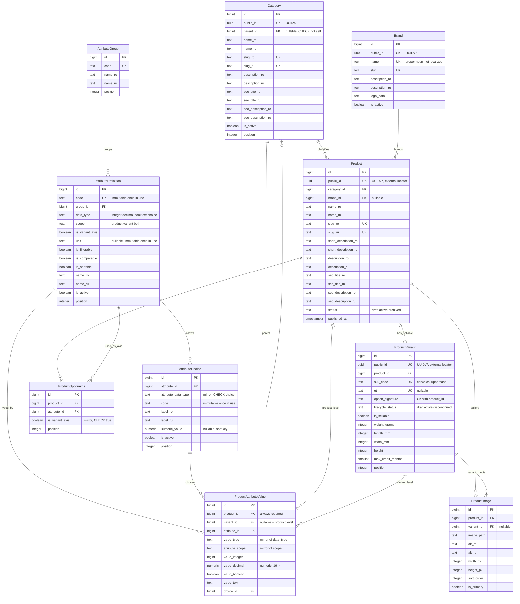
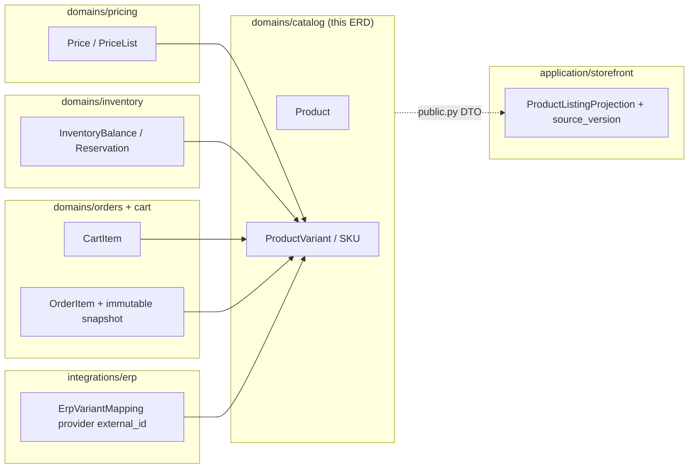

# ERD — Catalog: Product / SKU / typed attributes

- **Scope:** `domains/catalog` only.
- **Architecture baseline:** v1.3 (frozen 2026-09-03), master `# 7. Товары, SKU и характеристики`.
- **Roadmap item:** Phase 0 — `ERD Product/SKU/typed attributes`.
- **Status: Frozen** (v1.0, 2026-09-03). Every decision in this document, including the
  supplementary decisions D-9…D-13 in §15, is frozen. Any change requires a new ADR.
- **Related ADRs:** [0001](../../adr/0001-product-vs-sku-sellable-unit.md), [0002](../../adr/0002-typed-eav-source-of-truth.md), [0003](../../adr/0003-catalog-boundary-vs-storefront-projection.md).

This document is a **logical schema contract**, not an implementation. No Django models, no
migrations. Phase 2 implements it; every constraint listed here must appear as a real DB
constraint or index, and every invariant that PostgreSQL cannot enforce is listed in §10 with a
named enforcement owner.

**Convention:** every table carries `created_at timestamptz NOT NULL` and
`updated_at timestamptz NOT NULL`. These are omitted from the diagram and from the per-table
column tables to avoid noise; they are part of the contract.

---

## 1. Entities in scope

| Entity | Role |
|---|---|
| `Category` | Taxonomy node. Marketing/navigation. |
| `Brand` | Manufacturer/brand reference. |
| `Product` | Marketing entity. **Never sellable.** |
| `ProductVariant` | The SKU. **The only sellable unit.** |
| `ProductOptionAxis` | Declares which attributes form the variants of a product. |
| `AttributeGroup` | Presentation grouping of attribute definitions. |
| `AttributeDefinition` | Typed attribute contract (`data_type`, `scope`, `is_variant_axis`). |
| `AttributeChoice` | Allowed value of a `choice` attribute. |
| `ProductAttributeValue` | Typed EAV value, product-level or variant-level. |
| `ProductImage` | Product/variant media. |

Explicitly **out of scope** (external domain boundaries, §9): price, stock, reservations,
cart, order, storefront listing projection, ERP identifiers, reviews, promotions.

---

## 2. Diagram



---

## 3. Identity: internal PKs, public locators, contract identifiers

Three kinds of boundary, three rules. Which identifier is correct depends on **which boundary it
crosses**, not on the transport: a user/public locator boundary (§3.1), an external
machine-to-machine contract (§3.2), or a purely internal one (§3.3).

### 3.1. User/public locator boundaries — `PublicId` (UUIDv7) or a signed token

Boundaries where a human-reachable object locator is exposed:

| Boundary | Identifier |
|---|---|
| Storefront URLs and slugs | `slug_ro`/`slug_ru`, or `public_id` |
| Public HTTP API resource locators / DRF payloads | `public_id` |
| Email links, QR links, Track & Trace | `public_id` or a purpose-bound signed public token |

### 3.2. External machine-to-machine boundaries — an explicitly defined stable contract identifier

ERP/CRM/payment/vendor integrations do **not** all speak `public_id`. Each integration contract
names its own stable identifier, and that choice is documented in the adapter's contract:

| Allowed contract identifier | Typical use |
|---|---|
| `public_id` | when the vendor needs our opaque object locator |
| `sku_code` | catalog/price/stock exchange keyed on the business SKU code |
| `gtin` | marketplace/feed exchange keyed on the global trade item number |
| provider `external_id` | ERP/1C item key, held in `ErpVariantMapping(provider, external_id, variant_id)` |
| provider order/payment identifier | payment and fulfilment callbacks |
| another provider-specific stable identifier | as documented by that integration contract |

`integrations/*` is the anti-corruption boundary: it translates between the external identifier and
the internal `bigint` id, and it is the only place that holds the mapping.
`ErpVariantMapping` is not required to expose `ProductVariant.public_id` — it does so only if that
provider's contract actually needs it.

**Hard rule:** the internal `bigint` PK must never be exposed *as* an external contract identifier.
An integration may not simply serialize our PK and call it the key; it must name a stable contract
identifier from the list above.

### 3.3. Internal boundaries — `bigint` PKs are permitted

Strictly inside the monolith, where both producer and consumer are our own code and deploy
together:

- internal Outbox event payloads;
- projection rebuild jobs (`application/storefront`);
- internal Celery task payloads and batch job arguments.

Using `bigint` here is deliberate: narrower rows, cheaper joins on rebuild, smaller queue payloads.

**Hard rule:** an internal `bigint` id must never leave the monolith as an identifier of record. If
an internal event is forwarded to a public API, a user-facing link, a vendor or an analytics
export, the adapter in `interfaces/` or `integrations/` translates it first — to `public_id` on a
user/public locator boundary (§3.1), or to that contract's declared stable identifier on a
machine-to-machine boundary (§3.2). An Outbox event that is *by design* delivered to an external
party is an external contract and carries the contract's identifier, not the internal PK.

### 3.4. Public identifier columns

| Rule | Enforcement |
|---|---|
| Every externally addressable row carries `public_id uuid NOT NULL UNIQUE`, generated as UUIDv7 by `core` `PublicId`. | DB: `NOT NULL` + `UNIQUE`. UUID **version** is app-enforced (`core.PublicId`), not DB-enforced (I-3). |
| `Product.public_id` and `ProductVariant.public_id` are the catalog locators used on user/public boundaries (§3.1). Machine-to-machine contracts may instead use `sku_code`, `gtin` or a provider key (§3.2). | ADR-0001. |
| `Category.public_id`, `Brand.public_id` exist for API/event stability; navigation URLs use slugs. | DB `UNIQUE`. |
| `AttributeGroup`, `AttributeDefinition`, `AttributeChoice`, `ProductOptionAxis`, `ProductAttributeValue`, `ProductImage` have **no** `public_id` (D-11). They are addressed by stable `code` (attributes/choices) or embedded in DTOs. | Deliberate; avoids unused columns. |

### 3.5. Business keys on `ProductVariant`

```sql
sku_code text NOT NULL,
CONSTRAINT product_variant_sku_code_key UNIQUE (sku_code),
CONSTRAINT product_variant_sku_code_canonical
    CHECK (sku_code <> '' AND length(sku_code) <= 64 AND sku_code = upper(sku_code)),

gtin text NULL,
CONSTRAINT product_variant_gtin_key UNIQUE (gtin),   -- multiple NULLs allowed by PostgreSQL
CONSTRAINT product_variant_gtin_format
    CHECK (gtin IS NULL OR gtin ~ '^([0-9]{8}|[0-9]{12,14})$'),
```

The `upper()` CHECK removes case-duplicate SKUs (`abc123` vs `ABC123`) at the DB level instead of
trusting importers.

**No ERP/1C identifier lives in this schema.** See §9 and ADR-0003.

---

## 4. Product vs ProductVariant

`Product` holds marketing data only: taxonomy, localized copy, SEO, gallery.
`ProductVariant` is the SKU: the sellable unit.

**Frozen reference rule.** A relationship whose semantics require a concrete sellable unit **MUST**
reference `ProductVariant`/SKU. A variant-independent relationship **MAY** intentionally reference
`Product`.

| Requires SKU | May reference `Product` |
|---|---|
| `Price` | `Review` |
| `InventoryBalance` | `Favorite` |
| `Reservation` | `RelatedProduct` |
| `CartItem` | CMS merchandising |
| `OrderItem` | product-wide promotion targeting |
| fulfilment/shipment line where the concrete SKU matters | |

The invariant: **`Product` must never substitute for `ProductVariant` where concrete price, stock,
reservation, cart, order or fulfilment semantics require a SKU.** A `Product` reference is a defect
only when the relationship carries one of those semantics.

`Product` carries **no** price column, **no** stock column, **no** availability flag.

```sql
-- Product
category_id  bigint NOT NULL REFERENCES category(id)
                 ON DELETE RESTRICT ON UPDATE RESTRICT,
brand_id     bigint NULL REFERENCES brand(id)
                 ON DELETE RESTRICT ON UPDATE RESTRICT,
status       text NOT NULL CHECK (status IN ('draft','active','archived')),
published_at timestamptz NULL,
CONSTRAINT product_published_when_active
    CHECK (status <> 'active' OR published_at IS NOT NULL),
```

```sql
-- ProductVariant
product_id       bigint NOT NULL REFERENCES product(id)
                     ON DELETE RESTRICT ON UPDATE RESTRICT,
lifecycle_status text NOT NULL
                     CHECK (lifecycle_status IN ('draft','active','discontinued')),
is_sellable      boolean NOT NULL DEFAULT false,
CONSTRAINT product_variant_sellable_requires_active
    CHECK (is_sellable = false OR lifecycle_status = 'active'),
weight_grams     integer NULL CHECK (weight_grams IS NULL OR weight_grams > 0),
length_mm        integer NULL CHECK (length_mm IS NULL OR length_mm > 0),
width_mm         integer NULL CHECK (width_mm  IS NULL OR width_mm  > 0),
height_mm        integer NULL CHECK (height_mm IS NULL OR height_mm > 0),
max_credit_months smallint NULL
                     CHECK (max_credit_months IS NULL OR max_credit_months BETWEEN 0 AND 60),

-- required by the composite FKs in §6 and §8
CONSTRAINT product_variant_id_product_key UNIQUE (id, product_id),
```

A second sellability rule spans two tables — `is_sellable = true` requires the parent
`Product.status = 'active'`. PostgreSQL cannot express it as a CHECK, and MVP does not introduce a
trigger for it; it is invariant **I-9** in §10.

Dimensions and weight are integers in millimetres/grams — no float anywhere in the schema.

---

## 5. Attribute contract

### 5.1. `AttributeDefinition`

```sql
code         text NOT NULL UNIQUE CHECK (code ~ '^[a-z][a-z0-9_]{0,62}$'),
group_id     bigint NOT NULL REFERENCES attribute_group(id)
                 ON DELETE RESTRICT ON UPDATE RESTRICT,
data_type    text NOT NULL
                 CHECK (data_type IN ('integer','decimal','bool','text','choice')),
scope        text NOT NULL CHECK (scope IN ('product','variant','both')),
is_variant_axis boolean NOT NULL DEFAULT false,
unit         text NULL,
is_filterable   boolean NOT NULL DEFAULT false,
is_comparable   boolean NOT NULL DEFAULT false,
is_sortable     boolean NOT NULL DEFAULT false,
is_active       boolean NOT NULL DEFAULT true,

-- D-9: a variant axis is always a closed choice list owned by the variant level
CONSTRAINT attribute_definition_axis_shape
    CHECK (is_variant_axis = false
           OR (data_type = 'choice' AND scope = 'variant')),

-- targets for the mirrored composite FKs used by AttributeChoice / ProductAttributeValue /
-- ProductOptionAxis. PostgreSQL requires a UNIQUE constraint on exactly the referenced
-- column list, so all three are declared even though `id` alone is already unique.
CONSTRAINT attribute_definition_id_type_key       UNIQUE (id, data_type),
CONSTRAINT attribute_definition_id_type_scope_key UNIQUE (id, data_type, scope),
CONSTRAINT attribute_definition_id_axis_key       UNIQUE (id, is_variant_axis),
```

`scope` semantics (ADR-0002):

| `scope` | Where a value may exist | Inheritance |
|---|---|---|
| `product` | Product level only (`variant_id IS NULL`). | Applies to all variants. |
| `variant` | Variant level only (`variant_id IS NOT NULL`). | None. |
| `both` | Either level. | Product row is the **default**; variant row **overrides** it. |

Effective value for `scope='both'` is `variant explicit value ?? product default value`, resolved
in the catalog domain at read time. It is not materialized in this schema.

Because `is_variant_axis = true` forces `scope = 'variant'`, and constraint (6) in §6 forbids
`variant_id IS NULL` for `scope='variant'`, **a variant-axis attribute can never be stored at
product level and therefore can never be inherited.** This is DB-enforced, not documentation.

### 5.2. `AttributeChoice` — bound to `choice` attributes only

A choice list is meaningless for an `integer`/`decimal`/`bool`/`text` attribute. The same mirrored
composite-FK technique used for values (§6) makes such a row impossible to insert:

```sql
CREATE TABLE attribute_choice (
    id            bigint GENERATED BY DEFAULT AS IDENTITY PRIMARY KEY,
    attribute_id  bigint NOT NULL,

    -- mirrored copy of attribute_definition.data_type
    attribute_data_type text NOT NULL,

    code          text NOT NULL CHECK (code ~ '^[a-z0-9][a-z0-9_.-]{0,62}$'),
    label_ro      text NOT NULL,
    label_ru      text NOT NULL,
    numeric_value numeric(16,4) NULL,   -- sort key: 128 GB < 256 GB, 6.1" < 6.7"
    is_active     boolean NOT NULL DEFAULT true,
    position      integer NOT NULL DEFAULT 0,

    -- a choice may only exist for a choice-typed definition
    CONSTRAINT attribute_choice_only_for_choice_type
        CHECK (attribute_data_type = 'choice'),

    -- and the mirrored type must equal the definition's real type.
    -- ON UPDATE RESTRICT: an attribute that already has choices cannot be retyped.
    CONSTRAINT attribute_choice_attribute_type_fk
        FOREIGN KEY (attribute_id, attribute_data_type)
        REFERENCES attribute_definition (id, data_type)
        ON DELETE RESTRICT ON UPDATE RESTRICT,

    CONSTRAINT attribute_choice_attr_code_key UNIQUE (attribute_id, code),
    -- target for the composite FK in §6
    CONSTRAINT attribute_choice_id_attr_key   UNIQUE (id, attribute_id)
);
```

`numeric_value` gives ordering and range presentation for discrete axes without turning the axis
into a numeric attribute.

### 5.3. Decimal precision

All decimal attribute values use **`numeric(16,4)`**:

- 4 fractional digits cover unit conversions and real spec values (`6.3` in, `0.2210` kg,
  `71.6` mm, `1.5` GHz) with room for one conversion step without accumulating error;
- 12 integral digits exceed any physical/technical specification by a wide margin;
- fixed-point, so comparison, dedup and facet bucketing are exact and stable;
- **`float`/`double precision` is prohibited anywhere in this schema**;
- this type is **never** used for money. Money lives in `domains/pricing` as integer minor units
  (`Money(minor, currency)`), outside this ERD.

`AttributeChoice.numeric_value` uses the same type for consistency.

### 5.4. Immutable attribute identifiers and semantics

`option_signature` (§7) is composed of `AttributeDefinition.code` and `AttributeChoice.code`, and
every stored `value_integer`/`value_decimal` is meaningful only relative to
`AttributeDefinition.unit`. A casual admin `UPDATE` of any of these silently invalidates data that
already exists. Therefore, **once an `AttributeDefinition` is referenced by any
`ProductAttributeValue` or `ProductOptionAxis` row**:

| Field | Rule |
|---|---|
| `AttributeDefinition.code` | Immutable. A rename is a new definition plus a controlled data migration. |
| `AttributeDefinition.unit` | Immutable without a controlled value migration that rewrites every stored `value_integer`/`value_decimal` and every `AttributeChoice.numeric_value` in the same transaction. |
| `AttributeChoice.code` | Immutable. Retiring a choice is `is_active = false`, not a rename. |
| `AttributeDefinition.data_type`, `scope`, `is_variant_axis` | **DB-enforced immutable while in use** — the `ON UPDATE RESTRICT` composite FKs in §5.2, §6 and §7 reject the update (D-12). |

The first three are **domain-service enforced**, not DB-enforced (invariants I-7 and I-8 in §10):
PostgreSQL has no cheap way to say "this column is immutable once another table references the
row" without a trigger, and MVP does not introduce triggers here. Enforcement is the catalog
domain service plus admin-layer read-only fields plus an integrity test. Labels
(`name_ro/ru`, `label_ro/ru`) are freely editable — they carry no structural meaning.

---

## 6. `ProductAttributeValue` — enforceable typed EAV

The type contract cannot be expressed as a plain CHECK, because a CHECK cannot read
`AttributeDefinition.data_type` from another table. The schema therefore **mirrors** the two
governing columns into the value row and locks them with composite foreign keys. The CHECKs are
then purely local and fully enforceable.

```sql
CREATE TABLE product_attribute_value (
    id              bigint GENERATED BY DEFAULT AS IDENTITY PRIMARY KEY,

    product_id      bigint NOT NULL,
    variant_id      bigint NULL,
    attribute_id    bigint NOT NULL,

    -- mirrored copies of attribute_definition.data_type / .scope
    value_type      text NOT NULL,
    attribute_scope text NOT NULL,

    value_integer   bigint        NULL,
    value_decimal   numeric(16,4) NULL,
    value_boolean   boolean       NULL,
    value_text      text          NULL,
    choice_id       bigint        NULL,

    -- (1) product always exists
    CONSTRAINT pav_product_fk
        FOREIGN KEY (product_id) REFERENCES product(id)
        ON DELETE RESTRICT ON UPDATE RESTRICT,

    -- (2) if a variant is named, it MUST belong to this very product.
    --     MATCH SIMPLE (PostgreSQL default): skipped entirely when variant_id IS NULL.
    CONSTRAINT pav_variant_of_same_product_fk
        FOREIGN KEY (variant_id, product_id)
        REFERENCES product_variant (id, product_id) MATCH SIMPLE
        ON DELETE RESTRICT ON UPDATE RESTRICT,

    -- (3) the mirrored type/scope must equal the definition's.
    --     ON UPDATE RESTRICT: the data_type or scope of an attribute that is already
    --     in use cannot be changed silently.
    CONSTRAINT pav_attribute_type_scope_fk
        FOREIGN KEY (attribute_id, value_type, attribute_scope)
        REFERENCES attribute_definition (id, data_type, scope)
        ON DELETE RESTRICT ON UPDATE RESTRICT,

    -- (4) a choice must belong to the same attribute. MATCH SIMPLE: skipped when NULL.
    CONSTRAINT pav_choice_of_same_attribute_fk
        FOREIGN KEY (choice_id, attribute_id)
        REFERENCES attribute_choice (id, attribute_id) MATCH SIMPLE
        ON DELETE RESTRICT ON UPDATE RESTRICT,

    -- (5) exactly one value column, matching the mirrored type
    CONSTRAINT pav_exactly_one_typed_value CHECK (
        CASE value_type
            WHEN 'integer' THEN value_integer IS NOT NULL AND value_decimal IS NULL
                                AND value_boolean IS NULL AND value_text IS NULL
                                AND choice_id IS NULL
            WHEN 'decimal' THEN value_decimal IS NOT NULL AND value_integer IS NULL
                                AND value_boolean IS NULL AND value_text IS NULL
                                AND choice_id IS NULL
            WHEN 'bool'    THEN value_boolean IS NOT NULL AND value_integer IS NULL
                                AND value_decimal IS NULL AND value_text IS NULL
                                AND choice_id IS NULL
            WHEN 'text'    THEN value_text IS NOT NULL AND value_text <> ''
                                AND value_integer IS NULL AND value_decimal IS NULL
                                AND value_boolean IS NULL AND choice_id IS NULL
            WHEN 'choice'  THEN choice_id IS NOT NULL AND value_integer IS NULL
                                AND value_decimal IS NULL AND value_boolean IS NULL
                                AND value_text IS NULL
            ELSE false
        END
    ),

    -- (6) the owner level must match the attribute's scope
    CONSTRAINT pav_owner_level_matches_scope CHECK (
        (attribute_scope = 'product' AND variant_id IS NULL)
     OR (attribute_scope = 'variant' AND variant_id IS NOT NULL)
     OR (attribute_scope = 'both')
    )
);
```

### 6.1. One value per attribute per owner

`UNIQUE (product_id, variant_id, attribute_id)` would **not** work: in PostgreSQL two rows with
`variant_id IS NULL` never conflict, so product-level duplicates would slip through. Two partial
unique indexes are used instead:

```sql
CREATE UNIQUE INDEX pav_product_level_uniq
    ON product_attribute_value (product_id, attribute_id)
    WHERE variant_id IS NULL;

CREATE UNIQUE INDEX pav_variant_level_uniq
    ON product_attribute_value (variant_id, attribute_id)
    WHERE variant_id IS NOT NULL;
```

MVP rule: **one `AttributeDefinition` has at most one value per owner.** Multi-valued attributes
are explicitly **deferred** (ADR-0002) and would require a new ADR plus replacement of both
indexes.

---

## 7. Variant options and `option_signature`

Option values are **not** stored in a parallel structure. They are ordinary typed attribute values
on the variant (`ProductAttributeValue` with `attribute_scope='variant'`). `ProductOptionAxis` only
declares *which* attributes act as axes for a given product.

```sql
CREATE TABLE product_option_axis (
    id           bigint GENERATED BY DEFAULT AS IDENTITY PRIMARY KEY,
    product_id   bigint NOT NULL REFERENCES product(id)
                     ON DELETE RESTRICT ON UPDATE RESTRICT,
    attribute_id bigint NOT NULL,

    -- mirrored copy; the CHECK + composite FK make a non-axis attribute unusable here
    is_variant_axis boolean NOT NULL DEFAULT true
                        CHECK (is_variant_axis),
    position     integer NOT NULL,

    CONSTRAINT poa_attribute_is_axis_fk
        FOREIGN KEY (attribute_id, is_variant_axis)
        REFERENCES attribute_definition (id, is_variant_axis)
        ON DELETE RESTRICT ON UPDATE RESTRICT,

    CONSTRAINT poa_product_attribute_key UNIQUE (product_id, attribute_id),
    CONSTRAINT poa_product_position_key  UNIQUE (product_id, position)
);
```

### 7.1. Signature

```sql
-- on product_variant
option_signature text NOT NULL
    CHECK (option_signature <> '' AND length(option_signature) <= 512),

CONSTRAINT product_variant_option_signature_key UNIQUE (product_id, option_signature),
```

Canonical format — segments ordered by `ProductOptionAxis.position`, then `attribute_id`:

```
<attribute.code>=<choice.code>;<attribute.code>=<choice.code>
color=black;storage=256gb
```

- Because every axis is `data_type='choice'` (D-9), the normalized token is always the stable
  `AttributeChoice.code`. There is no locale, float or free-text normalization to get wrong.
- The codes it is built from are immutable while in use (§5.4), so a signature cannot silently
  drift out of sync with its source values through a rename.
- A product with **no** declared axes uses the sentinel `-`. Combined with
  `UNIQUE (product_id, option_signature)` this means such a product can hold **exactly one**
  variant, which is the correct semantics: without axes there is nothing to vary (D-10).
- The signature is **derived and immutable while the product's axis set is unchanged**. It is
  written by the catalog domain when a variant is created or its option values change, and is
  rebuilt wholesale by a controlled procedure when `ProductOptionAxis` rows change for a product.
- The signature is a denormalized cache. The DB guarantees *uniqueness of the signature*; the
  domain guarantees *the signature matches the stored option values* (I-2).

---

## 8. Images

```sql
CREATE TABLE product_image (
    id         bigint GENERATED BY DEFAULT AS IDENTITY PRIMARY KEY,
    product_id bigint NOT NULL REFERENCES product(id)
                   ON DELETE RESTRICT ON UPDATE RESTRICT,
    variant_id bigint NULL,
    image_path text NOT NULL CHECK (image_path <> ''),
    alt_ro     text NOT NULL DEFAULT '',
    alt_ru     text NOT NULL DEFAULT '',
    width_px   integer NULL CHECK (width_px  IS NULL OR width_px  > 0),
    height_px  integer NULL CHECK (height_px IS NULL OR height_px > 0),
    sort_order integer NOT NULL DEFAULT 0,
    is_primary boolean NOT NULL DEFAULT false,

    -- a variant image must belong to the same product (MATCH SIMPLE, skipped when NULL)
    CONSTRAINT product_image_variant_of_same_product_fk
        FOREIGN KEY (variant_id, product_id)
        REFERENCES product_variant (id, product_id) MATCH SIMPLE
        ON DELETE RESTRICT ON UPDATE RESTRICT
);

CREATE UNIQUE INDEX product_one_primary
    ON product_image (product_id)
    WHERE is_primary AND variant_id IS NULL;

CREATE UNIQUE INDEX variant_one_primary
    ON product_image (variant_id)
    WHERE is_primary AND variant_id IS NOT NULL;
```

`width_px`/`height_px` are stored so the storefront can emit fixed aspect boxes and avoid layout
shift; they are not filtering data. The storefront listing never loads this table — it reads a
denormalized `primary_image_path` from its own projection (§9).

---

## 9. External domain boundaries

None of the following exist in the catalog schema. They are shown only to make the reference
direction explicit.



| External concern | Owner | Rule |
|---|---|---|
| Price, price lists, discounts | `domains/pricing` | References SKU. Catalog has no money column. |
| Stock, reservations | `domains/inventory` | References SKU. Catalog has no stock/availability column. |
| Cart/Order lines | `domains/*` via `application/checkout` | Reference SKU, plus immutable commercial snapshot on the order. |
| `ProductListingProjection`, `facet_choice_ids`, promoted `attr_*` columns, `source_version` | `application/storefront` | Built from catalog `public.py` DTOs. **No `source_version` column exists on `Product` or `ProductVariant`** (ADR-0003). |
| ERP/1C identity | `integrations/erp` — `ErpVariantMapping(provider, external_id, variant_id)` | **No `erp_id` / `1c_id` / `external_1c_id` in catalog** (ADR-0003). |
| Reviews, ratings | `domains/reviews` | References `Product` deliberately — a review is variant-independent (§4). Aggregates land in the storefront projection, not here. |
| Favorites, comparison | `domains/accounts` | Reference `Product`; variant-independent (§4). |

EAV is the source of truth for admin, validation, comparison and import/export. It is **not** the
hot filtering path: the storefront filters an array/typed-column projection, never a self-join
over `product_attribute_value` (master `# 7.2`).

---

## 10. Invariants NOT enforced by the database

Listed so Phase 2 covers them with domain services and tests instead of assuming the DB does it.
MVP deliberately introduces **no triggers** for any of these.

| # | Invariant | Enforcement owner |
|---|---|---|
| I-1 | Every sellable variant has an explicit value for **every** declared `ProductOptionAxis` of its product. | Catalog domain service on write + `catalog_consistency` integrity test/management command. |
| I-2 | `option_signature` actually matches the variant's stored option values. | Same writer path; rebuild procedure + integrity test. DB guarantees uniqueness only. |
| I-3 | `public_id` is UUID **version 7** (DB stores plain `uuid`). | `core.PublicId` factory + unit test. |
| I-4 | Attribute values are within a category-appropriate set (an attribute meaningful for phones is not attached to a fridge). | Deferred (D-13): category↔attribute applicability is not modelled. Needs a new ADR if required. |
| I-5 | `unit` is consistent with `data_type` (a `bool` attribute has no unit). | Domain validation; low value as a DB constraint. |
| I-6 | The internal `bigint` PK is never exposed as an identifier of record on a user/public locator boundary (§3.1) or as an external contract identifier on a machine-to-machine boundary (§3.2). | Serializer/route/API tests for public HTTP identifiers; webhook/integration contract tests for external machine identifiers; typed `PublicId` DTOs to reduce accidental id confusion; optional targeted AST/static checks. `import-linter` governs module dependencies, **not** payload contents. |
| I-7 | `AttributeDefinition.code` and `AttributeChoice.code` are immutable once referenced by `ProductAttributeValue` or `ProductOptionAxis` (§5.4). | Catalog domain service + admin read-only fields + integrity test. A rename is a new definition plus a controlled data migration. |
| I-8 | `AttributeDefinition.unit` is immutable unless a controlled migration rewrites every dependent `value_integer`/`value_decimal`/`numeric_value` in the same transaction (§5.4). | Catalog domain service + admin read-only field + explicit migration procedure. |
| I-9 | `ProductVariant.is_sellable = true` requires the parent `Product.status = 'active'`. | Catalog domain service on write (both directions: publishing/archiving a product and flipping a variant) + consistency/integrity test in Phase 2. |
| I-10 | The `Category` hierarchy is acyclic — no indirect `A → B → … → A` cycle. Direct self-parenting is DB-blocked (§11). | Catalog category service + integrity/consistency test in Phase 2. |

---

## 11. Deletion, tree integrity and referential policy

Products and variants are **not hard-deleted** in normal business flow. Withdrawal is expressed as
`Product.status='archived'`, `ProductVariant.lifecycle_status='discontinued'`, `is_sellable=false`.
Historical commercial references (order lines, payments, invoices) must never break.

`Category` self-parenting is blocked directly:

```sql
CONSTRAINT category_parent_not_self
    CHECK (parent_id IS NULL OR parent_id <> id),
```

Longer cycles are invariant **I-10** — service-enforced, no trigger in MVP.

Every foreign key in this schema is `ON DELETE RESTRICT ON UPDATE RESTRICT`:

| Child | Parent | ON DELETE | ON UPDATE | Note |
|---|---|---|---|---|
| `Category.parent_id` | `Category.id` | RESTRICT | RESTRICT | Plus `category_parent_not_self` CHECK. |
| `Product.category_id` | `Category.id` | RESTRICT | RESTRICT | |
| `Product.brand_id` (nullable) | `Brand.id` | RESTRICT | RESTRICT | Brands are deactivated, not deleted; no `SET NULL` — it would silently rewrite catalog data. |
| `ProductVariant.product_id` | `Product.id` | RESTRICT | RESTRICT | |
| `ProductOptionAxis.product_id` | `Product.id` | RESTRICT | RESTRICT | |
| `ProductOptionAxis.(attribute_id, is_variant_axis)` | `AttributeDefinition.(id, is_variant_axis)` | RESTRICT | RESTRICT | Flipping `is_variant_axis` on an attribute in use is blocked. |
| `AttributeDefinition.group_id` | `AttributeGroup.id` | RESTRICT | RESTRICT | |
| `AttributeChoice.(attribute_id, attribute_data_type)` | `AttributeDefinition.(id, data_type)` | RESTRICT | RESTRICT | Also blocks retyping an attribute that already has choices. |
| `ProductAttributeValue.product_id` | `Product.id` | RESTRICT | RESTRICT | |
| `ProductAttributeValue.(variant_id, product_id)` | `ProductVariant.(id, product_id)` | RESTRICT | RESTRICT | MATCH SIMPLE. |
| `ProductAttributeValue.(attribute_id, value_type, attribute_scope)` | `AttributeDefinition.(id, data_type, scope)` | RESTRICT | RESTRICT | Blocks retyping/rescoping an attribute that has values. |
| `ProductAttributeValue.(choice_id, attribute_id)` | `AttributeChoice.(id, attribute_id)` | RESTRICT | RESTRICT | MATCH SIMPLE. |
| `ProductImage.product_id` | `Product.id` | RESTRICT | RESTRICT | |
| `ProductImage.(variant_id, product_id)` | `ProductVariant.(id, product_id)` | RESTRICT | RESTRICT | MATCH SIMPLE. |

No `CASCADE` anywhere. Admin-side removal of a genuinely unused draft product is an explicit
administrative operation that must delete children first, which is exactly the friction we want.

External domains (`pricing`, `inventory`, `orders`) hold their own references to
`ProductVariant`; those are declared in their own schemas and follow the same no-hard-delete rule.

---

## 12. Indexes

Only indexes with a named, present-tense purpose. Storefront filtering/facet indexes are **not**
here — they belong to `ProductListingProjection` (ADR-0003).

| Index | Purpose |
|---|---|
| PK on every table | Identity. |
| `UNIQUE (public_id)` on `Category`, `Brand`, `Product`, `ProductVariant` | External locator lookup. |
| `UNIQUE (slug_ro)`, `UNIQUE (slug_ru)` on `Category`, `Product`; `UNIQUE (slug)` on `Brand` | Per-language URL routing. |
| `UNIQUE (sku_code)`, `UNIQUE (gtin)` on `ProductVariant` | Business keys, import dedup. |
| `UNIQUE (product_id, option_signature)` on `ProductVariant` | Option-combination uniqueness; its `product_id` prefix also serves "variants of a product". |
| `UNIQUE (id, product_id)` on `ProductVariant` | Composite-FK target (§6, §8). |
| `UNIQUE (id, data_type)`, `UNIQUE (id, data_type, scope)`, `UNIQUE (id, is_variant_axis)` on `AttributeDefinition` | Composite-FK targets for `AttributeChoice` (§5.2), `ProductAttributeValue` (§6) and `ProductOptionAxis` (§7). PostgreSQL requires a unique constraint matching each referenced column list exactly. |
| `UNIQUE (code)` on `AttributeGroup`, `AttributeDefinition` | Stable external attribute contract. |
| `UNIQUE (attribute_id, code)` on `AttributeChoice` | Choice contract; prefix serves ordered choice listing. |
| `UNIQUE (id, attribute_id)` on `AttributeChoice` | Composite-FK target (§6). |
| `UNIQUE (product_id, attribute_id)`, `UNIQUE (product_id, position)` on `ProductOptionAxis` | Axis declaration integrity + ordering. |
| `pav_product_level_uniq`, `pav_variant_level_uniq` (partial) | One value per attribute per owner (§6.1); also the access path by owner. |
| `btree (attribute_id)` on `ProductAttributeValue` | Reverse lookup for admin/export, and the FK-check path for `RESTRICT` on `AttributeDefinition`. |
| `btree (choice_id) WHERE choice_id IS NOT NULL` on `ProductAttributeValue` | FK-check path for `RESTRICT` on `AttributeChoice`; without it, deactivating/deleting a choice sequentially scans the largest table. |
| `btree (product_id, sort_order)` on `ProductImage` | Ordered gallery fetch for the product page. |
| `btree (variant_id) WHERE variant_id IS NOT NULL` on `ProductImage` | Variant media fetch + FK-check path. |
| `product_one_primary`, `variant_one_primary` (partial unique) | One primary image per level (§8). |
| `btree (category_id)`, `btree (brand_id) WHERE brand_id IS NOT NULL` on `Product` | FK-check path for `RESTRICT`; admin filtering. Storefront does **not** use these. |
| `btree (parent_id)` on `Category` | Tree traversal + FK-check path. |

Deliberately **absent**: any index on `status`/`is_sellable`/`is_active` (low cardinality, no
measured hot query yet), any GIN/trigram index (search is not catalog's job in v1.3), any index
supporting facets.

---

## 13. Localization

Fixed RO/RU pair, physical localized columns. No translation side table, no runtime join. The
list below matches the entity definitions in §2 exactly.

| Entity | Localized columns |
|---|---|
| `Category` | `name_ro/ru`, `slug_ro/ru`, `description_ro/ru`, `seo_title_ro/ru`, `seo_description_ro/ru` |
| `Brand` | `description_ro/ru` (`name` is a proper noun and is not translated; a single `slug`) |
| `Product` | `name_ro/ru`, `slug_ro/ru`, `short_description_ro/ru`, `description_ro/ru`, `seo_title_ro/ru`, `seo_description_ro/ru` |
| `ProductVariant` | none — a variant is identified by its option values, whose labels are localized on `AttributeChoice` |
| `AttributeGroup` | `name_ro/ru` |
| `AttributeDefinition` | `name_ro/ru` |
| `AttributeChoice` | `label_ro/ru` |
| `ProductAttributeValue` | none — `value_text` is deliberately non-localized; a user-visible translatable attribute must be modelled as `choice` |
| `ProductImage` | `alt_ro/ru` |

`django-modeltranslation` may manage these columns in Phase 2, but that is an implementation
detail: the columns are the contract, and the storefront hot read path resolves language by column
name without any modeltranslation machinery (ADR-0003).

---

## 14. Acceptance checklist

| # | Criterion | Status |
|---|---|---|
| 1 | `Product` is never sellable. Every relationship carrying price, stock, reservation, cart, order or fulfilment semantics references `ProductVariant`; variant-independent relationships (review, favorite, related, CMS merchandising, product-wide promotion targeting) may reference `Product`. | ✅ §4, §9 |
| 2 | No price/money/stock/availability column in the catalog schema. | ✅ §4, §9 |
| 3 | No ERP/1C identifier in the catalog schema; provider keys live in `integrations/*`. | ✅ §3.2, §3.5, §9 |
| 4 | Typed-EAV type contract is enforceable in PostgreSQL (composite FK + local CHECK), not prose. | ✅ §6 |
| 5 | `AttributeChoice` cannot exist for a non-`choice` `AttributeDefinition`, enforced relationally. | ✅ §5.2 |
| 6 | Every composite-FK target has its exact `UNIQUE` constraint declared. | ✅ §4, §5.1, §5.2 |
| 7 | A variant-level attribute value cannot point at a variant of a different product. | ✅ §6 constraint (2) |
| 8 | Product-level duplicate attribute values are impossible despite NULL semantics. | ✅ §6.1 |
| 9 | Two variants of one product cannot share an option combination. | ✅ §7.1 |
| 10 | Variant-axis attributes cannot be inherited from product level. | ✅ §5.1 + §6 constraint (6) |
| 11 | `option_signature` cannot go stale through a casual rename of an attribute/choice code. | ✅ §5.4, I-7 |
| 12 | `unit` semantics cannot change silently under stored numeric values. | ✅ §5.4, I-8 |
| 13 | An archived product cannot legitimately expose a sellable variant. | ✅ §4 + I-9 (service-enforced, stated as such) |
| 14 | No `ProductListingProjection`, `facet_choice_ids`, promoted `attr_*` or `source_version` in catalog. | ✅ §9 |
| 15 | User/public locator boundaries use `public_id` or a signed token; machine-to-machine contracts use an explicitly declared stable identifier (`public_id`, `sku_code`, `gtin`, provider key); internal `bigint` PKs are permitted on internal events/jobs and are never exposed as an external contract identifier. | ✅ §3.1–§3.4, I-6 |
| 16 | RO/RU physical columns; the localization table and the §2 entity definitions agree column for column. | ✅ §2, §13 |
| 17 | Direct `Category` self-parenting is DB-blocked; indirect cycles have a named enforcement owner. | ✅ §11, I-10 |
| 18 | Hard delete cannot break historical commercial references; all `on_delete` policies enumerated. | ✅ §11 |
| 19 | Decimal precision fixed and justified; no float. | ✅ §5.3 |
| 20 | Every index has a stated purpose; no speculative facet/status indexes. | ✅ §12 |
| 21 | Invariants PostgreSQL cannot enforce are listed with a planned enforcement owner. | ✅ §10 |
| 22 | Multi-valued attributes explicitly deferred. | ✅ §6.1, ADR-0002 |

---

## 15. Supplementary frozen decisions (D-9 … D-13)

These were introduced by this ERD and are **frozen together with it**. Changing any of them
requires a new ADR.

- **D-9 — Frozen.** A variant axis must be `data_type='choice'` and `scope='variant'`. This makes
  `option_signature` normalization trivial and stable (choice codes), matches the discrete-facet
  model in master `# 7.2`, and is DB-enforced. Numeric ordering for axes such as storage is carried
  by `AttributeChoice.numeric_value`.
- **D-10 — Frozen.** `option_signature = '-'` for products without declared axes, which limits such
  a product to exactly one `ProductVariant`.
- **D-11 — Frozen.** Attribute, EAV, option-axis and image rows receive no `public_id`. They are
  internal structural rows addressed by `code` or embedded in DTOs. A `public_id` is added only if
  such a row later becomes independently externally addressable, which requires a new ADR.
- **D-12 — Frozen.** `ON UPDATE RESTRICT` on the mirrored composite FKs, so an attribute's
  `data_type`, `scope` or `is_variant_axis` cannot be changed while values, choices or axes exist.
- **D-13 — Frozen as deferred.** Category↔attribute applicability is not modelled (I-4). It is
  deferred, not forgotten; introducing it requires a new ADR.
