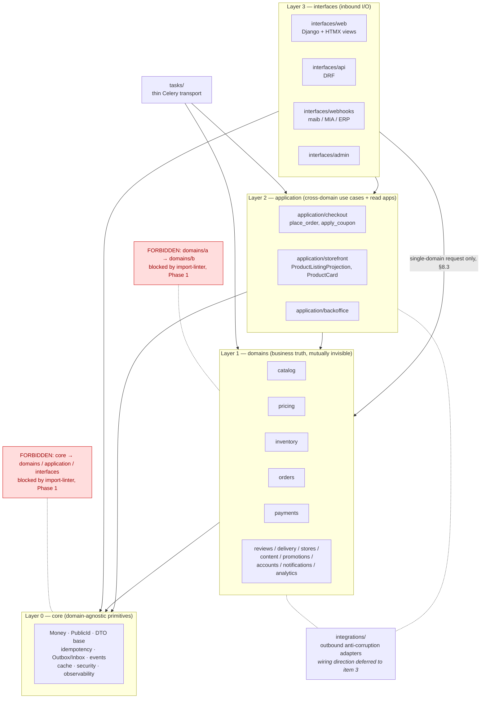

# Phase 0 — Item 2: The four architectural layers

- **Status:** Frozen
- **Date:** 2026-09-03
- **Phase:** 0 — Architecture Freeze
- **Decision record:** [ADR-0004](../../adr/0004-four-layer-modular-monolith.md)
- **Related:** [ADR-0001](../../adr/0001-product-vs-sku-sellable-unit.md),
  [ADR-0002](../../adr/0002-typed-eav-source-of-truth.md),
  [ADR-0003](../../adr/0003-catalog-boundary-vs-storefront-projection.md),
  master `# 3. Архитектура верхнего уровня`, `# 4. Структура проекта и машинно-проверяемые границы`

---

## 1. Purpose

This artifact freezes the **meaning and responsibility** of the four architectural layers
`core / domains / application / interfaces`, plus the architectural role of the two supporting
package families `integrations/` and `tasks/`.

It is deliberately written **before** any physical package is created (Phase 1) and before the
machine-checkable dependency matrix is written (Phase 0 item 3). The purpose is that when the
directories appear, there is no remaining argument about *what belongs where* — only about how to
express an already-decided rule in `import-linter`.

**What this artifact decides:** where a given piece of behaviour lives, who owns an invariant, who
owns a transaction, who owns provider protocol verification versus business interpretation, where
authorization splits, and which conceptual flows are legal.

**What this artifact does not decide:** the exact allowed-import matrix, the wiring/port direction
between `integrations/*` and the layers, `import-linter` contract syntax, `public.py` templates, the
internals of `place_order`, the fields of `ProductCard`, the event registry, the queue matrix,
`source_version` generation, or any directory on disk. Those are enumerated in §16.

---

## 2. Architectural model

The platform is a **structured modular monolith**: one deployment, one PostgreSQL, four layers with
one-directional dependencies. The monolith is the *target state* for the ACID core, not a temporary
compromise (master `# 4.5`).

The layering exists to buy two things at once:

1. **ACID** — checkout can stay one local transaction because orders, pricing, inventory and
   payments live in one database;
2. **Boundaries** — the code cannot decay into a distributed monolith, because a module's
   dependencies are visible, one-directional and CI-enforced.

The conceptual direction is:

```text
interfaces
    ↓
application
    ↓
domains
    ↓
core
```

This is the *direction* of dependency, not a rule that every call must pass through every layer.
A layer may depend on **any** layer below it. The precise, non-simplified statement:

| Rule | Statement |
|---|---|
| R1 | A layer may depend only on layers **below** it. Never upward, never sideways at the domain level. |
| R2 | A layer may **skip** a layer downward when it needs nothing from the skipped layer. `interfaces → domains` and `application → core` are legal. |
| R3 | `domains/*` are siblings and are **mutually invisible**. There is no legal domain→domain edge, not even through `public.py`. |
| R4 | Downward calls cross a **contract**, not an implementation: `<domain>.public` and immutable DTO/value objects. |
| R5 | `core` depends on nothing in this project except itself. |

R2 is the reason this document exists. "Interfaces must always go through application" is a
simplification that produces pointless pass-through modules and an `application/` layer that slowly
becomes a god-layer. See §8.3 for the exact rule.

---

## 3. Dependency diagram



The links to `integrations/` are drawn **undirected on purpose**. Item 2 freezes that the outbound
vendor boundary exists and what it may contain; whether an adapter is imported directly, injected
through a port, or reached only via a worker is **Phase 0 item 3**.

---

## 4. Responsibility table

| | **Layer 0 — core** | **Layer 1 — domains** | **Layer 2 — application** | **Layer 3 — interfaces** |
|---|---|---|---|---|
| **Question it answers** | "What primitive does every layer need?" | "What does this business concept *mean*, and what must always be true of it?" | "In what order, and under what workflow, are business capabilities combined?" | "How does the outside world reach a use case, and how is the answer rendered?" |
| **Owns** | Money/RoundingPolicy, PublicId/UUIDv7, DTO base primitives, idempotency infrastructure, Outbox/Inbox primitives, typed+versioned event infrastructure, cache helpers (single-flight, versioning), security primitives (signing, actor type, trusted IP), observability primitives | Business entities, DB-backed domain state, domain invariants, domain commands/services, domain selectors, **object-level policies and actor-scoped selectors for domain-owned state**, immutable DTO/value-object contracts, the future `public.py` boundary, domain-owned state machines | Cross-domain use cases, application-specific read models and projections, workflow/step sequencing, the transaction boundary of a cross-domain operation, application DTOs shared by web and API, **object-level policies and actor-scoped selectors for application-owned state (e.g. `CheckoutSession`)**, **composition of authorization decisions across owners** | Transport parsing and validation, **authentication**, credential / signed-token validation, **coarse endpoint-level permission**, actor/context construction, **provider protocol verification at an inbound webhook**, calling a use case or a domain public contract, mapping DTOs to HTML/JSON/HTTP status, HTTP caching/SEO concerns |
| **Knows about** | Nothing in this project but itself | Itself + `core` | Domain **public contracts** + `core` | `application` + domain **public contracts** + `core` |
| **Must never** | Import a domain, application, interface or any business module; contain a business rule | Import another domain (public or not); own a cross-domain workflow; expose ORM instances/QuerySets outward; know about a read model of another layer; contain vendor wire-protocol details | Own a domain invariant; reimplement a domain rule, including a domain's object-level authorization rule; hold ORM models of a domain; become a second home for single-domain logic | Own a business rule; orchestrate multiple domains; touch another domain's ORM; compute money, availability or eligibility; **decide object-level authorization by loading an ORM row and comparing ownership fields** |
| **Persistence** | Infrastructure tables only (idempotency, outbox, inbox) — no business tables | Its own OLTP tables — the business source of truth | Its own tables only when they are application-owned: `CheckoutSession`, `ProductListingProjection` | None |
| **Typical artifact** | `core/money.py`, `core/public_id.py`, `core/outbox/` | `domains/inventory/state_machine.py`, `domains/pricing/pipeline/` | `application/checkout/use_cases/place_order.py`, `application/storefront/selectors.py` | `interfaces/web/views/`, `interfaces/api/v1/`, `interfaces/webhooks/maib.py` |

---

## 5. Layer 0 — `core`

### 5.1 Definition

`core` holds cross-cutting primitives that **do not know any business domain**. It is the vocabulary
every other layer speaks: money, identity, events, idempotency, caching, security, observability.

Frozen scope (matching master `# 4`):

- `Money` + `RoundingPolicy` — integer minor units, never float;
- `PublicId` / UUIDv7 external locator type;
- base DTO / value-object primitives (frozen dataclass conventions);
- idempotency infrastructure (`IdempotencyKey` machinery, durable in PostgreSQL);
- Outbox / Inbox primitives (partitions, relay, dedupe key, trace metadata);
- typed, versioned event infrastructure (registry mechanism);
- cache helpers — single-flight, key versioning, stale fallback;
- security primitives — generic signing/HMAC and constant-time comparison, trusted-IP, `Actor` type;
- observability primitives — logging, tracing, metrics.

`core` provides the *mechanism* of signing and comparison. A **provider-specific** signature scheme
(maib's canonical string, MIA's header layout) is a vendor protocol detail and is not a `core`
primitive — see §9 and §10.3.

### 5.2 Freeze

`core` **MUST NOT** import:

- `domains/*`
- `application/*`
- `interfaces/*`
- any project-specific business module

### 5.3 The admission test — what qualifies for core

A helper belongs in `core` only if **all four** hold:

1. **Domain-independent** — it would be identical in a project that sells insurance instead of
   electronics. `Money` passes. `discount_for_loyalty_tier()` fails.
2. **No business and no vendor vocabulary** — its names, types and docstrings mention no
   catalog/pricing/order/payment/inventory concept and no vendor. If a name has to be genericised to
   fit (`process_entity`), it fails.
3. **Used by, or clearly usable by, more than one domain or layer** — a primitive used by exactly
   one domain belongs to that domain until a second consumer exists.
4. **Stable and mechanism-shaped, not policy-shaped** — it provides a *mechanism* (how to sign, how
   to cache, how to emit an event); the *policy* (what is signed, what is cached, which event) is
   the caller's.

If any test fails, the helper belongs to the domain (or to `application`, or to `integrations`) that
needed it, even at the cost of temporary duplication. Duplication is cheaper to undo than a `core`
that has learned what an order is.

**Anti-pattern guard.** `core` is not "utils". A module named `helpers.py`, `common.py` or
`utils.py` in `core` with mixed content is a review failure. The event *registry mechanism* is core;
the concrete event catalogue is defined against that mechanism and is frozen in a later Phase 0
item — this artifact does not decide the placement of individual event schemas.

---

## 6. Layer 1 — `domains`

### 6.1 Definition

A domain is a bounded piece of business truth with its own persistent state and its own invariants.
Frozen domain list (master `# 4`): `catalog`, `pricing`, `inventory`, `orders`, `payments`,
`reviews`, `delivery`, `stores`, `content`, `promotions`, `accounts`, `notifications`, `tradein`
(deferred feature, master `# 18`), and `analytics` when implemented.

A domain owns:

- business entities;
- DB-backed domain state (its OLTP tables);
- domain invariants and the constraints that enforce them;
- domain commands / services;
- domain selectors;
- policies — including **object-level authorization for its own state** and actor-scoped selectors (§11);
- immutable DTO / value-object contracts;
- its future `public.py` boundary.

### 6.2 Freeze

- A domain **MUST NOT** import another domain — not its internal modules, not its ORM models, and
  not its `public.py`. Domains are mutually invisible.
- A domain knows **itself** and **`core`** only.
- A domain **MUST NOT** expose ORM model instances or QuerySets across its boundary. What crosses is
  a frozen DTO or value object.
- A domain **MUST NOT** contain vendor wire-protocol details: vendor enums, vendor status strings,
  vendor error shapes, raw vendor payload structures or provider signature algorithms.
- Cross-domain workflow **does not** belong inside a domain merely because one domain looks like the
  "main" one. `place_order` is not `orders`' just because an Order comes out of it.

### 6.3 Why domain→domain is forbidden even through `public.py`

A `public.py` import would be *safe* in isolation and *fatal* in aggregate: it makes the dependency
graph a mesh instead of a DAG, allows import cycles (`pricing → inventory → pricing`), and hides
cross-domain workflows inside a domain where no one looks for them. The one-directional edge
`application → domains` is what keeps every cross-domain flow discoverable and every domain
independently testable (the Phase 2 DoD for catalog depends on exactly this).

The cost is real and accepted: some flows need an `application/` module that would otherwise have
been three lines in a domain service. §7.3 covers the case where that feels excessive.

### 6.4 Not frozen here

The detailed import-linter matrix — including how `domains/*` are permitted to reach
`integrations/*` and which `core` submodules are open to which layer — is **Phase 0 item 3**.

---

## 7. Layer 2 — `application`

### 7.1 Definition

`application` owns:

1. **use cases that coordinate more than one domain**, and
2. **application-specific read models** that no single domain can own.

Frozen homes (master `# 4.3`, `# 3`):

| Concern | Owner |
|---|---|
| Order placement | `application/checkout/use_cases/place_order.py` |
| Coupon application on a checkout session | `application/checkout/use_cases/apply_coupon.py` |
| `CheckoutSession` state (separate from `Order`) | `application/checkout` |
| Storefront listing read model, facets, `ProductCard` | `application/storefront` |
| Cross-domain administrative scenarios | `application/backoffice` |

Application may orchestrate several domain public contracts in one workflow. It calls domains only
through `<domain>.public`, and exchanges immutable DTO/value objects.

### 7.2 Freeze — application must not own domain invariants

Application decides **WHEN** domain capabilities are called and in what order.
Domains decide **WHAT** their own rules mean.

| Invariant | Owner — frozen | Application's role |
|---|---|---|
| Inventory reservation state transitions, atomicity, no read-then-decrement | `domains/inventory` | asks for a reservation, reacts to the result |
| Price computation, price-list resolution, rounding | `domains/pricing` | asks for a priced basket at a point in the workflow |
| Promotion eligibility and redemption limits | `domains/promotions` | asks whether a coupon applies, and when |
| Order state machine and immutable commercial snapshot | `domains/orders` | asks orders to create the order from the snapshot it assembled |
| Payment attempt state machine, legal transitions, amount/currency matching, duplicate-effect prevention | `domains/payments` | asks for a payment attempt; does not decide what `captured` means |
| Object-level authorization for a domain-owned object | that domain's policy | composes decisions across owners; owns the same rule for its **own** state, e.g. `CheckoutSession` (§11) |

If `application` starts *deciding* whether stock is sufficient, what a discount is worth, or when an
order may move to `paid`, the invariant has leaked out of its domain. That is the primary review
failure this layer is checked for.

### 7.3 Guard — application must not become a god-layer

`application` is for orchestration, not for "logic that was awkward to place". Three guards:

1. **Two-domain test.** A module in `application` that reaches exactly one domain and adds no
   workflow of its own is a pass-through and should be deleted; the interface calls the domain
   directly (§8.3). The exception is an application-owned read model or an application-owned entity
   (`ProductListingProjection`, `CheckoutSession`), which legitimately touches one domain today.
2. **No shared "services" module.** Cross-domain code is organised by *use case* under a named
   application (`checkout`, `storefront`, `backoffice`), never as `application/services.py`.
3. **No domain state.** `application` owns tables only for concepts it genuinely owns. It never
   holds a mirror of a domain entity.

### 7.4 Storefront read model — frozen placement

`ProductListingProjection` belongs to **`application/storefront`**, not `domains/catalog`.

It is a **disposable** read model, assembled from the public contracts of catalog, pricing,
inventory, reviews and promotions, and fully rebuildable from them. Catalog cannot own it, because
owning it would require catalog to know price, stock, rating and the version scheme of another
layer's read model — all four explicitly forbidden by
[ADR-0003](../../adr/0003-catalog-boundary-vs-storefront-projection.md).

Consequently, and consistent with ADR-0003: no `source_version` column on `Product` or
`ProductVariant`; no facet/GIN/promoted-attribute index on catalog tables.

The hot read path is frozen in shape (master `# 3`):

```text
canonical filters
      ↓
application/storefront  (FilterSpec + query-cost guard)
      ↓
ProductListingProjection
      ↓
list[ProductCard] / FacetResult DTO
      ├── interfaces/web → HTML partial → anonymous fragment cache
      └── interfaces/api → JSON
```

One selector, one DTO, two renderers. HTML fragment caching is a web-side optimisation; it must not
create a second query path.

**Not decided here:** the projection's schema, `ProductCard`'s fields, `source_version` generation
and the guarded upsert. Those are separate Phase 0 items.

---

## 8. Layer 3 — `interfaces`

### 8.1 Definition

`interfaces` are **inbound** I/O adapters: Django/HTMX web views, the DRF API, webhook endpoints,
the admin boundary, and CLI/management entry points.

An interface:

1. parses and validates transport input (query string, form, JSON body, raw webhook body, argv);
2. **authenticates** the caller — session, token, or signed guest token — and verifies inbound
   **provider protocol facts** where the caller is a vendor (§10.3);
3. enforces **coarse, endpoint-level** permission (is this endpoint open to anonymous / to an
   authenticated user / to staff at all);
4. constructs the actor/context and propagates the trace;
5. calls **one** application use case or **one** domain public contract;
6. maps returned DTOs to HTML / JSON / HTTP status / headers.

### 8.2 Freeze — no business rules in interfaces

Views, serializers, admin classes and webhook handlers **MUST NOT** become a service layer. In
particular an interface never: computes a price or a total; decides stock sufficiency; advances an
order or payment state machine; writes to more than one domain; or performs multi-domain ORM
orchestration.

Client-supplied totals, prices, IDs, ownership claims and callback statuses are **never** trusted;
validation and re-derivation happen below the interface.

### 8.3 When may an interface call a domain directly?

`interfaces → domains` is a **legal** edge (master `# 3` diagram: `I --> D`). It is legal precisely
when inserting an `application` module would create a pass-through with no workflow. The rule:

**An interface may call `<domain>.public` directly when the request is satisfied by a single domain
and the interface adds no cross-domain sequencing.**

| Case | Verdict |
|---|---|
| Category tree / brand page read from `catalog.public` | ✅ direct to domain |
| Submitting a product review via `reviews.public` | ✅ direct to domain |
| Account profile read/update via `accounts.public` | ✅ direct to domain |
| Store/pickup-point list via `stores.public` | ✅ direct to domain |
| Product grid / list API | ❌ must go through `application/storefront` — it is a cross-domain read model |
| Product detail page (price + stock + rating + catalog data) | ❌ cross-domain composition → `application` |
| Place order, apply coupon, checkout steps | ❌ `application/checkout` |
| Payment webhook | ❌ protocol verification + durable Inbox ingest at the boundary, then worker → payments state machine (§10.3) |

The moment a second domain enters the request, the interface stops choosing the order of calls and
hands the workflow to an `application` use case. An interface must never call two domains and
combine their results itself — that *is* cross-domain orchestration, whatever file it lives in.

A legal direct `interfaces → <domain>.public` call carries **no** authorization relaxation: object
scoping is still the domain's, per §11.

### 8.4 The admin boundary

Django admin is an interface. Admin actions that cross domains call an `application/backoffice` use
case; they do not perform multi-model ORM writes in an admin action body. A domain's `admin.py`
lives with its domain (master `# 4`) and is an interface-role module inside the domain package —
its *content* is bound by interface rules, not domain rules.

---

## 9. `integrations/` — outbound anti-corruption adapters

### 9.1 Role

`integrations/*` are **outbound** anti-corruption adapters for external systems: ERP/1C, maib, MIA,
CRM, Chatwoot, email/SMS providers. They are the mirror image of `interfaces/`: interfaces adapt the
world *into* the system, integrations adapt the system *out to* the world.

Each vendor client has, by construction: explicit connect/read/total timeouts, bounded retry, a
circuit breaker, its own vendor DTO types, an isolated failure-domain queue, and a DLQ/replay
procedure (master `# 4`, `# 20`).

### 9.2 Freeze — conceptual rules only

`integrations/*` adapters:

- **own no domain truth** — they hold no business invariant and answer no business question;
- **contain the vendor protocol and client DTOs** — request/response shapes, headers, canonical
  string construction, provider signature schemes;
- **isolate vendor SDKs, enums, statuses and error shapes** so that these stop at the adapter;
- **may use domain-independent `core` primitives** where appropriate (`Money`, `PublicId`, generic
  HMAC/constant-time comparison, observability, timeouts);
- **must never expose vendor-specific types into domain or application public contracts** — no
  vendor enum, vendor status string, vendor error class or raw vendor payload in a `public.py`
  signature or a domain/application DTO;
- **do not decide business policy** — "is this payment captured?", "may this order ship?" and "is
  this price valid?" are answered below, not by the adapter;
- **perform network and protocol translation only.**

What crosses the adapter edge is described neutrally as:

```text
vendor DTO  ↔  stable internal integration contract / value types
```

The **placement** of those stable contract types — whether they are defined by the adapter, by a
port declared elsewhere, or in a shared contract module — is **not decided here**.

### 9.3 Explicitly not frozen here

Item 2 deliberately does **not** decide:

- whether an adapter imports a port or DTO defined by `application/` or a domain;
- whether dependency inversion is used, and in which direction;
- which layer imports the adapter, and whether a domain may reach one at all;
- which layers `integrations/*` may itself import.

All of that is **Phase 0 item 3**. Nothing in this section may be read as fixing that direction.

### 9.4 Provider identity mapping — ownership vs physical placement

The semantic rule from [ADR-0003](../../adr/0003-catalog-boundary-vs-storefront-projection.md) §2
stands unchanged and is restated here:

> **ERP/1C external identity does not belong on catalog domain entities.** No `erp_id`, `1c_id` or
> `external_1c_id` on `Product` or `ProductVariant`.

Item 2 adds the missing distinction between *ownership* and *physical placement*:

- **Ownership (frozen).** A durable mapping of the conceptual form
  `provider + external_id ↔ internal entity` is **integration/synchronization boundary state**. It
  is not catalog state, not pricing state, and not inventory state. A vendor key rename must not
  touch a domain table, and more than one provider must be possible.
- **Physical placement (deferred).** Where that persistent mapping physically lives — which package,
  which Django app owns the model — is **not** decided in item 2. Architectural
  dependency/wiring placement is **Phase 0 item 3**; the concrete ERP model and schema are
  **Phase 3**.

This resolves a latent tension rather than a contradiction: master `# 4` describes the
`integrations/` **package** as pure Python without Django models, while ADR-0003 names
`ErpVariantMapping` "conceptually in `integrations/erp`". ADR-0003's phrasing is a statement of
**boundary ownership**, not a frozen Python module location — it says the mapping is not catalog's,
and it explicitly defers the table's design to Phase 3. Item 2 keeps that ownership statement and
records that the physical home is still open, so that no one is forced to choose between "pure
Python integrations" and "the mapping must live in `integrations/erp`".

No fifth business layer is introduced by this, and the mapping does not move into `domains/catalog`.

---

## 10. `tasks/` — thin Celery transport

### 10.1 Role

Celery tasks are **transport/execution adapters**, exactly like a view is an HTTP transport adapter.
The only difference is the trigger: a broker message instead of a request.

```text
Celery task
    ↓
application use case / domain public command
```

A task body: deserialises its arguments, reconstructs the actor/context and trace, calls **one**
use case or domain public command, and maps the result to task success/retry/DLQ.

### 10.2 Freeze

- A task body **MUST NOT** contain business logic. If a task and a view would both need the rule,
  the rule belongs below both.
- A task **MUST NOT** be a second implementation of a use case. There is exactly one implementation;
  the task is one of its callers.
- A task **MUST NOT** orchestrate multiple domains itself. Multi-domain work invoked from a worker
  goes through an `application` use case, same as from a view.
- Retry semantics are transport concerns and belong in the task; **idempotency is durable in
  PostgreSQL** (`IdempotencyKey`/Inbox) and belongs below the task. A retrying task must not be the
  thing that makes an operation safe.
- A task **MAY** decide *when* an operation runs (schedule, backoff, batching window). It never
  decides what the operation means.

### 10.3 Webhook and payment path — one owner per concern

This is the flow where ownership is most often duplicated, so it is frozen explicitly.

```text
vendor
  ↓
interfaces/webhooks/<provider>          ── inbound provider protocol verification
      raw-body signature / HMAC              (provider-specific scheme lives with the
      provider timestamp                      provider adapter code or a provider-specific
      replay window                           security helper used by this boundary)
      provider event identifier format
  ↓
core Inbox (durable ingest) → 2xx
  ↓ (broker)
tasks/payments.py                       ── thin transport: retry / DLQ / when
  ↓
domains/payments                        ── business interpretation of an already
      PaymentAttempt state machine           authenticated, normalized payment event
      legal transitions
      amount + currency matching
      duplicate-business-effect prevention
```

**Frozen split:**

| Concern | Owner |
|---|---|
| Raw-body signature/HMAC, provider timestamp, replay window, provider event-id format | the **inbound adapter/boundary**: `interfaces/webhooks/<provider>`, or a provider-specific security helper it uses |
| Durable ingest and acknowledgement | the inbound adapter, writing to the `core` Inbox |
| When the event is processed, retried, or dead-lettered | `tasks/*` |
| `PaymentAttempt` state machine, legal transitions, amount/currency matching, duplicate-business-effect prevention, interpretation of a normalized event | `domains/payments` |

These verification facts are **vendor/protocol boundary concerns, not payment business invariants**.
Correspondingly, maib/MIA-specific signature algorithms, vendor status strings and raw payload
structures **must not** appear in `domains/payments`. The payments domain receives an authenticated,
normalized event and decides what it means.

**Reconciliation** is split three ways, with no overlap:

| Reconciliation step | Owner |
|---|---|
| Deciding *when* reconciliation runs (schedule, trigger, batch window) | `tasks/*` and/or an `application` use case |
| Performing the provider API call and translating the vendor response | `integrations/<provider>` |
| Validating and applying the normalized reconciliation result under the state machine | `domains/payments` |

---

## 11. Authorization split

Authentication and object-level authorization are different concerns with different owners.

### 11.1 The invariant

> **Authorization follows state ownership.**
>
> Object-level authorization belongs to the architectural module that **owns the protected state** —
> which is usually a domain, and is `application` for genuinely application-owned state.

This is deliberately *not* "always the owning domain". `CheckoutSession` is frozen as
application-owned (§7.1), and application-owned private state must not be pushed into an artificial
domain merely to satisfy an authorization rule.

| Concern | Owner | Notes |
|---|---|---|
| Authentication of the caller (session, API token, signed guest token) | `interfaces` | includes parsing and validating the credential itself |
| Inbound provider protocol verification (webhook signature/replay) | `interfaces` (inbound adapter) | §10.3 |
| Coarse, endpoint-level permission (anonymous / authenticated / staff at all) | `interfaces` | a route-level gate, not an object decision |
| Actor / context construction | `interfaces` | the `Actor` type is a `core` primitive |
| **Object-level authorization for domain-owned state** — may *this* actor view/change *this* `Order`, `Review`, `Address`, `PaymentAttempt` | the **owning domain's** policy + actor-scoped selector | exposed through that domain's future `public.py` |
| **Object-level authorization for application-owned state** — e.g. *this* `CheckoutSession` | the **owning application module's** policy + actor-scoped selector | exposed through that application module's contract |
| Composing authorization decisions across owners in a cross-domain workflow | `application` use case | composes decisions from the owning modules; never reimplements one |

Ownership map for the objects named above:

| Protected object | State owner | Authorization owner |
|---|---|---|
| `Order` | `domains/orders` | `domains/orders` |
| `Review` | `domains/reviews` | `domains/reviews` |
| `Address` | `domains/accounts` | `domains/accounts` |
| `PaymentAttempt` | `domains/payments` | `domains/payments` |
| `CheckoutSession` | `application/checkout` | `application/checkout` |
| any future genuinely application-owned workflow entity or private read state | `application/<owner>` | `application/<owner>` |

### 11.2 Freeze

An interface **MUST NOT** implement object-level authorization by loading an ORM object and
comparing `user_id`, an ownership field, or any other business state. Private objects are fetched
through the owner's actor-scoped selectors and policies; there is no direct unscoped `.get()` from
a request identifier.

This applies identically to all three call shapes:

```text
interfaces → application/<owner>    application-owned private object:
                                    the owning application module's actor-scoped contract/policy

interfaces → application            cross-domain workflow: scoping happens at each owner below

interfaces → <domain>.public        domain-owned private object:
                                    that domain's actor-scoped contract   (§8.3)
```

A direct interface→domain call is a *layering* shortcut, never an *authorization* shortcut. An
`application` use case may compose authorization decisions from several owning modules, but it
**MUST NOT** reimplement a domain's object-level rule — that would be the invariant leak of §7.2.

The contract shape that carries the actor into a domain call is part of the `public.py` template
item and is not designed here.

---

## 12. Transaction ownership

### 12.1 The rule

**The owner of a use case owns its transaction boundary.**

| Scenario | Who opens the transaction |
|---|---|
| Cross-domain use case | the `application` use case (e.g. `place_order`) |
| Single-domain command | the domain command in `<domain>.public` |
| Anything in `interfaces` | nobody — interfaces do not open business transactions |
| Anything in `tasks` | nobody — the task calls a use case that owns its own boundary |

Domain commands are written to be **transaction participants**: they must compose correctly when
called inside an outer `transaction.atomic()`, must not commit or rollback on their own behalf, and
must not perform external HTTP inside the critical section.

### 12.2 The freeze — local ACID is not a saga

> While the ACID core lives in one PostgreSQL, a cross-domain application use case **may** coordinate
> the whole operation inside **one local `transaction.atomic()`**.
>
> That does **not** make it a distributed saga.
>
> A saga / compensation design is required **only** when an ACID participant moves across a real
> process or database boundary.

`place_order` touches checkout, pricing, promotions, inventory, orders, payments, idempotency and
outbox. Because all of them are tables in the same PostgreSQL, it is one transaction, and the
database — not application code — guarantees atomicity. Inventory reservation is an atomic state
transition backed by DB constraints; it is not a step needing a compensating action.

Introducing saga machinery, compensating commands or an orchestration state table for this flow
today would be **premature complexity**: it would replace a guarantee PostgreSQL already gives with
hand-written code that is weaker and harder to test. It is explicitly out of scope (master `# 3`,
`# 4.5`; scope discipline in `CLAUDE.md`).

### 12.3 What stays outside the transaction

Inside the critical transaction: actor/policy validation, cart/checkout validation, pricing
preparation before hot row locks, short conditional updates to inventory/coupon/redemption, and the
`Order` / `PaymentAttempt` / `IdempotencyKey` / `Outbox` inserts.

Outside it: every call to a bank, ERP, CRM or notification provider — performed after local commit
or by a worker, driven by the Outbox. This is what keeps the transaction short and makes the
integration boundary independently retryable.

---

## 13. Ten questions, answered

**1. What qualifies something for `core`?**
All four admission tests in §5.3: domain-independent, no business *or vendor* vocabulary, more than
one consumer, mechanism rather than policy. Anything else stays with the module that needed it.

**2. What distinguishes a domain service from an application use case?**

| | Domain service | Application use case |
|---|---|---|
| Answers | *What does this rule mean?* | *In what order do we invoke rules?* |
| Scope | one domain's state and invariants | two or more domains, or an application-owned read model/entity |
| Owns | an invariant | a workflow |
| Vocabulary | its own domain's | several domains' public DTOs |
| Example | `inventory.reserve()` — decides whether the reservation is legal and performs the atomic transition | `place_order()` — decides that pricing runs, then reservation, then order creation, then payment attempt |
| Test | can it be tested with only its own domain + core? If yes, it is a domain service. | does it need two domain contracts? If yes, it is a use case. |

A useful phrasing: a domain service can be *wrong about the business*; an application use case can
only be *wrong about the sequence*.

**3. When can an interface call a domain directly instead of application?**
When the request is satisfied by a single domain and the interface adds no cross-domain sequencing
(§8.3). The second domain in a request is the boundary. The shortcut is about layering only —
object-level authorization still happens below the interface, at whichever module owns the
protected state (§11).

**4. Where does cross-domain orchestration live?**
In `application/`, in a named use case under a named application — never in a domain, never in a
view, never in a task body. Order placement is frozen to
`application/checkout/use_cases/place_order.py`.

**5. Where does a disposable cross-domain read model such as the storefront projection live?**
In `application/storefront` (§7.4). It is assembled from domain public contracts, fully rebuildable,
droppable, and must never move back into `domains/catalog` (ADR-0003).

**6. Who owns transaction orchestration for a cross-domain use case while everything is still in one
PostgreSQL?**
The `application` use case, in one local `transaction.atomic()` (§12). Domain commands participate;
interfaces and tasks never own a business transaction. This is not a saga.

**7. Where do outbound vendor adapters conceptually sit?**
In `integrations/*`, as outbound anti-corruption adapters at the edge of the system: they hold the
vendor protocol and client DTOs, isolate vendor SDKs/enums/statuses/errors, own no domain truth, and
decide no business policy (§9). Their import/wiring direction is Phase 0 item 3.

**8. Where do Celery tasks conceptually sit?**
In `tasks/*`, as transport adapters peer to `interfaces/*` — a different trigger, the same
thinness. They call one use case or one domain public command, and they may decide *when*, never
*what* (§10).

**9. What is forbidden business logic in interfaces / tasks / integrations?**
Any of: computing or re-deriving money; deciding availability or eligibility; advancing a state
machine; writing to more than one domain; combining two domains' results; enforcing an invariant;
**deciding object-level authorization by comparing ownership fields on an ORM row**; trusting
client-supplied totals/status/ownership; or reimplementing a rule that exists below. In
`integrations` additionally: making a business decision on the vendor's behalf, or letting a vendor
type into a domain/application public contract. Conversely, an inbound adapter verifying a provider
signature/replay window is **not** forbidden logic — that is its own frozen responsibility (§10.3).

**10. What changes if one domain is eventually extracted into a service?**
For a **non-ACID-core** domain — the sensible candidates are content/CMS, notifications, analytics,
image processing and dedicated search (master `# 4.5`) — very little changes *architecturally*,
which is the payoff of this layering:

- callers already speak only `<domain>.public` + DTO, so the call site becomes a remote client under
  the same contract;
- the domain's `public.py` becomes a network contract and needs explicit versioning, timeouts,
  retries, a circuit breaker and a failure domain — i.e. it acquires the operational properties an
  outbound adapter already has, and is reached like one;
- the operation loses local ACID with the rest of the system. Any flow that previously relied on one
  `transaction.atomic()` spanning it now needs eventual consistency via Outbox/Inbox, or a real
  saga with compensation;
- its DTOs must become wire-serialisable and backwards-compatible, not just frozen dataclasses;
- object-level authorization must be re-established across the wire: the actor and its scope become
  part of the contract instead of an in-process policy call.

For an **ACID-core** domain — `catalog`, `pricing`, `inventory`, `orders`, `payments` plus
`application/checkout` — extraction is a genuine architectural change requiring distributed
saga/compensation, and must be justified by a measured load or organisational reason and a new ADR.
They stay together while one ACID transaction binds them.

---

## 14. Allowed conceptual flows

Storefront read — one selector, one DTO, two renderers:

```text
interfaces/web
    → application/storefront
    → ProductCard DTO

interfaces/api
    → application/storefront
    → ProductCard DTO
```

Cross-domain write — one use case, one transaction:

```text
interfaces/web
    → application/checkout.place_order
    → pricing public contract
    → inventory public contract
    → orders public contract
```

Asynchronous execution — thin transport:

```text
Celery task
    → application use case / domain public command
```

Single-domain read, no pass-through layer — scoping still below the interface:

```text
interfaces/web
    → authenticate + build actor
    → catalog public contract
    → Category DTO
```

Private single-domain read — actor-scoped, never an unscoped `.get()`:

```text
interfaces/api
    → authenticate + build actor
    → orders public contract (actor-scoped selector, PublicId locator)
    → Order DTO
```

Webhook — protocol verification, durable ingest, then business decision:

```text
interfaces/webhooks/maib
    → provider signature + timestamp + replay verification
    → core Inbox (durable)
    → 2xx

tasks/payments
    → payments public contract (state machine, amount/currency match, transition)
```

Reconciliation — three owners, no overlap:

```text
tasks/payments (when)
    → application/domain command
    → integrations/maib client (provider API call, vendor response translated at the edge)
    → payments public contract (validate + apply normalized result)
```

Outbound vendor call — after commit, vendor types contained:

```text
application use case  → commit
    → Outbox event
    → tasks/erp
    → vendor adapter (timeout + retry + breaker)
    → vendor DTO translated at the adapter edge into stable internal contract types
```

---

## 15. Forbidden dependency examples

```text
domains/orders
    → domains/inventory.models          ✗ domain → another domain's internals
```

```text
domains/orders
    → domains/inventory.public          ✗ domain → another domain, at all (R3)
```

```text
domains/catalog
    → domains/pricing                   ✗ and would also violate ADR-0003
```

```text
core/money.py
    → domains/pricing                   ✗ core must know no domain
```

```text
core/security/signing.py
    → maib canonical-string builder     ✗ vendor protocol detail in a core primitive
```

```text
domains/catalog
    → application/storefront            ✗ upward dependency
```

```text
interfaces/web/view.py
    → direct multi-domain ORM orchestration   ✗ business logic in an interface
```

```text
interfaces/api/views.py
    → Order.objects.get(public_id=...) then `if order.user_id == request.user.id`
                                        ✗ object-level authorization in an interface (§11)
```

```text
interfaces/api/serializers.py
    → recomputes order total from request payload   ✗ trusting the client + rule in interface
```

```text
tasks/erp.py
    → inventory/order/pricing business rules implemented inside task body   ✗ logic in transport
```

```text
integrations/maib/client.py
    → decides that a PaymentAttempt is captured and writes payment state
                                        ✗ vendor adapter owning domain truth
```

```text
domains/payments/dto.py
    → maib vendor status enum           ✗ vendor type leaking into a domain contract
```

```text
domains/payments/services.py
    → maib raw-body HMAC verification   ✗ vendor wire protocol in the domain (§10.3)
```

```text
domains/catalog
    → external_1c_id column             ✗ provider identity on a catalog entity (ADR-0003, §9.4)
```

```text
application/checkout
    → decides whether stock is sufficient   ✗ invariant leaked out of domains/inventory
```

```text
application/storefront
    → moves ProductListingProjection into domains/catalog   ✗ contradicts ADR-0003 and §7.4
```

---

## 16. Acceptance checklist

A change is compatible with this freeze when every line holds:

- [ ] No `domains/a → domains/b` import exists, public or internal.
- [ ] `core` imports no domain, application, interface or business module, and contains no vendor
      protocol detail.
- [ ] Every new `core` helper passes all four admission tests (§5.3).
- [ ] No ORM instance or QuerySet crosses a domain boundary; only frozen DTOs/value objects do.
- [ ] Every operation touching two or more domains has exactly one owner in `application/`.
- [ ] No `application` module owns a domain invariant or mirrors domain state.
- [ ] No `application` module is a single-domain pass-through (unless it owns a read model/entity).
- [ ] `ProductListingProjection` and `ProductCard` live in `application/storefront`; no
      `source_version`, price, stock, provider identity or facet index appears on catalog tables
      (ADR-0003, §9.4).
- [ ] Interfaces parse, authenticate, gate coarsely, delegate and render — they compute nothing and
      touch one domain at most directly.
- [ ] **Object-level authorization happens below the transport boundary and follows state
      ownership** — the owning domain for domain-owned state, the owning `application` module for
      application-owned state such as `CheckoutSession` — through actor-scoped selectors and
      policies, including on legal direct `interfaces → <domain>.public` calls. No interface
      compares an ownership field on a loaded ORM row.
- [ ] No application-owned private state is pushed into an artificial domain just to satisfy the
      authorization rule, and no `application` module reimplements a domain's object-level rule.
- [ ] No client-supplied total, price, status, ownership claim or ID is trusted at an interface.
- [ ] Inbound provider signature / timestamp / replay verification lives at the inbound adapter
      boundary, and **only** there.
- [ ] `domains/payments` contains no provider signature algorithm, vendor status string or raw
      vendor payload structure; it interprets normalized, already-authenticated events.
- [ ] Reconciliation keeps its three owners separate: *when* (task/application), *provider call*
      (integration adapter), *apply under the state machine* (payments domain).
- [ ] Task bodies are thin; no business rule and no multi-domain orchestration inside them.
- [ ] Retry lives in the task; idempotency is durable in PostgreSQL.
- [ ] Vendor SDKs, enums, statuses and error shapes stop at the adapter; no vendor-specific type
      appears in a domain or application public contract.
- [ ] Provider↔internal identity mapping is treated as integration/synchronization boundary state,
      not as domain state.
- [ ] Outbound HTTP happens after commit or in a worker, never inside a critical transaction.
- [ ] The transaction boundary of a cross-domain use case is owned by the application use case;
      domain commands are composable participants.
- [ ] No saga/compensation machinery is introduced for a flow that is one local transaction.

---

## 17. Explicitly deferred decisions

Nothing below is decided by this artifact.

| Deferred | Owner |
|---|---|
| Detailed dependency matrix; which module may import which | Phase 0 item 3 |
| `import-linter` contract configuration and AST rules | Phase 0 item 3 → enforced in Phase 1 |
| Whether an `integrations/*` adapter imports a port/DTO defined by `application`/a domain; whether dependency inversion is used and in which direction; which layer imports an adapter; which layers an adapter may import | Phase 0 item 3 |
| Placement of the stable internal contract/value types exchanged at the adapter edge | Phase 0 item 3 |
| Physical package/model placement of the persistent `provider + external_id ↔ internal entity` mapping | Phase 0 item 3 (architectural placement) → Phase 3 (concrete ERP model/schema) |
| Exact package/import rules for `tasks/*` | Phase 0 item 3 |
| `public.py` contract template per domain, including how the actor is carried into a domain call | Phase 0 item 4 |
| Internal design of `place_order` (steps, locking order, failure modes) | Phase 0 item 5 |
| `ProductCard` / `FacetCount` / `Badge` DTO fields | Phase 0 item 7 |
| `ProductListingProjection` schema and indexes | later Phase 0 / Phase 3 |
| Event registry, event names, versioning policy, placement of per-domain event schemas | Phase 0 item 8 |
| Queue / failure-domain matrix, DLQ policy | Phase 0 item 9 |
| `source_version` generation and the guarded projection upsert | later Phase 0 item |
| `Money` / `PublicId` concrete types | Phase 0 item 11 → implemented Phase 1 |
| Whether `analytics` ships as a domain in MVP | Phase 0 item 13 |
| Physical package directories, Django apps, settings, dependencies | Phase 1 |
| `ATOMIC_REQUESTS` and other transaction *settings* (as opposed to ownership) | Phase 1 |
| Any actual extraction of a domain into a service | future, requires a new ADR |

---

## 18. Self-review record

| Check | Result |
|---|---|
| Accidental domain→domain dependency | Pass — R3 forbids it including via `public.py`; §6.3 gives the reason; §15 lists both forms. |
| Application becoming a god-domain | Pass — §7.2 keeps invariants in domains; §7.3 adds the two-domain test, the no-`services.py` rule and the no-domain-state rule. |
| `core` becoming a dumping ground | Pass — §5.3 four admission tests, extended to exclude vendor vocabulary; explicit "not utils" guard. |
| Business logic leaking into interfaces / tasks / integrations | Pass — §8.2, §10.2, §9.2, consolidated in Q9 and §15. |
| Storefront projection drifting back to catalog | Pass — §7.4 freezes `application/storefront`; §15 lists the move as forbidden; checklist item present. |
| Local ACID confused with a distributed saga | Pass — §12.2 unchanged; the single trigger for saga design is an ACID participant crossing a process/DB boundary. |
| Prematurely freezing the item-3 dependency matrix | Pass — §9.3 explicitly disclaims integration wiring/port direction; §6.4, §10 and §17 defer the matrix and the `import-linter` config. The diagram draws integration links undirected on purpose. |
| Integrations over-specified / pure-Python vs Django-model tension | Pass — §9.2 states conceptual rules only and uses the neutral `vendor DTO ↔ stable internal integration contract/value types` wording; §9.4 separates mapping *ownership* (frozen) from *physical placement* (deferred). No claim that adapters depend on `core` "and nothing above it". |
| Provider signature verification having two owners | Pass — §10.3 gives it exactly one owner (the inbound adapter/boundary), and forbids vendor protocol detail in `domains/payments` and in `core` primitives. |
| Payments domain owning wire protocol | Pass — §6.2, §10.3, §15 keep vendor algorithms/statuses/payloads out of the domain; the domain interprets normalized events. |
| Reconciliation ownership | Pass — §10.3 splits *when* / *provider call* / *apply* across three owners with no overlap. |
| Authorization split | Pass — §11 gives authentication + coarse endpoint permission + actor construction to interfaces, and object-level authorization to the owner of the protected state, including on direct `interfaces → <domain>.public` calls. |
| Authorization rule consistent with `CheckoutSession` being application-owned | Pass — §11.1 freezes *authorization follows state ownership*, with an explicit ownership map: `Order`/`Review`/`Address`/`PaymentAttempt` to their domains, `CheckoutSession` to `application/checkout`. No statement remains that every protected object must belong to a domain, and application-owned state is not pushed into an artificial domain. |
| Direct interface → domain still legal | Pass — §8.3 unchanged in substance; §8.3 and §11 clarify it is a layering shortcut only. |
| Transaction ownership / local-ACID rules unchanged | Pass — §12 is substantively unchanged. |
| Contradiction with ADR-0001 | Pass — identity boundaries referenced, not redefined. |
| Contradiction with ADR-0002 | Pass — typed EAV untouched; "truth, not the filtering path" is consistent with the projection living in `application/storefront`. |
| Contradiction with ADR-0003 | Pass — projection ownership, absent `source_version`, absent price/stock/provider-identity columns on catalog are restated identically. §9.4 clarifies ADR-0003's `ErpVariantMapping` phrasing as boundary ownership rather than a frozen module path; ADR-0003 is not edited and no direct contradiction with it exists. |
| Contradiction with master `# 3` / `# 4` | Pass — the `interfaces → domains` edge matches the master's `I --> D`; layer contents match master `# 4`; the saga statement matches master `# 3`. |

Verdict: **PASS**.
