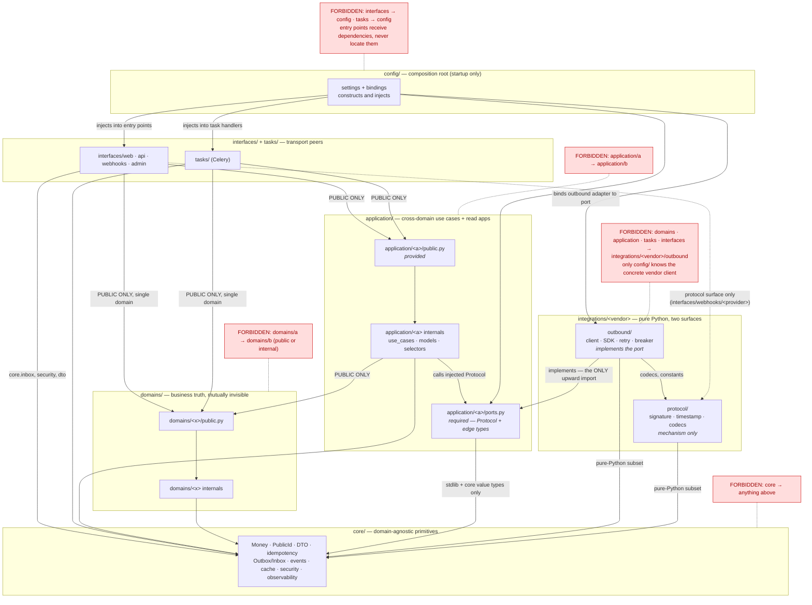

# Phase 0 — Item 3: Dependency matrix and allowed imports

- **Status:** Frozen
- **Date:** 2026-09-04
- **Phase:** 0 — Architecture Freeze
- **Decision record:** [ADR-0005](../../adr/0005-dependency-and-integration-wiring.md)
- **Builds on:** [ADR-0004](../../adr/0004-four-layer-modular-monolith.md),
  [Phase 0 item 2](02-four-layer-architecture.md)
- **Related:** [ADR-0001](../../adr/0001-product-vs-sku-sellable-unit.md),
  [ADR-0003](../../adr/0003-catalog-boundary-vs-storefront-projection.md),
  master `# 4. Структура проекта и машинно-проверяемые границы`

---

## 1. Purpose

Item 2 froze *what belongs where*. This artifact freezes *what may import what*, precisely enough
that Phase 1 can translate it into `import-linter` contracts, AST checks and a package layout
**without reopening an architectural decision**.

It closes the four questions item 2 deliberately deferred (§9.3, §6.4, §10, §17 there):

1. the exact allowed-import matrix, including which `core` submodules are open to which package family;
2. the integration wiring / port direction;
3. the placement of the stable contract types exchanged at the adapter edge, and of the persistent
   `provider + external_id ↔ internal entity` mapping;
4. the exact package/import rules for `tasks/*`.

**Out of scope, deliberately:** no `.importlinter` file, no AST checker code, no Python package, no
`ports.py`, no `public.py`, no Django model, no dependency. This item freezes the graph only.
Physical paths and names are illustrative until Phase 1 creates them.

---

## 2. Frozen principles inherited from ADR-0004 / item 2

| Rule | Statement | Source |
|---|---|---|
| R1 | A layer may depend only on layers **below** it. Never upward, never sideways at the domain level. | item 2 §2 |
| R2 | Skipping downward is legal: `interfaces → domains`, `application → core`, `interfaces → core`. | item 2 §2 |
| R3 | `domains/*` are mutually invisible — no domain→domain edge, **not even via `public.py`**. | ADR-0004 §3 |
| R4 | A downward call crosses a **contract** (`public.py` + immutable DTO/value objects), never an implementation. | ADR-0004 §1 |
| R5 | `core` depends on nothing in this project but itself. | item 2 §2 |
| R6 | `integrations/*` and `tasks/*` are **not** a fifth business layer; integrations are outbound anti-corruption adapters, tasks are transport peers of `interfaces/*`. | ADR-0004 §8–9 |
| R7 | Provider protocol verification (inbound) belongs to the boundary; business interpretation belongs to the owning domain. | ADR-0004 §7 |
| R8 | The use-case owner owns the transaction; external HTTP never runs inside the critical section. | ADR-0004 §10, item 2 §12.3 |

Nothing below weakens R1–R8. Everything below is either a refinement or a decision item 2 left open.

---

## 3. Vocabulary

**Provided vs required interface.** Every module family has at most two externally visible surfaces:

| Surface | Meaning | Who may import it |
|---|---|---|
| `public.py` | the **provided** interface — what this module offers callers above it | the callers listed in §10 / §11 |
| `ports.py` | the **required** interface — the outbound capability this module needs from the outside world, expressed as a vendor-neutral `Protocol` + frozen edge types | `integrations/*` implementations and the composition root only |

Everything else in a package is **internal** and importable only from inside that package.

**Cell statuses used in the matrix:**

| Status | Meaning |
|---|---|
| `ALLOW` | Any module of the target may be imported. |
| `PUBLIC ONLY` | Only `<target>.public` (and the DTO/value types it re-exports) may be imported. |
| `PORT ONLY` | No import of the target's modules at all; the capability is reached through a `ports.py` Protocol, bound by the composition root and injected. For `integrations → application` it means the single legal upward import: `application.<a>.ports`. |
| `SELF ONLY` | Only the importer's own package (same domain / same application / same vendor package). |
| `FORBID` | No import, in any form, ever. |
| `SPECIAL CASE` | Allowed for an enumerated, narrow purpose stated in the row notes; anything outside that purpose is `FORBID`. |

**Matrix convention.** Rows are the *importer*, columns the *imported*. `domains/<x>` (self) means
the importer's own domain package; for non-domain rows "self" is not applicable and the rule of
`domains/<y>` (other) applies. The same holds for `application/<a>` (self) vs `application/<b>`.

---

## 4. The dependency matrix

Compact grid (rows import columns):

| importer ↓ / imported → | core | dom/self | dom/other | app/self | app/other | interfaces | integrations | tasks | bootstrap | tests | migrations |
|---|---|---|---|---|---|---|---|---|---|---|---|
| **core** | SELF ONLY | FORBID | FORBID | FORBID | FORBID | FORBID | FORBID | FORBID | FORBID | FORBID | FORBID |
| **domains/\<x\>** | ALLOW | SELF ONLY | FORBID | FORBID | FORBID | FORBID | FORBID | FORBID | FORBID | FORBID | FORBID |
| **application/\<a\>** | ALLOW | PUBLIC ONLY | PUBLIC ONLY | SELF ONLY | FORBID | FORBID | PORT ONLY | FORBID | FORBID | FORBID | FORBID |
| **interfaces/\*** | SPECIAL CASE | PUBLIC ONLY | PUBLIC ONLY | PUBLIC ONLY | PUBLIC ONLY | SELF ONLY | SPECIAL CASE | SPECIAL CASE | FORBID | FORBID | FORBID |
| **integrations/\*** | SPECIAL CASE | FORBID | FORBID | PORT ONLY | PORT ONLY | FORBID | SPECIAL CASE | FORBID | FORBID | FORBID | FORBID |
| **tasks/\*** | ALLOW | PUBLIC ONLY | PUBLIC ONLY | PUBLIC ONLY | PUBLIC ONLY | FORBID | FORBID | SELF ONLY | FORBID | FORBID | FORBID |
| **bootstrap (`config/`)** | ALLOW | PUBLIC ONLY | PUBLIC ONLY | SPECIAL CASE | SPECIAL CASE | ALLOW | ALLOW | ALLOW | SELF ONLY | FORBID | FORBID |
| **tests/\*** | ALLOW | ALLOW | ALLOW | ALLOW | ALLOW | ALLOW | ALLOW | ALLOW | ALLOW | ALLOW | SPECIAL CASE |
| **\*\*/migrations/\*** | SPECIAL CASE | FORBID | FORBID | FORBID | FORBID | FORBID | FORBID | FORBID | FORBID | FORBID | SELF ONLY |

Every cell, with its reason, follows.

### 4.1 Row: `core`

| Target | Status | Reason |
|---|---|---|
| core | SELF ONLY | `core` is a leaf; internal cross-references are the only legal edge (R5). |
| domains/self, domains/other | FORBID | A primitive that knows a domain is not a primitive (item 2 §5.3). |
| application/\* | FORBID | Upward dependency; would invert the layering. |
| interfaces | FORBID | Upward dependency. |
| integrations | FORBID | Vendor vocabulary in a primitive is banned by the `core` admission test. |
| tasks | FORBID | Upward dependency on transport. |
| bootstrap | FORBID | `core` must never wire business dependencies (§7). |
| tests | FORBID | Production code never imports test code (§14). |
| migrations | FORBID | Migration modules are historical artifacts, never runtime imports (§13). |

### 4.2 Row: `domains/<x>` (including `domains/<x>/admin.py`)

| Target | Status | Reason |
|---|---|---|
| core | ALLOW | A domain knows itself and `core` only (item 2 §6.2). All `core` submodules are open to domains. |
| domains/self | SELF ONLY | Its own internals — models, services, selectors, policies, state machines, DTO, `public.py`. |
| domains/other | FORBID | R3, including `<other>.public`. No exception, and none for `admin.py` (§12). |
| application/self, application/other | FORBID | Upward dependency; cross-domain workflow lives above (ADR-0004 §4). |
| interfaces | FORBID | Upward dependency. |
| integrations | FORBID | Domains are vendor-agnostic and perform **no outbound vendor I/O** (§6.3). |
| tasks | FORBID | A domain never schedules its own transport; it emits an Outbox event via `core`. |
| bootstrap | FORBID | A domain never selects an implementation (§7). |
| tests | FORBID | §14. |
| migrations | FORBID | §13, including its own migrations package. |

### 4.3 Row: `application/<a>`

| Target | Status | Reason |
|---|---|---|
| core | ALLOW | Legal downward skip (R2); `Money`, `PublicId`, idempotency, Outbox/Inbox, events, cache, security, observability. |
| domains/self, domains/other | PUBLIC ONLY | Application orchestrates domains exclusively through `<domain>.public` + frozen DTOs (R4). Every domain is "other" from an application's point of view. |
| application/self | SELF ONLY | Its own use cases, models, selectors, policies, DTOs, `public.py`, `ports.py`. |
| application/other | FORBID | Application→application is forbidden by default (§11.3); no MVP exception exists. |
| interfaces | FORBID | Upward dependency. |
| integrations | PORT ONLY | The vendor capability is declared as `application/<a>/ports.py` and injected; the application never imports a vendor module (§6). |
| tasks | FORBID | Application must not know its transport. It returns, or emits an Outbox event that a relay dispatches. |
| bootstrap | FORBID | Would invert the wiring: the composition root imports the application, never the reverse (§7). |
| tests | FORBID | §14. |
| migrations | FORBID | §13. |

### 4.4 Row: `interfaces/*`

| Target | Status | Reason |
|---|---|---|
| core | SPECIAL CASE | Allowed: transport/security primitives (`core.security`, `core.dto`, `core.money`, `core.public_id`, `core.observability`, `core.cache` for HTTP fragment caching) and **`core.inbox` for durable webhook ingest** (ADR-0004 §7). Forbidden: `core.outbox`, `core.idempotency` — writing an event or claiming an idempotency key is a decision that belongs below the transport boundary. |
| domains/self, domains/other | PUBLIC ONLY | Legal direct call for a genuine single-domain request (item 2 §8.3); **at most one domain per request** — the second domain moves the flow to `application` (AST rule A5). |
| application/self, application/other | PUBLIC ONLY | Entry point is `application/<a>/public.py`; internals and `ports.py` are not for interfaces (§11.2). |
| interfaces | SELF ONLY | Shared transport helpers inside `interfaces/` (renderers, pagination, form base). |
| integrations | SPECIAL CASE | Only `interfaces/webhooks/<provider>` → `integrations/<provider>` **protocol surface** (§6.5): signature/HMAC canonicalisation, header parsing, timestamp helpers, event-id parsing, wire DTO codecs, protocol constants. The **outbound surface** (client, SDK, retry/breaker) is `FORBID` here and everywhere except the composition root. All other interface packages: `FORBID` for both surfaces. |
| tasks | SPECIAL CASE | Enqueue only — `task.delay()` / `apply_async()`. Calling a task function body inline, or importing anything else from `tasks/`, is `FORBID`. |
| bootstrap | FORBID | Entry points **receive** their dependencies from the composition root; they never **locate** them. `interfaces/* → config/*` would create a `config ↔ interfaces` source cycle and reintroduce service location (§7). |
| tests | FORBID | §14. |
| migrations | FORBID | §13. |

### 4.5 Row: `integrations/*`

| Target | Status | Reason |
|---|---|---|
| core | SPECIAL CASE | Allowed subset, pure Python only: `core.money`, `core.public_id`, `core.dto`, `core.security.signing`, `core.observability`. Forbidden: `core.outbox`, `core.inbox`, `core.idempotency`, `core.cache`, `core.events` — these are Django/Redis-backed platform state, and `integrations/*` must remain importable without the Django app registry (master `# 4`). |
| domains/self, domains/other | FORBID | An adapter owns no domain truth and must never touch a domain ORM model or contract (ADR-0004 §8). |
| application/self, application/other | PORT ONLY | The single legal upward import in the whole graph: `application/<a>/ports.py` — the Protocol the adapter implements and its vendor-neutral edge types (§6). Every other `application` module is `FORBID`. |
| interfaces | FORBID | Two adapters at opposite edges; the inbound boundary imports the vendor **protocol** surface, never the reverse. |
| integrations | SPECIAL CASE | Own vendor package (`SELF ONLY`, including `outbound/ → protocol/` inside it) plus shared mechanism in `integrations/base` (client, timeouts, retry, circuit breaker). Sibling vendor packages: `FORBID` — vendor isolation is the point of the package. `protocol/ → outbound/` is `FORBID`: protocol support stays free of client/SDK code (§6.5). |
| tasks | FORBID | An adapter never schedules itself. |
| bootstrap | FORBID | Inverted wiring; the composition root imports the adapter. |
| tests | FORBID | §14. |
| migrations | FORBID | §13. Adapters hold no Django models at all (§8). |

### 4.6 Row: `tasks/*`

| Target | Status | Reason |
|---|---|---|
| core | ALLOW | Trace restoration, actor reconstruction, idempotency/Inbox primitives, observability. |
| domains/self, domains/other | PUBLIC ONLY | Single-domain background command; **at most one** `<domain>.public` per task module-function (§9). |
| application/self, application/other | PUBLIC ONLY | Any multi-domain background work goes through one `application/<a>/public.py` use case. |
| interfaces | FORBID | Two peer transports; a task never renders HTTP. |
| integrations | FORBID | A task body is not a composition root and never names a vendor — neither surface, outbound least of all. The bound port arrives with the handler, injected at bootstrap (§9.2). |
| tasks | SELF ONLY | Shared task base, routing helpers, chaining/`chord` between tasks. |
| bootstrap | FORBID | Same rule as interfaces: a task handler receives its dependencies at registration time; it does not import `config/*` to look them up (§7). |
| tests | FORBID | §14. |
| migrations | FORBID | §13. |

### 4.7 Row: bootstrap / composition root (`config/`)

| Target | Status | Reason |
|---|---|---|
| core | ALLOW | Wiring needs the primitive types. |
| domains/self, domains/other | PUBLIC ONLY | Django app registration and URL/Celery wiring need no domain internals. |
| application/self, application/other | SPECIAL CASE | `application/<a>/ports.py` (to know what to bind) and `application/<a>/public.py` (to expose entry points where a URLconf or Celery beat entry requires it). Application internals: `FORBID`. |
| interfaces | ALLOW | URLconf, DRF routers, admin autodiscovery — and the **injection** side of the wiring: the composition root constructs/binds the interface entry point with its dependencies. The reverse edge is `FORBID` (§4.4). |
| integrations | ALLOW | **The only package family allowed to import a concrete outbound vendor adapter** (§6.5, §7); it may import both surfaces of a provider package. |
| tasks | ALLOW | Celery app and autodiscovery — and the injection side: task handlers are registered/bound with their dependencies at bootstrap. The reverse edge is `FORBID` (§4.6). |
| bootstrap | SELF ONLY | Settings modules and wiring modules reference each other. |
| tests | FORBID | §14. |
| migrations | FORBID | §13. |

### 4.8 Row: `tests/*`

| Target | Status | Reason |
|---|---|---|
| everything except migrations | ALLOW | The dependency matrix constrains **production** code. Test-tier scoping (§14) is a policy enforced by test-layout review and an AST tier rule, not by the runtime graph — architecture tests in particular must be able to inspect every package. |
| migrations | SPECIAL CASE | Only migration-behaviour tests may import a migration module, via the Django migration executor. |

### 4.9 Row: `**/migrations/*`

| Target | Status | Reason |
|---|---|---|
| core | SPECIAL CASE | Only stable technical primitives Django's deconstruction requires to be importable: custom field classes and expression/constraint helpers. No `core.money` business helpers, no DTOs, no services. |
| domains/self | FORBID | Historical models come from `apps.get_model()` inside `RunPython`, never `from domains.x.models import ...` (§13). |
| domains/other, application/\*, interfaces, integrations, tasks, bootstrap | FORBID | A migration that imports runtime business code freezes today's code into history and punches a hole in the boundary checks. |
| tests | FORBID | §14. |
| migrations | SELF ONLY | The Django migration graph — `dependencies`, `run_before`, `SeparateDatabaseAndState`. Cross-app *dependencies* are declared through this machinery, which is not a Python import of another app's runtime code. |

---

## 5. Mermaid dependency graph



---

## 6. Integration wiring — the frozen port model

### 6.1 Decision

**Ports and adapters with dependency inversion.** The business side declares the capability it
requires; the vendor adapter implements it; the composition root binds them.

```text
application/<a>/use_cases/*      calls an injected Protocol
        ↓
application/<a>/ports.py         Protocol + vendor-neutral frozen edge types   (declared by the owner)
        ↑
integrations/<vendor>/outbound   implements the Protocol                       (imports the port)
        ↑
config/ composition root         binds vendor → port at startup
```

The **runtime** dependency points application → adapter. The **source** dependency points
adapter → port. That inversion is the whole point: the caller never names a vendor.

### 6.2 Where ports live — frozen rule

> **Every outbound vendor port is owned by an `application` module, at `application/<a>/ports.py`.
> No domain declares, imports, invokes or is injected with a port. No shared `contracts/` package
> exists.**

Rejected alternatives:

- **`domains/<x>/ports.py`** (option B, the "recommended starting rule" of the item-3 brief). It
  would make a domain perform outbound vendor I/O, which collides with R8 (external HTTP outside the
  critical section, after commit or in a worker), with item 2 §10.3 (the call to the provider's API is the
  *integration adapter's*, triggered by task/application), and with the domain unit-test tier
  (§14: domain + `core` only). It also reintroduces a placement argument at every new capability.
  The single-owner rule removes the argument entirely.
- **A shared `contracts/` package** (option C). Exactly the "vendor-neutral dumping ground" the brief
  warns about: it has no owner, so nobody can refuse an addition to it.

**Consequence, accepted and recorded here:** item 2 §7.3's two-domain test gains a third
justification for an `application` module. A module in `application/` is justified when it
(a) coordinates two or more domains, **or** (b) owns application state (`CheckoutSession`,
`ProductListingProjection`), **or** (c) **owns an outbound vendor port and the workflow around it**.
Clause (c) is added by this item; it does not weaken the anti-pass-through guard, because a port
owner owns a real workflow — sequencing a vendor call against durable state — rather than forwarding
a single domain call.

### 6.3 Rules for ports

- `ports.py` contains only `typing.Protocol` definitions and frozen, vendor-neutral edge types
  (`@dataclass(frozen=True)`, `enum.Enum`) expressed in the platform's own vocabulary.
- `ports.py` may import **stdlib + `core` value primitives only** (`core.money`, `core.public_id`,
  `core.dto`). It must import no domain, no other application module, no Django, and — critically —
  **no `integrations` module**. This keeps `adapter → port` acyclic and keeps the port importable
  without the Django app registry, which is what lets `integrations/*` stay pure Python.
- No vendor enum, vendor status string, vendor error class or raw vendor payload may appear in a
  port signature or edge type (ADR-0004 §8).
- A use case receives its port(s) as explicit parameters. No module-level default, no import-time
  resolution, no service locator inside `application/`.
- Conformance is checked by static typing plus one contract test per adapter; the adapter is free to
  subclass the Protocol explicitly or to conform structurally.

### 6.4 Frozen port owners

| External capability | Port owner (frozen) | Adapter | MVP |
|---|---|---|---|
| Payment provider client (maib, MIA) | `application/payments_gateway/ports.py` | `integrations/maib`, `integrations/mia` | yes |
| ERP / 1C import + fetch client | `application/erp_sync/ports.py` | `integrations/erp` | yes |
| Email sender | `application/notifications/ports.py` | `integrations/<email vendor>` | yes |
| SMS sender | `application/notifications/ports.py` | `integrations/<sms vendor>` | yes |
| CRM export | `application/crm_sync/ports.py` | `integrations/crm` | later |
| Chatwoot support adapter | `application/support/ports.py` | `integrations/chatwoot` | later |

Email and SMS share one owner: they are the same capability family (deliver a rendered notification
through a channel) and splitting them would create two pass-through modules.

`application/payments_gateway` is the port owner and the *when* of reconciliation; `domains/payments`
keeps the `PaymentAttempt` state machine, amount/currency matching and duplicate-effect prevention
(ADR-0004 §7). The gateway module never decides what `captured` means.

Adding a new external capability means naming its application owner in this table — a documentation
change, not an architectural one. A capability whose owner is genuinely ambiguous needs a new ADR.

### 6.5 Two surfaces inside a provider integration package

Ports are **outbound**. Inbound provider protocol verification is not a port — but it is
provider-specific mechanism that the inbound boundary legitimately reuses. A provider package
therefore has two import surfaces, and only one of them is visible outside the composition root:

```text
integrations/<provider>/
    protocol/      # pure provider protocol support — reusable inbound and outbound
    outbound/      # the concrete implementation of application/<a>/ports.py
```

Phase 1 may choose different file names; the two **import surfaces must stay distinguishable**, so
that a linter can allow one and forbid the other.

| | `protocol/` | `outbound/` |
|---|---|---|
| Contains | signature/HMAC canonicalisation, header parsing, timestamp validation helpers, provider event-id parsing, request/response wire DTO codecs, protocol constants | provider HTTP client, provider SDK usage, timeout/retry/circuit-breaker behaviour, outbound request/response translation |
| Imports | stdlib + the allowlisted pure-Python `core` subset | stdlib, allowlisted `core`, `integrations/base`, its own `protocol/`, and `application/<a>/ports` |
| May be imported by | `interfaces/webhooks/<provider>`, its own package's `outbound/`, the composition root, provider tests | **the composition root and provider-integration tests only** |
| Never | contains Django, owns a business rule, performs a domain state transition, or performs an outbound business operation merely because it knows the protocol | is named by a view, task, use case or domain |

Frozen consequences:

```text
interfaces/webhooks/<provider> → integrations/<provider>/protocol      ALLOWED
interfaces/*                   → integrations/<provider>/outbound      FORBID
tasks/*                        → integrations/<provider>/*             FORBID
application/*                  → integrations/<provider>/*             FORBID  (PORT ONLY)
domains/*                      → integrations/<provider>/*             FORBID
integrations/<p>/protocol      → integrations/<p>/outbound             FORBID
```

**This does not move webhook ownership into `integrations/`.** `interfaces/webhooks/<provider>`
remains the inbound adapter and the owner of: authentication of the provider call, the
replay/timestamp policy, durable Inbox ingest, and the HTTP acknowledgement (ADR-0004 §7, item 2
§10.3). The `protocol/` surface is reusable provider-specific *mechanism* — it answers "is this
really the provider, and is it fresh?", never "what does this event mean?" and never "should we call
the provider now?".

ADR-0004 §8's characterisation of `integrations/*` as an **outbound** anti-corruption boundary
remains true of the adapter implementation. This item adds only the narrow pure-protocol support
surface consumed by the inbound boundary; it grants `integrations/*` no business role in either
direction.

---

## 7. Composition root

> **There is exactly one composition root: the project bootstrap package `config/`
> (conceptually `config/composition/`; the physical module name is Phase 1).**

### 7.1 The invariant

> **Entry points receive dependencies; they do not locate them.**

The composition root owns **construction and injection**. There is no provider API, registry lookup
or service locator imported by a view, a task or a use case.

### 7.2 Source dependency direction — frozen

`config/composition` MAY import:

- `application/<a>/ports.py` — the contracts it binds;
- concrete `integrations/<provider>/outbound` implementations — the only package family allowed to;
- `interfaces/*` entry-point factories/classes;
- `tasks/*` registration/factory functions;
- settings/configuration.

`interfaces/*` and `tasks/*` **MUST NOT import `config/*`** — no exception, no "just the provider
API".

```text
application port
       ↑
integration adapter (outbound)
       ↑
config/composition
       │
       ├── injects the dependency into the interface entry point
       └── injects the dependency into the task handler
```

Production source graph, acyclic by construction:

```text
config → integrations          interfaces → application.public
config → application ports     tasks      → application.public
config → interfaces
config → tasks                 interfaces ✕→ config
                               tasks      ✕→ config
```

### 7.3 Frozen rules

- Binding happens **at startup**, driven by settings/environment. No per-request adapter graph
  construction, and no adapter built inside a view, task, use case or domain.
- A use case still receives its port **explicitly**, as a parameter. Injection into the entry point
  does not turn into a global.
- `core` may own the *mechanism* of a typed registry (domain-independent, mechanism-shaped, passes
  the item 2 §5.3 admission test) but never a **binding**, and it is not a lookup seam for entry
  points: `core` knows no vendor and wires nothing.
- `domains/*` never see the composition root. `application/*` never imports it — that would invert
  the wiring.
- The composition root contains **no business logic**: it maps configuration to objects and nothing
  else (review rule V4).
- **No global service locator is introduced.** If a framework-specific late lookup ever proves
  genuinely unavoidable, it requires an explicit architecture review and a new ADR — not a silent
  reintroduction of `interfaces/tasks → config`.

The **injection mechanism** is deliberately not frozen: Phase 1 may use an entry-point/view factory,
class construction or `as_view()` binding for web/API, and handler registration or a bound
callable/task class for Celery — or another explicit startup binding mechanism. What is frozen is
the direction, not the Python API.

Test doubles are bound the same way: a test composes a fake implementation of the same Protocol into
the entry point or passes it into the use case; it never monkey-patches a vendor module.

---

## 8. Persistent integration state — `provider + external_id ↔ internal entity`

Item 2 §9.4 froze the *ownership* (integration/synchronization boundary state, not domain state) and
deferred the *architectural placement*. Frozen now:

> **The persistent mapping is owned by the `application` synchronization module that owns the
> corresponding external workflow, as an internal model of that module.
> `ErpVariantMapping` therefore belongs to `application/erp_sync` (internal `models.py`).**

- **No new business domain** is invented for vendor mapping (ADR-0004 §8; the brief's explicit ban).
- **No generic cross-provider mapping table** and no `application/integration_state` catch-all. A
  polymorphic `entity_type + entity_id` table cannot carry real uniqueness/FK constraints, which
  collides with the DB-constraints-as-last-line invariant. Each synchronization module owns the
  mapping its own workflow needs, with real constraints. If two sync modules ever need identical
  mechanics, the *mechanism* may move to `core`; the *table* does not.
- `integrations/*` **must not** import or define this model: adapters stay pure Python vendor
  protocol with no Django (§4.5). The adapter speaks `external_id` strings; the application module
  resolves them against the mapping.
- No domain table acquires a provider identity column — ADR-0003 §2 stands unchanged, and this
  placement is compatible with its "conceptually in `integrations/erp`" phrasing, which item 2 §9.4
  already read as a statement of *boundary ownership*, not a Python path.
- The mapping model is internal to `application/erp_sync`; interfaces, tasks and other applications
  reach it only through `application/erp_sync/public.py` (§12).
- The concrete schema, uniqueness rules and provider versioning remain **Phase 3**.

---

## 9. `tasks/*` import policy

### 9.1 What a task may import

| May import | Note |
|---|---|
| `application/<a>/public.py` | the normal case: one use case per task function |
| `<domain>.public` | only for a genuine single-domain background command |
| `core` | trace/actor restoration, idempotency and Inbox primitives, observability |
| `tasks/*` | shared base, routing, chaining |

A task imports **nothing else** — in particular no `integrations/*` and no `config/*`. When a task
handler needs an outbound port, the port arrives **with the handler**: the composition root binds it
at registration/bootstrap (§7.2), and the task passes it into the use case it calls.

### 9.2 What a task may not do

- **Import `integrations/*`.** Frozen as an unconditional `FORBID`, which resolves the brief's open
  question: even when a task is the transport owner of a post-commit external operation, the bound
  port is injected into the handler at bootstrap. A task body is never a composition root and never
  names a vendor.
- **Import `config/*`.** No provider lookup, no service locator at the transport boundary (§7.1).
- **Orchestrate more than one domain.** A task module-function importing two or more
  `domains.*.public` is a static failure (AST rule A5) — that flow needs an `application` use case.
- **Contain a business rule**, re-implement a use case, or make retry the thing that provides
  idempotency (item 2 §10.2; idempotency is durable in PostgreSQL below the task).

```text
legal      tasks/catalog.py    → catalog.public.rebuild_something()
legal      tasks/storefront.py → application/storefront.public.rebuild_projection()
legal      tasks/payments.py   → application/payments_gateway.public.reconcile(attempt_id, gateway=<injected>)
                                 (the handler was bound with its gateway port at bootstrap;
                                  the task module itself names no vendor and imports no config)

forbidden  tasks/order.py      → pricing.public + inventory.public + orders.public
                                 (three domains in a task body → application/checkout use case)
forbidden  tasks/erp.py        → integrations/erp/outbound/client.py
                                 (task naming a vendor → composition root + application/erp_sync)
forbidden  tasks/payments.py   → config.composition.provide(...)
                                 (service location at the transport boundary → inject at bootstrap)
```

---

## 10. `domains/<x>.public` boundary rule

`domains/<x>/public.py` **MAY** be imported by:

- `application/<a>` (any application module);
- `interfaces/*`, for a genuine single-domain request (item 2 §8.3), at most one domain per request;
- `tasks/*`, for a genuine single-domain background command, at most one domain per task function;
- the composition root, for registration/wiring purposes;
- tests, per the tier policy in §14.

`domains/<x>/public.py` **MUST NOT** be imported by:

- another domain — R3, including `domains/<x>/admin.py` (§12);
- `core` — R5;
- `integrations/*` — an adapter answers no business question;
- any migration module.

**No other module of `domains/<x>` is importable from outside `domains/<x>`.** The public contract
exports callables, frozen DTOs and value objects only — never an ORM model, manager or QuerySet
(master `# 4.1`).

Additional freeze that makes this mechanically checkable: **package `__init__.py` files under
`domains/`, `application/` and `integrations/` stay empty** — no re-export shortcuts. Otherwise
`import domains.catalog` would drag internals into the import graph and blur every contract above.

---

## 11. `application` boundary rule

### 11.1 Provided interface

Each application module exposes exactly one provided entry point: **`application/<a>/public.py`**,
symmetric with domains. It re-exports use-case callables, application DTOs, and actor-scoped
selectors/policies for application-owned state (`CheckoutSession`, `ProductListingProjection`
reads). `interfaces/*` and `tasks/*` import that module and nothing else from the package.

The alternative — treating `use_cases/__init__.py` as the entry point — is rejected: it makes the
package's `__init__` non-empty (§10) and gives read applications like `storefront`, whose surface is
a selector rather than a use case, no home.

### 11.2 Required interface

`application/<a>/ports.py` is externally importable **only** by `integrations/*` implementations and
the composition root (§6.3). Interfaces and tasks never import a port module; they receive a bound
implementation from the composition root.

### 11.3 Application → application

**Forbidden by default, with no MVP exception.** When one application use case appears to need
another application's capability, exactly one of these applies:

1. the two workflows have one real owner → **merge them** under that owner;
2. the shared thing is a business rule → it belongs in a **domain**, reached via `<domain>.public`;
3. the shared thing is a mechanism → it belongs in **`core`**, if it passes the admission test;
4. neither fits → a narrowly defined application public contract may be justified, and requires a
   **new ADR** naming the exact contract. It is not a judgement call made in a pull request.

The reason this is stricter than the domain rule needs to be: `application` is where god-layers form,
and an application mesh would hide cross-domain workflows exactly like a domain mesh would (item 2
§6.3, §7.3).

---

## 12. ORM ownership rules

**Domain-owned ORM.** Outside `domains/<x>`, these are `FORBID` for every package family:
`domains.<x>.models`, `.repositories`, `.services`, `.selectors`, `.policies`, `.state_machine`,
`.pipeline`, `.dto` (internal DTO module), `.admin`, and any other internal module. Only
`domains.<x>.public` crosses.

**Application-owned ORM.** The same rule applies verbatim to application-owned persistence —
`CheckoutSession` in `application/checkout/models.py`, `ProductListingProjection` in
`application/storefront/models.py`, `ErpVariantMapping` in `application/erp_sync/models.py`. These
models are **internal**. `interfaces/*` and `tasks/*` consume the owning module's use cases,
selectors and DTOs through `application/<a>/public.py`; they never import the model, never build a
QuerySet against it, and never render an ORM instance.

**No ORM instance or QuerySet crosses any module boundary** — domain or application. What crosses is
a frozen DTO or value object (R4).

**Cross-family bans that make this checkable:** `integrations/*` may not import `django.db` at all
(AST rule A3); a migration may not import a runtime model (§13); an interface may not call
`Model.objects...` for object-level authorization (AST rule A4, ADR-0004 §6).

---

## 13. Django admin exception

`domains/<x>/admin.py` physically lives inside the domain package and plays an interface *role*
(item 2 §8.4). Frozen resolution:

- **Import rules: the domain's.** `admin.py` may import its own domain internals and `core`, and
  nothing else. It may **not** import a sibling domain's internals *or its `public.py`*, may not
  import `integrations/*`, and may not import `application/*` — the last one would be an upward edge
  that breaks the DAG.
- **Content rules: the interface's.** No business rule, no money computation, no state-machine
  advance, no object-level authorization by ownership-field comparison in an admin action body.
- **Cross-domain admin actions live in `interfaces/admin/`**, which legally imports
  `application/backoffice/public.py`. This is the frozen resolution of the loophole: a domain-local
  admin action that needs a second domain does not get an exception — it **moves** to
  `interfaces/admin/`.

**No `import-linter` exception is required.** Because `admin.py` sits inside `domains/<x>`, its legal
imports (own domain + `core`) are already exactly what the domain row of the matrix allows, and its
forbidden imports are already forbidden by the same row. Adding an exception would be the loophole.
Only the *content* rules need a review/AST check (§15).

---

## 14. Migrations exception, and the test dependency policy

### 14.1 Migrations

- `**/migrations/**` modules are **excluded from the runtime layer contracts** — and only from those.
  The exclusion is scoped by path pattern to migration packages; it is never a blanket `ignore_imports`
  list and never covers a runtime module.
- Migrations reference other apps' historical models **only through Django's migration machinery** —
  `dependencies`, `run_before`, `SeparateDatabaseAndState`, and `apps.get_model()` inside `RunPython`
  — which is not a Python import of runtime code.
- **No migration imports a runtime model, service, selector, policy or DTO — including its own
  domain's.** Enum/choice values are inlined as literals in the migration.
- The only permitted import is the one Django's deconstruction forces: stable custom field and
  expression/constraint classes from `core` (§4.9).
- **Runtime code never imports a migration module.** A dedicated AST check inspects migration
  modules for runtime imports, so the layer-contract exclusion cannot become a hole (rule A6).
- A cross-app data migration is a boundary event and needs explicit review sign-off.

### 14.2 Tests

| Tier | May import | Purpose |
|---|---|---|
| Domain unit tests | that domain + `core` | proves the domain is independently testable (Phase 2 catalog DoD) |
| Contract tests | `<domain>.public` / `application/<a>/public.py` + fixtures/fakes | the contract, never the internals behind it |
| Application tests | `application/<a>` + domain public contracts + port fakes | workflow and sequencing |
| Integration/provider tests | `integrations/<vendor>` + the port/edge types it implements + `core` | vendor protocol conformance, timeouts, retry, breaker |
| Architecture tests | every package | that is their job |
| Concurrency / security / performance / E2E | may cross everything | realistic flows |

Frozen guards:

- **`tests/` is never a source package.** No production module may import `tests.*` — an
  `import-linter` forbidden contract with production packages as sources.
- Test code must not be the place where a production dependency rule is quietly widened: if a test
  needs an import the matrix forbids in production, that is a finding about the design, not a
  licence. Test fakes implement ports; they do not monkey-patch vendor modules.
- Tier scoping is a **layout + review** rule with an AST assist (rule A7), not a runtime-graph rule —
  §4.8.

---

## 15. Enforcement map

### 15.1 `import-linter` enforceable (Phase 1)

| # | Rule |
|---|---|
| L1 | `core` imports no `domains`, `application`, `interfaces`, `integrations`, `tasks`, `config`. |
| L2 | `domains.<x>` imports no `domains.<y>` — internals **and** `public` (independence contract, one per domain pair). |
| L3 | `domains.*` imports no `application`, `interfaces`, `tasks`, `integrations`, `config`. |
| L4 | Outside `domains.<x>`, only `domains.<x>.public` is importable (forbidden contract listing every internal module family: `models`, `repositories`, `services`, `selectors`, `policies`, `state_machine`, `pipeline`, `dto`, `admin`). |
| L5 | `application.<a>` imports no `application.<b>`. |
| L6 | `application.*` imports no `interfaces`, `tasks`, `integrations`, `config`. |
| L7 | Outside `application.<a>`, only `application.<a>.public` is importable — plus `application.<a>.ports`, allowed **only** for `integrations.*` and `config.*`. |
| L8 | `integrations.*` imports no `domains.*`, no `interfaces.*`, no `tasks.*`, no `config.*`, and no `application.*` other than `application.*.ports`. |
| L9 | `integrations.<v>` imports no `integrations.<w>`; `integrations.base` is shared. |
| L10 | `integrations.*` imports only the allowlisted pure-Python `core` submodules. |
| L11 | `tasks.*` imports no `integrations.*` and no `interfaces.*`. |
| L12 | `interfaces.*` imports `integrations.*` only from `interfaces.webhooks.*`, and only the provider **protocol** surface. |
| L13 | `interfaces.*` imports no `core.outbox`, no `core.idempotency`. |
| L14 | No production package imports `tests.*`. |
| L15 | `application.*.ports` imports only stdlib + allowlisted `core` value modules (no `django`, no `domains`, no `integrations`). |
| L16 | **`interfaces.*` and `tasks.*` import no `config.*`** — the composition root is never imported by an entry point (§7.2). With L1/L3/L6 this makes `config` the **root of the wiring dependencies** — it imports downward and no runtime package imports back into it — so the production source graph stays acyclic. |
| L17 | `integrations.<v>.outbound` is importable only by `config.*` (and provider tests); `interfaces.*`, `tasks.*`, `application.*`, `domains.*` are forbidden sources. |
| L18 | `integrations.<v>.protocol` imports no `integrations.<v>.outbound` — protocol support carries no client/SDK code. |
| L19 | `**/migrations/**` excluded from L1–L18 by path scope only. |

### 15.2 AST / static-rule enforceable (Phase 1)

| # | Rule |
|---|---|
| A1 | No `from django.db import models` / model class definition outside `domains/<x>/models*`, `application/<a>/models*`, and `core` infrastructure models. |
| A2 | Vendor SDK imports (`requests`/vendor client libs against a provider host, vendor SDK packages) appear only under `integrations/*`. |
| A3 | `integrations/*` imports no `django.*` — adapters stay pure Python. |
| A4 | No `<Model>.objects.get/filter(...)` in `interfaces/*` or `tasks/*` module bodies — in particular the "load row, compare `user_id`" authorization anti-pattern (ADR-0004 §6). |
| A5 | An `interfaces/*` view function/class and a `tasks/*` task function reference at most **one** `domains.*.public` module. |
| A6 | Migration modules contain no runtime import beyond allowlisted `core` field/expression classes; `apps.get_model` is the only historical-model access. |
| A7 | Test-tier scoping: a module under `tests/unit/domains/<x>/` imports only that domain + `core`; a module under `tests/integration/providers/` imports no `domains.*`. |
| A8 | `__init__.py` under `domains/`, `application/`, `integrations/` is empty (no re-export). |
| A9 | `ports.py` exists only under `application/<a>/`; a `ports.py` under `domains/` or `integrations/` fails. |
| A10 | No module outside `config/` imports both an `integrations.*` module and an `application.*.ports` module (single composition root). |
| A11 | `public.py` re-exports no ORM model/manager/QuerySet symbol (name/annotation check). |
| A12 | No service-locator call shape in `interfaces/*` or `tasks/*`: no module-level or per-request resolution of a dependency by name/type from a registry, and (with L16) no import path through which one could be reached. Dependencies arrive as constructor/registration arguments. |
| A13 | A provider integration package keeps its two surfaces separate and distinguishable — the `protocol` surface defines no HTTP client/SDK call, and the `outbound` surface is the only one implementing a port (§6.5). |

### 15.3 Review / test only — **not** mechanically detectable

`import-linter` and AST checks see *imports and shapes*, not *meaning*. These stay on the review
checklist and in the behavioural test suites:

| # | Rule |
|---|---|
| V1 | Business logic living in a view, admin action or task body while the imports look legal. |
| V2 | `application` reimplementing a domain invariant (deciding stock sufficiency, discount value, what `captured` means). |
| V3 | A DTO or port edge type carrying vendor semantics under a neutral type name (`status: str` holding `"OK_MAIB"`). |
| V4 | The composition root growing business logic instead of configuration→object mapping. |
| V5 | An `application` module that is a genuine pass-through (fails the two-domain test and owns no state and no port). |
| V6 | A `core` helper that passes an import check but fails the four admission tests. |
| V7 | Object-level authorization performed at the wrong owner, or duplicated at two owners. |
| V8 | Outbound HTTP inside a critical transaction (partly covered by concurrency/integration tests). |
| V9 | A mapping table drifting into business semantics (`ErpVariantMapping` growing a price or a stock column). |
| V10 | An interface combining two domains' results via two *separate* legal single-domain calls in one request path (A5 catches the common single-module form; a split across helper modules is a review catch). |

No claim is made that `import-linter` can detect V1–V10.

---

## 16. Explicit import examples

### 16.1 Legal

```text
application/checkout/use_cases/place_order.py
    → core.money.Money, core.idempotency
    → domains.pricing.public, domains.promotions.public,
      domains.inventory.public, domains.orders.public, domains.payments.public
    → application.checkout.models (own CheckoutSession)          # SELF ONLY
```

```text
interfaces/web/views/category.py
    → domains.catalog.public                                     # single domain, §8.3
    → core.security.actor
```

```text
interfaces/webhooks/maib.py
    → integrations.maib.protocol (raw-body HMAC, timestamp, event-id parsing)  # protocol surface
    → core.inbox (durable ingest)                                # then 2xx
    (owns authentication of the call, replay/timestamp policy, ingest, acknowledgement)
```

```text
integrations/maib/outbound/client.py
    → application.payments_gateway.ports (PaymentGatewayPort, ChargeResult)   # the one upward edge
    → integrations.maib.protocol (codecs, constants)             # own package
    → integrations.base.client, integrations.base.circuit_breaker
    → core.money, core.observability
```

```text
config/composition/payments.py
    → application.payments_gateway.ports.PaymentGatewayPort
    → integrations.maib.outbound.client.MaibClient
    → binds one to the other from settings                       # only place both appear
    → constructs/binds the interface entry point and the task handler with the bound port
```

```text
tasks/storefront.py
    → application.storefront.public.rebuild_projection()
    (imports no config, no integrations)
```

### 16.2 Forbidden

```text
domains/orders/services.py
    → domains.inventory.public                  ✗ R3 — domain→domain, even via public
```

```text
domains/notifications/services.py
    → application.notifications.ports           ✗ upward, and domains own no ports (§6.2)
```

```text
domains/catalog/admin.py
    → domains.pricing.models                    ✗ admin is not a cross-domain loophole (§13)
```

```text
domains/catalog/admin.py
    → application.backoffice.public             ✗ upward edge; move the action to interfaces/admin/
```

```text
application/checkout/use_cases/place_order.py
    → integrations.maib.outbound.client         ✗ PORT ONLY — vendor named by the application
```

```text
application/checkout/...
    → application.storefront.selectors          ✗ application→application (§11.3)
```

```text
application/storefront/selectors.py
    → domains.catalog.models                    ✗ domain internals; PUBLIC ONLY
```

```text
interfaces/api/v1/orders.py
    → application.checkout.models.CheckoutSession   ✗ application-owned ORM is internal (§12)
```

```text
interfaces/api/v1/orders.py
    → Order.objects.get(public_id=...) ; if order.user_id == request.user.id
                                                ✗ object-level authz in an interface (A4)
```

```text
tasks/erp.py
    → integrations.erp.outbound.client          ✗ tasks never name a vendor (§9.2)
```

```text
integrations/erp/outbound/client.py
    → application.erp_sync.models.ErpVariantMapping   ✗ adapters hold no Django state (§8)
```

```text
integrations/maib/outbound/client.py
    → integrations.mia.outbound.client          ✗ vendor isolation (L9)
```

```text
application/payments_gateway/ports.py
    → integrations.maib.protocol                ✗ would invert the port and create a cycle (§6.3)
```

```text
domains/catalog/migrations/0007_x.py
    → from domains.catalog.models import Product   ✗ use apps.get_model (§14.1)
```

```text
core/cache/single_flight.py
    → application.storefront                    ✗ R5
```

```text
interfaces/web/views/checkout.py
    → config.composition.provide(PaymentGatewayPort)
                                                ✗ entry point locating a dependency;
                                                  config → interfaces cycle (L16, §7.1)
```

```text
tasks/payments.py
    → config.composition                        ✗ same rule for the other transport (L16)
```

```text
interfaces/webhooks/maib.py
    → integrations.maib.outbound.client         ✗ inbound boundary reaching the outbound
                                                  surface; protocol only (L17, §6.5)
```

```text
integrations/maib/protocol/signature.py
    → integrations.maib.outbound.client         ✗ protocol support is mechanism only (L18)
```

---

## 17. Acceptance checklist

A change is compatible with this freeze when every line holds:

- [ ] No `domains/a → domains/b` import exists, internal or `public`.
- [ ] `core` imports nothing above it and wires no implementation.
- [ ] Every cross-family import matches a matrix cell, and no cell is widened "temporarily".
- [ ] Only `<domain>.public` and `application/<a>/public.py` cross their package boundary;
      `application/<a>/ports.py` is imported only by `integrations/*` and the composition root.
- [ ] No ORM model, manager or QuerySet — domain-owned or application-owned — is imported or
      re-exported across a boundary.
- [ ] No `application/<a>` imports another `application/<b>`.
- [ ] No domain declares, imports or is injected with a port; no domain imports `integrations/*`.
- [ ] No vendor type appears in a port signature, edge type, DTO or public contract.
- [ ] `integrations/*` imports no Django, no domain, and no `application` module except `*.ports`.
- [ ] `tasks/*` imports no `integrations/*`, and no task function reaches two domains.
- [ ] `interfaces/*` reaches at most one domain per request and performs no object-level
      authorization on a loaded ORM row.
- [ ] Only `config/` binds a concrete outbound adapter to a port, and it does so at startup.
- [ ] No `interfaces/*` or `tasks/*` module imports `config/*`; entry points receive their
      dependencies and never locate them. The production source graph has no `config ↔ interfaces`
      or `config ↔ tasks` cycle.
- [ ] Only the composition root and provider tests know a concrete `integrations/<v>/outbound`
      module; an inbound webhook uses the `protocol` surface only.
- [ ] The persistent provider mapping lives in the owning `application` sync module; no domain table
      carries a provider identity column.
- [ ] Migrations import no runtime business module; the migration exclusion is path-scoped only.
- [ ] No production module imports `tests.*`, and no test widens a production rule.
- [ ] `__init__.py` files under `domains/`, `application/`, `integrations/` are empty.
- [ ] Every new rule added later is classified as import-linter, AST/static, or review-only —
      accurately.

---

## 18. Explicitly deferred decisions

| Deferred | Owner |
|---|---|
| `.importlinter` file, contract syntax, CI wiring | Phase 1 |
| AST checker implementation for A1–A13 | Phase 1 |
| Physical package directories, Django app labels, settings modules, and the composition-root module names | Phase 1 |
| The **injection mechanism** at each entry point — view/entry-point factory, class construction or `as_view()` binding for web/API; handler registration or a bound callable/task class for Celery; or another explicit startup binding (§7.3) | Phase 1 |
| Physical file names inside a provider package, as long as the `protocol` / `outbound` import surfaces stay distinguishable (§6.5) | Phase 1 / per-integration phase |
| `public.py` contract template, and how the actor is carried into a domain call | Phase 0 item 4 |
| Concrete port method signatures and edge-type fields (`PaymentGatewayPort`, `ErpFetchPort`, `EmailSenderPort`, …) | the phase that implements each capability (payments: Phase 4; ERP: Phase 3; notifications: Phase 5) |
| Retry/timeout/circuit-breaker parameter values per vendor | Phase 1 baseline + per-integration phase |
| `ErpVariantMapping` schema, uniqueness rules, provider versioning | Phase 3 |
| Internal design of `place_order` | Phase 0 item 5 |
| `ProductCard` / Facet DTO fields, projection schema, `source_version` generation | Phase 0 items 7, 12 |
| Event registry, event names, versioning policy | Phase 0 item 8 |
| Queue / failure-domain matrix, DLQ policy | Phase 0 item 9 |
| Whether `analytics` ships as a domain in MVP | Phase 0 item 13 |
| Any narrowly defined application→application contract | requires a new ADR (§11.3) |
| Extraction of a domain into a service | requires a new ADR |

---

## 19. Self-review record

| # | Check | Result |
|---|---|---|
| 1 | No legal domain→domain edge | Pass — matrix row §4.2 `domains/other = FORBID`, L2, §10, §13 close the admin variant. |
| 2 | No vendor type can leak into a domain/application contract | Pass — §6.3 bans vendor types in ports and edge types; L15 forbids `ports.py → integrations`; A2 confines vendor SDKs; V3 covers the semantic variant a checker cannot see. |
| 3 | Domain code does not depend on vendor adapters | Pass — §4.2 `integrations = FORBID`, §6.2 forbids domain-owned ports, A9 fails a `domains/*/ports.py`. |
| 4 | Port direction consistent with dependency inversion | Pass — §6.1: source dependency adapter→port, runtime dependency application→adapter; the port module is a leaf importing only stdlib + core value types, so the graph stays acyclic. |
| 5 | Composition root has exactly one conceptual owner, with no reverse dependency | Pass — §7 names `config/` and only `config/`; A10 fails any other module importing both an adapter and a port; L16 forbids `interfaces/* → config/*` and `tasks/* → config/*`, so `config` is the **root of the wiring dependencies** — it imports ports, adapters, interfaces and tasks, and no runtime package imports back into it — leaving the production source graph acyclic and `config ↔ interfaces` / `config ↔ tasks` cycles impossible. Injection replaces the former provider API; A12 covers the service-locator call shape. |
| 6 | `ErpVariantMapping` has an owner without polluting a business domain | Pass — §8 assigns it to `application/erp_sync` internals; no new domain, no generic catch-all, no provider column on a catalog table (ADR-0003 §2 intact). |
| 7 | Tasks remain transport | Pass — §9: one use case or one domain public per task, no `integrations` import and no `config` import (A5, L11, L16); the bound port is injected into the handler; retry vs durable idempotency restated. |
| 8 | Interfaces cannot import domain internals | Pass — §4.4 `PUBLIC ONLY` + L4; the only interface→integrations edge is `interfaces/webhooks/<provider>` → the provider **protocol** surface, scoped by L12 and bounded by L17. |
| 9 | Application cannot import domain ORM internals | Pass — §4.3 `PUBLIC ONLY` + L4 + §12. |
| 10 | Domain-local admin is not a cross-domain loophole | Pass — §13: domain import rules apply unchanged, cross-domain actions move to `interfaces/admin/`, and **no** linter exception is created. |
| 11 | Migration exceptions cannot leak into runtime | Pass — §14.1: exclusion is path-scoped to `**/migrations/**`, runtime never imports a migration, and A6 inspects migrations separately instead of a blanket ignore. |
| 12 | Tests do not redefine production rules | Pass — §14.2 tiers + L14 (no production import of `tests.*`) + the explicit statement that a test needing a forbidden import is a design finding. |
| 13 | Every matrix cell has an intentional status | Pass — §4.1–§4.9 enumerate all 99 cells of the 9 importer rows with a reason each; the row/column convention for "self" is stated in §3. |
| 14 | Each rule assigned to the right mechanism | Pass — §15 splits L1–L19 (import graph), A1–A13 (AST shapes), V1–V10 (meaning); §15.3 states explicitly that V-rules are not machine-detectable. |
| 16 | Inbound protocol vs outbound adapter separated | Pass — §6.5 freezes the two surfaces and their consumers; L17 restricts `outbound` to the composition root and provider tests; L18 and A13 keep `protocol` free of client/SDK code; webhook ownership (authentication, replay policy, ingest, acknowledgement) stays with `interfaces/webhooks/<provider>`, and ADR-0004 §8's outbound characterisation is preserved for the adapter implementation. |
| 15 | No contradiction with ADR-0001…0004 | Pass — ADR-0001 identity rules untouched (external contract identifiers stay at the integration boundary); ADR-0002 untouched; ADR-0003 §2 restated and satisfied by §8; ADR-0004 §1–§10 all preserved. The one **addition** is §6.2 clause (c) — an outbound port owner justifies an `application` module — which extends item 2 §7.3's two-domain test in the space item 2 §9.3 explicitly left open, and does not weaken the anti-pass-through guard. |

Verdict: **PASS**.
